<div style="background-color:#0A2B07;">
  <h1 style="margin:auto; padding:20px 0; color:#fff; text-align:center; font-weight:bold;">
    PROJET 5 DATA SCIENTIST
  </h1>
  <h2 style="margin:auto; padding:20px 0; color:#fff; text-align:center; font-weight:bold;">
    Segmentez des clients d'un site e-commerce
  </h2>
</div>


## **INITIALISATION**


```python
# ============================================================
# LIBRAIRIES STANDARD
# ============================================================

from datetime import datetime, timedelta
import itertools
import joblib

# ============================================================
# MANIPULATION DE DONNÉES
# ============================================================

import numpy as np
import pandas as pd

# ============================================================
# VISUALISATION
# ============================================================

import matplotlib.pyplot as plt
import seaborn as sns
from matplotlib.lines import Line2D
from mpl_toolkits.mplot3d import Axes3D
from IPython.display import display

# ============================================================
# MACHINE LEARNING
# ============================================================

from sklearn.preprocessing import StandardScaler
from sklearn.cluster import KMeans, DBSCAN, AgglomerativeClustering
from sklearn.metrics import silhouette_score, adjusted_rand_score
from sklearn.decomposition import PCA
from sklearn.neighbors import NearestNeighbors

# ============================================================
# CLUSTERING HIÉRARCHIQUE (SCIPY)
# ============================================================

from scipy.cluster.hierarchy import linkage, dendrogram

```


```python
# Définir le dossier où sont stockés les fichiers CSV
data_path = r"C:\Users\barre\Documents\Pro\Reconversion_professionnelle\Formations\Data_Scientist_by_Openclassrooms\P05\data"

# Charger tous les fichiers CSV en utilisant le chemin centralisé
customers = pd.read_csv(f"{data_path}\\olist_customers_dataset.csv")
geolocation = pd.read_csv(f"{data_path}\\olist_geolocation_dataset.csv")
order_items = pd.read_csv(f"{data_path}\\olist_order_items_dataset.csv")
order_payments = pd.read_csv(f"{data_path}\\olist_order_payments_dataset.csv")
order_reviews = pd.read_csv(f"{data_path}\\olist_order_reviews_dataset.csv")
orders = pd.read_csv(f"{data_path}\\olist_orders_dataset.csv")
products = pd.read_csv(f"{data_path}\\olist_products_dataset.csv")
sellers = pd.read_csv(f"{data_path}\\olist_sellers_dataset.csv")

```


```python
def profile_dataframe(df, table_name, primary_keys=None, verbose=True):
    """
    Profiling complet d'un DataFrame avec informations sur les colonnes
    et éventuellement sur la clé primaire, avec quartiles pour les colonnes numériques et dates.

    Arguments :
        df : DataFrame à analyser
        table_name : nom logique de la table (string)
        primary_keys : dictionnaire {nom_table: [liste_colonnes_identifiants]}
        verbose : bool, si True affiche les infos générales
    
    Retour :
        DataFrame contenant pour chaque colonne :
        - première valeur
        - type pandas
        - type détaillé (numérique, texte, date, booléen)
        - nombre de valeurs uniques
        - % doublons si clé primaire
        - % valeurs manquantes
        - % zéros (numérique)
        - min, max, médiane
        - 1er quartile (25%), 3ème quartile (75%)
        - moyenne (numérique)
    """
    n_rows, n_cols = df.shape

    # Gestion clé primaire
    pk_cols = []
    n_duplicates = None
    if primary_keys and table_name in primary_keys:
        pk_cols = [c for c in primary_keys[table_name] if c in df.columns]
        if pk_cols:
            n_duplicates = df.duplicated(subset=pk_cols, keep=False).sum()
    
    if verbose:
        print(f"\n=== Table : {table_name} ===")
        print(f"Taille : {n_rows} lignes × {n_cols} colonnes")
        if pk_cols:
            pk_str = "', '".join(pk_cols)
            print(f"Clé primaire : '{pk_str}' → {n_duplicates} doublons")
        else:
            if primary_keys and table_name in primary_keys:
                print("Clé primaire définie dans primary_keys mais colonnes manquantes dans le DataFrame")
            else:
                print("Clé primaire : non renseignée")
    
    results = []
    
    for col in df.columns:
        serie = df[col]
        first_value = serie.iloc[0]
        dtype = serie.dtype

        # type détaillé
        if pd.api.types.is_numeric_dtype(serie):
            detailed_type = "numérique"
        elif pd.api.types.is_bool_dtype(serie):
            detailed_type = "booléen"
        elif pd.api.types.is_datetime64_any_dtype(serie):
            detailed_type = "date"
        else:
            detailed_type = "texte"
        
        n_unique = serie.nunique(dropna=False)
        pct_missing = round(serie.isna().mean() * 100, 2)
        
        if detailed_type == "numérique":
            pct_zeros = round((serie == 0).mean() * 100, 2)
            col_min = serie.min()
            col_max = serie.max()
            median = serie.median()
            mean = round(serie.mean(), 2)
            q25 = serie.quantile(0.25)
            q75 = serie.quantile(0.75)
        elif detailed_type == "date":
            pct_zeros = np.nan
            col_min = serie.min()
            col_max = serie.max()
            median = serie.median()
            mean = np.nan
            q25 = serie.quantile(0.25)
            q75 = serie.quantile(0.75)
        else:
            pct_zeros = np.nan
            col_min = np.nan
            col_max = np.nan
            median = np.nan
            mean = np.nan
            q25 = np.nan
            q75 = np.nan

        pct_duplicates = np.nan
        if col in pk_cols:
            pct_duplicates = round((1 - serie.nunique(dropna=False) / n_rows) * 100, 2)
        
        results.append({
            "column": col,
            "first_value": first_value,
            "dtype": dtype,
            "detailed_type": detailed_type,
            "n_unique": n_unique,
            "pct_duplicates": pct_duplicates,
            "pct_missing": pct_missing,
            "pct_zeros": pct_zeros,
            "min": col_min,
            "q25": q25,
            "median": median,
            "q75": q75,
            "max": col_max,
            "mean": mean
        })

    if verbose:
        print("\n--- Tableau de profil ---")
    
    return pd.DataFrame(results)

```


```python
def plot_distributions(
    df,
    columns,
    table_name="Table",
    save_path=None,
    show_values=None,
    color_dict=None,
    agg_col=None
):
    """
    Affiche la distribution d'une ou plusieurs colonnes d'un DataFrame.

    La fonction gère plusieurs cas :
    1. Colonne "raw" (une ligne = un client / observation)
        - Numérique / date : histogramme + boxplot
        - Catégoriel : barplot avec counts / % selon show_values
    2. Colonne déjà agrégée (DataFrame avec effectifs)
        - agg_col doit être fourni (colonne contenant les effectifs)
        - barplot avec counts / % affichés au-dessus des barres

    Paramètres
    ----------
    df : pandas.DataFrame
        DataFrame contenant les données à visualiser.

    columns : list[str] ou str
        Nom(s) des colonnes à tracer. Chaque colonne est traitée séparément.

    table_name : str, optionnel
        Nom logique de la table, utilisé dans le titre des graphiques.

    save_path : str, optionnel
        Chemin pour sauvegarder la figure (PNG, fond transparent).

    show_values : dict, optionnel
        Dictionnaire de configuration des annotations par colonne.
        Clé   : nom de la colonne (str)
        Valeur: type d’annotation à afficher
                - "count"   : effectifs
                - "percent" : pourcentage
                - "both"    : effectifs et %
        Pour les numériques, l’annotation correspond aux counts par bin.

    color_dict : dict, optionnel
        Couleurs personnalisées pour les barplots catégoriels.
        Mapping : valeur de catégorie → couleur.

    agg_col : str, optionnel
        Si le DataFrame contient déjà les effectifs par catégorie, nom de cette colonne.

    Notes
    -----
    - Chaque colonne génère sa propre figure.
    - Pour un DataFrame agrégé (avec agg_col), show_values contrôle l'affichage des counts/%.
    - Pour un DataFrame "raw", show_values contrôle uniquement les colonnes catégorielles et les bins numériques.
    """

    # S'assurer que columns est une liste
    if isinstance(columns, str):
        columns = [columns]

    show_values = show_values or {}

    # Boucle sur chaque colonne
    for col in columns:
        if col not in df.columns:
            print(f"Colonne '{col}' non trouvée.")
            continue

        plt.figure(figsize=(12,5))
        col_tex = col.replace("_", r"\_")
        table_tex = table_name.replace("_", r"\_")
        title_str = (
            fr"Distribution de la variable $\mathbf{{\mathit{{{col_tex}}}}}$ "
            fr"de la table $\mathbf{{\mathit{{{table_tex}}}}}$"
        )

        # ------------------------------
        # Cas DataFrame déjà agrégé
        # ------------------------------
        if agg_col is not None:
            x = df[col]         # catégories
            y = df[agg_col]     # hauteurs des barres (effectifs)
            total = y.sum()

            colors = [color_dict.get(v, "forestgreen") for v in x] if color_dict else ["forestgreen"]*len(x)
            ax = sns.barplot(x=x, y=y, palette=colors)
            plt.title(title_str)
            plt.ylabel("Fréquence")
            plt.xticks(rotation=45)

            # Ajustement axe Y pour laisser de la place aux annotations
            ymax = max(y)
            ax.set_ylim(0, ymax*1.15)

            # Annotations au-dessus des barres
            mode = show_values.get(col)
            if mode:
                for i, v in enumerate(y):
                    pct = v / total * 100
                    if mode=="count":
                        label = f"{v}"
                    elif mode=="percent":
                        label = f"{pct:.1f}%"
                    elif mode=="both":
                        label = f"{v} ({pct:.1f}%)"
                    else:
                        continue
                    ax.text(i, v + ymax*0.02, label, ha="center", va="bottom", fontsize=9)

            plt.tight_layout()
            if save_path: plt.savefig(save_path, transparent=True)
            plt.show()
            continue

        # ------------------------------
        # Cas DataFrame "raw"
        # ------------------------------
        serie = df[col]

        # Détection du type
        if pd.api.types.is_numeric_dtype(serie):
            type_col = "numérique"
        elif pd.api.types.is_datetime64_any_dtype(serie):
            type_col = "date"
        else:
            type_col = "catégoriel"

        # ----- Numérique / Date -----
        if type_col in ["numérique", "date"]:
            plt.subplot(1,2,1)
            mode = show_values.get(col)

            # Si on veut afficher count/% au-dessus des bins
            if mode:
                counts, bins, _ = plt.hist(serie, bins=30, color="forestgreen", alpha=0.6)
                total = counts.sum()
                for i, (c, left, right) in enumerate(zip(counts, bins[:-1], bins[1:])):
                    pct = c / total * 100
                    if mode=="count":
                        label = f"{int(c)}"
                    elif mode=="percent":
                        label = f"{pct:.1f}%"
                    elif mode=="both":
                        label = f"{int(c)} ({pct:.1f}%)"
                    else:
                        continue
                    # texte centré sur la barre
                    plt.text((left+right)/2, c + max(counts)*0.01, label, ha="center", va="bottom", fontsize=9)
            else:
                plt.hist(serie, bins=30, color="forestgreen", alpha=0.6)

            plt.title(title_str)
            plt.ylabel("Fréquence")

            # Boxplot à côté
            plt.subplot(1,2,2)
            sns.boxplot(x=serie, color="forestgreen")
            plt.title("Boxplot")
            plt.tight_layout()
            if save_path: plt.savefig(save_path, transparent=True)
            plt.show()

        # ----- Catégoriel -----
        else:
            counts = serie.value_counts()
            total = counts.sum()
            colors = [color_dict.get(v,"forestgreen") for v in counts.index] if color_dict else ["forestgreen"]*len(counts)

            ax = sns.barplot(x=counts.index, y=counts.values, palette=colors)
            plt.title(title_str)
            plt.ylabel("Fréquence")
            plt.xticks(rotation=45)

            # Ajustement axe Y
            ymax = counts.max()
            ax.set_ylim(0, ymax*1.15)

            # Annotations
            mode = show_values.get(col)
            if mode:
                for i, v in enumerate(counts.values):
                    pct = v / total * 100
                    if mode=="count":
                        label = f"{v}"
                    elif mode=="percent":
                        label = f"{pct:.1f}%"
                    elif mode=="both":
                        label = f"{v} ({pct:.1f}%)"
                    else:
                        continue
                    ax.text(i, v + ymax*0.02, label, ha="center", va="bottom", fontsize=9)

            plt.tight_layout()
            if save_path: plt.savefig(save_path, transparent=True)
            plt.show()


# # ==============================
# # Exemple d'utilisation : segments clients
# # ==============================

# # Définition des couleurs pour chaque segment
# color_segment = {
#     "loyaux": "#2851FF",
#     "loyalistes potentiels": "#092AAE",
#     "Champions": "#15C574",
#     "a réactiver": "#1D8C56",
#     "perdus": "#910909",
#     "a risque": "#E72C26"
# }

# # --- Affichage des effectifs et pourcentages au-dessus des barres ---
# plot_distributions(
#     df=rfm_v2,                          # DataFrame raw (une ligne par client)
#     columns=["segment"],                # colonne à tracer
#     table_name="rfm_v2",
#     show_values={"segment": "both"},    # affiche count + %
#     color_dict=color_segment            # couleurs personnalisées
# )

```


```python
def value_frequencies(df, column):
    """
    Affiche un tableau avec la fréquence des valeurs uniques d'une colonne.
    """
    if column not in df.columns:
        print(f"Colonne '{column}' non trouvée dans le DataFrame.")
        return
    
    freqs = df[column].value_counts(dropna=False)
    freq_table = pd.DataFrame({
        "valeur": freqs.index,
        "fréquence": freqs.values,
        "pourcentage": (freqs.values / len(df) * 100).round(2)
    })
    return freq_table

```

# **CADRAGE**

**Objectif métier de la segmentation**
- Identifier des groupes de clients homogènes pour adapter les actions marketing

**Usage marketing attendu**
- Campagnes ciblées, offres personnalisées, priorisation des clients, relances, fidélisation

**Contraintes**
- Interprétabilité : les segments doivent pouvoir être expliqués aux équipes marketing
- Stabilité : segmentation stable dans le temps pour comparer les clusters
- Recalcul : prévoir la fréquence et la méthode pour mettre à jour la segmentation


# **ANALYSE EXPLORATOIRE ET NETTOYAGE DES DONNÉES**


```python
print('customer', customers.columns.tolist())
print('geolocation', geolocation.columns.tolist())
print('order_items', order_items.columns.tolist())
print('order_payments', order_payments.columns.tolist())
print('order_reviews', order_reviews.columns.tolist())
print('orders', orders.columns.tolist())
print('products', products.columns.tolist())
print('sellers', sellers.columns.tolist())
```

    customer ['customer_id', 'customer_unique_id', 'customer_zip_code_prefix', 'customer_city', 'customer_state']
    geolocation ['geolocation_zip_code_prefix', 'geolocation_lat', 'geolocation_lng', 'geolocation_city', 'geolocation_state']
    order_items ['order_id', 'order_item_id', 'product_id', 'seller_id', 'shipping_limit_date', 'price', 'freight_value']
    order_payments ['order_id', 'payment_sequential', 'payment_type', 'payment_installments', 'payment_value']
    order_reviews ['review_id', 'order_id', 'review_score', 'review_comment_title', 'review_comment_message', 'review_creation_date', 'review_answer_timestamp']
    orders ['order_id', 'customer_id', 'order_status', 'order_purchase_timestamp', 'order_approved_at', 'order_delivered_carrier_date', 'order_delivered_customer_date', 'order_estimated_delivery_date']
    products ['product_id', 'product_category_name', 'product_name_lenght', 'product_description_lenght', 'product_photos_qty', 'product_weight_g', 'product_length_cm', 'product_height_cm', 'product_width_cm']
    sellers ['seller_id', 'seller_zip_code_prefix', 'seller_city', 'seller_state']
    


```python
primary_keys = {
    "customers": ["customer_unique_id"],
    "geolocation": ["geolocation_zip_code_prefix", "geolocation_city"],
    "order_items": ["order_id", "order_item_id"],
    "order_payments": ["order_id", "payment_sequential"],
    "order_reviews": ["review_id"],
    "orders": ["order_id"],
    "products": ["product_id"],
    "sellers": ["seller_id"]
}
```

### **CUSTOMER**


```python
# # Suppression des doublons sur customer_unique_id
# # customers = customers.drop_duplicates(subset=['customer_unique_id'], keep='first')

# # Affichage du profil
# profile_customers = profile_dataframe(customers, "customers", primary_keys)
# display(profile_customers)

# # Affichage de la distribution
# plot_distributions(customers, "customer_state", table_name="customers")
```

### **GEOLOCALISATION**


```python
# Suppression des doublons
geolocation = geolocation.drop_duplicates(subset=['geolocation_zip_code_prefix', 'geolocation_city'], keep='first')

# # Affichage du profil
# profile_geolocation = profile_dataframe(geolocation, "geolocation", primary_keys)
# # display(profile_geolocation)

# # Affichage de la distribution
# plot_distributions(geolocation, "geolocation_state", table_name="geolocation")
```

### **ORDER_ITEMS**


```python
# Conversion des colonnes de date
cols_to_convert = ['shipping_limit_date']
order_items[cols_to_convert] = order_items[cols_to_convert].apply(pd.to_datetime, format='%Y-%m-%d %H:%M:%S', errors='coerce')

# # Affichage du profil
# profile_order_items = profile_dataframe(order_items, "order_items", primary_keys)
# display(profile_order_items)

# # Affichage de la distribution
# plot_distributions(order_items, ["price", "freight_value", "order_item_id"], table_name="order_items")
```

### **ORDER_PAYMENTS**


```python
# # Affichage du profil
# profile_order_payments = profile_dataframe(order_payments, "order_payments", primary_keys)
# display(profile_order_payments)

# # Affichage de la distribution
# plot_distributions(order_payments, ["payment_sequential", "payment_type", "payment_value"], table_name="order_payments")
```

### **ORDER_REVIEW**


```python
# Suppression des doublons sur review_id
# order_reviews = order_reviews.drop_duplicates(subset=['review_id'], keep='first')

# Conversion des colonnes de date
cols_to_convert = ['review_creation_date', 'review_answer_timestamp']
order_reviews[cols_to_convert] = order_reviews[cols_to_convert].apply(
    pd.to_datetime, format='%Y-%m-%d %H:%M:%S', errors='coerce'
)

# # Affichage du profil
# profile_order_reviews = profile_dataframe(order_reviews, "order_reviews", primary_keys)
# display(profile_order_reviews)

# # Affichage de la distribution
# plot_distributions(order_reviews, "review_score", table_name="order_reviews")

```

### **ORDERS**


```python
# Conversion des colonnes de date
cols_to_convert_orders = ['order_purchase_timestamp', 'order_approved_at', 
                          'order_delivered_carrier_date', 'order_delivered_customer_date', 
                          'order_estimated_delivery_date']
orders[cols_to_convert_orders] = orders[cols_to_convert_orders].apply(
    pd.to_datetime, format='%Y-%m-%d %H:%M:%S', errors='coerce'
)

# # Affichage du profil
# profile_orders = profile_dataframe(orders, "orders", primary_keys)
# display(profile_orders)

# # Affichage de la distribution
# plot_distributions(orders, ["order_status", "order_purchase_timestamp", "order_delivered_customer_date"], table_name="orders")
```

### **PRODUCTS**


```python
# # Affichage du profil
# profile_products = profile_dataframe(products, "products", primary_keys)
# display(profile_products)

# # Affichage de la distribution
# plot_distributions(products, ["product_weight_g", "product_length_cm"], table_name="products")
```


```python
# value_frequencies(products, "product_category_name")
```

### **SELLERS**


```python
# # Affichage du profil
# profile_sellers = profile_dataframe(sellers, "sellers", primary_keys)
# display(profile_sellers)

# # Affichage de la distribution
# plot_distributions(sellers, "seller_state", table_name="sellers")
```

# **K-MEANS_V1**

### **FEATURE ENGINEERING**


```python
# ============================================================
# 1. AGRÉGATION AU NIVEAU COMMANDE (MONETARY)
# ============================================================

order_value = (
    order_items
    .groupby('order_id', as_index=False)
    .agg(
        order_total_value=('price', 'sum'),
        freight_total=('freight_value', 'sum')
    )
)

# Montant total commande = produits + frais de port
order_value['order_total_value'] += order_value['freight_total']


# ============================================================
# 2. ENRICHISSEMENT DES COMMANDES
# ============================================================

orders_rfm = (
    orders
    .merge(order_value, on='order_id', how='left')
    .merge(
        customers[['customer_id', 'customer_unique_id']],
        on='customer_id',
        how='left'
    )
)

orders_rfm['order_purchase_timestamp'] = pd.to_datetime(
    orders_rfm['order_purchase_timestamp']
)


# ============================================================
# 3. AGRÉGATION CLIENT — VARIABLES RFM
# ============================================================

df_rfm = (
    orders_rfm
    .groupby('customer_unique_id', as_index=False)
    .agg(
        frequency=('order_id', 'nunique'),                 # Nombre de commandes
        monetary=('order_total_value', 'sum'),             # Dépense totale
        last_order_date=('order_purchase_timestamp', 'max')
    )
)


# ============================================================
# 4. CALCUL DE LA RECENCY
# ============================================================

# Date de référence = dernière date de commande du dataset
reference_date = df_rfm['last_order_date'].max()

df_rfm['recency'] = (
    reference_date - df_rfm['last_order_date']
).dt.days


# ============================================================
# 5. TABLE FINALE RFM
# ============================================================

df_rfm = df_rfm[[
    'customer_unique_id',
    'frequency',
    'recency',
    'monetary'
]]

```


```python
# ==============================
# PROFIL
# ==============================

# --- Profil du dataframe ---
profile_df_rfm = profile_dataframe(df_rfm, "df_rfm")
display(profile_df_rfm)

# --- Affichage des distributions ---
plot_distributions(df_rfm, ['frequency', 'recency', 'monetary'], table_name="df_rfm")
```

    
    === Table : df_rfm ===
    Taille : 96096 lignes × 4 colonnes
    Clé primaire : non renseignée
    
    --- Tableau de profil ---
    


<div>
<style scoped>
    .dataframe tbody tr th:only-of-type {
        vertical-align: middle;
    }

    .dataframe tbody tr th {
        vertical-align: top;
    }

    .dataframe thead th {
        text-align: right;
    }
</style>
<table border="1" class="dataframe">
  <thead>
    <tr style="text-align: right;">
      <th></th>
      <th>column</th>
      <th>first_value</th>
      <th>dtype</th>
      <th>detailed_type</th>
      <th>n_unique</th>
      <th>pct_duplicates</th>
      <th>pct_missing</th>
      <th>pct_zeros</th>
      <th>min</th>
      <th>q25</th>
      <th>median</th>
      <th>q75</th>
      <th>max</th>
      <th>mean</th>
    </tr>
  </thead>
  <tbody>
    <tr>
      <th>0</th>
      <td>customer_unique_id</td>
      <td>0000366f3b9a7992bf8c76cfdf3221e2</td>
      <td>object</td>
      <td>texte</td>
      <td>96096</td>
      <td>NaN</td>
      <td>0.0</td>
      <td>NaN</td>
      <td>NaN</td>
      <td>NaN</td>
      <td>NaN</td>
      <td>NaN</td>
      <td>NaN</td>
      <td>NaN</td>
    </tr>
    <tr>
      <th>1</th>
      <td>frequency</td>
      <td>1</td>
      <td>int64</td>
      <td>numérique</td>
      <td>9</td>
      <td>NaN</td>
      <td>0.0</td>
      <td>0.0</td>
      <td>1.0</td>
      <td>1.00</td>
      <td>1.00</td>
      <td>1.0000</td>
      <td>17.00</td>
      <td>1.03</td>
    </tr>
    <tr>
      <th>2</th>
      <td>recency</td>
      <td>160</td>
      <td>int64</td>
      <td>numérique</td>
      <td>630</td>
      <td>NaN</td>
      <td>0.0</td>
      <td>0.0</td>
      <td>0.0</td>
      <td>163.00</td>
      <td>268.00</td>
      <td>397.0000</td>
      <td>772.00</td>
      <td>287.74</td>
    </tr>
    <tr>
      <th>3</th>
      <td>monetary</td>
      <td>141.9</td>
      <td>float64</td>
      <td>numérique</td>
      <td>31718</td>
      <td>NaN</td>
      <td>0.0</td>
      <td>0.7</td>
      <td>0.0</td>
      <td>62.39</td>
      <td>107.27</td>
      <td>182.2375</td>
      <td>13664.08</td>
      <td>164.87</td>
    </tr>
  </tbody>
</table>
</div>


    
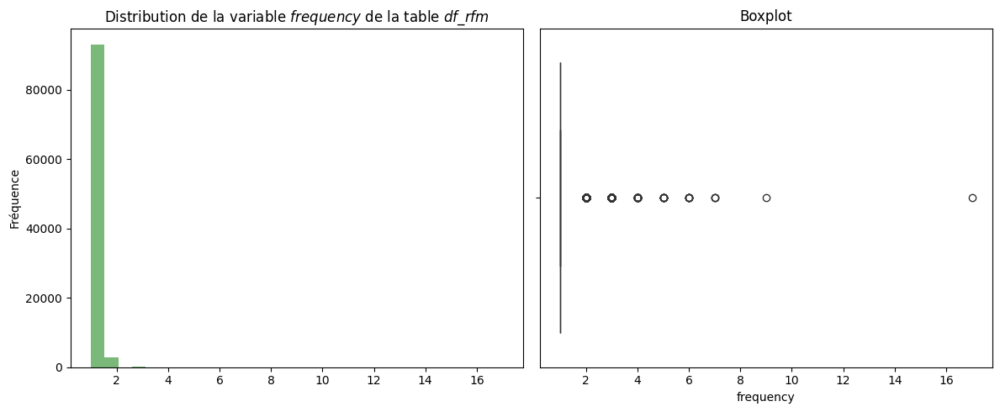
    


    
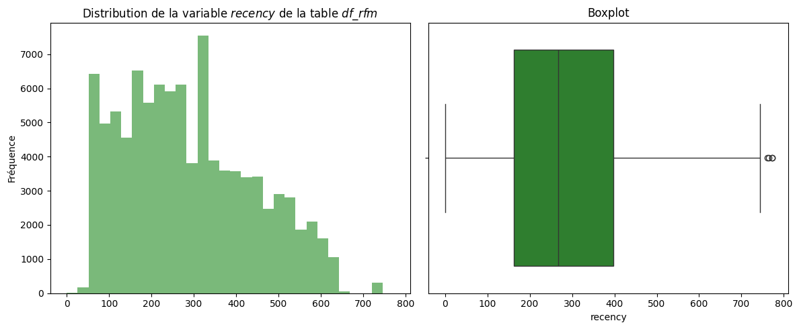
    


    
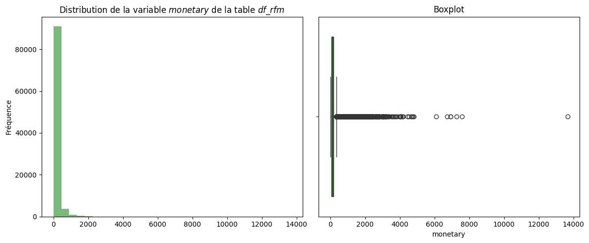
    


### **ENTRAÎNEMENT**


```python
# ==============================
# 1. PRÉPARATION DES DONNÉES
# ==============================

# --- Copie pour analyse métier (brute) ---
df_k_means_rfm_raw = df_rfm.copy()

# --- Exclusion explicite de l'identifiant ---
id_col = 'customer_unique_id'
df_k_means_rfm_raw = df_k_means_rfm_raw.drop(columns=[id_col])

# --- Copie pour clustering (standardisée) ---
df_k_means_rfm_scaled = df_k_means_rfm_raw.select_dtypes(include=['int64', 'float64']).copy()

# --- Standardisation ---
scaler = StandardScaler()
df_k_means_rfm_scaled.loc[:, :] = scaler.fit_transform(df_k_means_rfm_scaled)

```

    C:\Users\barre\AppData\Local\Temp\ipykernel_17200\1790365566.py:17: FutureWarning: Setting an item of incompatible dtype is deprecated and will raise in a future error of pandas. Value '[-0.16236828 -0.16236828 -0.16236828 ... -0.16236828 -0.16236828
     -0.16236828]' has dtype incompatible with int64, please explicitly cast to a compatible dtype first.
      df_k_means_rfm_scaled.loc[:, :] = scaler.fit_transform(df_k_means_rfm_scaled)
    C:\Users\barre\AppData\Local\Temp\ipykernel_17200\1790365566.py:17: FutureWarning: Setting an item of incompatible dtype is deprecated and will raise in a future error of pandas. Value '[-0.83262149 -0.81306654  1.93766244 ...  2.14624852 -0.78047497
      1.59219173]' has dtype incompatible with int64, please explicitly cast to a compatible dtype first.
      df_k_means_rfm_scaled.loc[:, :] = scaler.fit_transform(df_k_means_rfm_scaled)
    


```python
# ==============================
# 2. ÉVALUATION DU NOMBRE DE CLUSTERS (SILHOUETTE + COUDE)
# ==============================

range_n_clusters = range(2, 7)
silhouette_scores = []
inertias = []

for k in range_n_clusters:
    kmeans = KMeans(n_clusters=k, n_init=10, random_state=42)
    labels = kmeans.fit_predict(df_k_means_rfm_scaled)

    silhouette_scores.append(
        silhouette_score(df_k_means_rfm_scaled, labels)
    )
    inertias.append(
        kmeans.inertia_
    )

# --- tableau récap ---
df_kmeans_eval = pd.DataFrame({
    "n_clusters": list(range_n_clusters),
    "silhouette_score": silhouette_scores,
    "inertia": inertias
})

display(df_kmeans_eval)  # <- assure l'affichage du tableau

# --- Courbe silhouette ---
plt.figure(figsize=(6, 4))
plt.plot(
    df_kmeans_eval["n_clusters"],
    df_kmeans_eval["silhouette_score"],
    marker='o',
    color='forestgreen'
)
plt.xlabel("Nombre de clusters (k)")
plt.ylabel("Silhouette score")
plt.title("Silhouette en fonction de k")
plt.grid(True)
plt.show()

# --- Courbe du coude (inertie) ---
plt.figure(figsize=(6, 4))
plt.plot(
    df_kmeans_eval["n_clusters"],
    df_kmeans_eval["inertia"],
    marker='o',
    color='forestgreen'
)
plt.xlabel("Nombre de clusters (k)")
plt.ylabel("Inertie")
plt.title("Méthode du coude")
plt.grid(True)
plt.show()

```


    
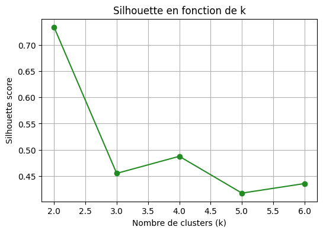
    


    
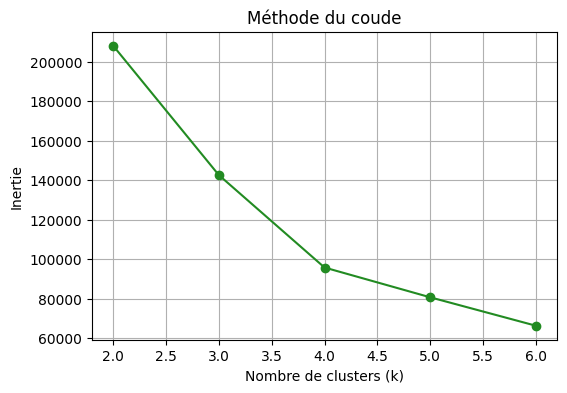
    


```python
display(df_kmeans_eval)
```


<div>
<style scoped>
    .dataframe tbody tr th:only-of-type {
        vertical-align: middle;
    }

    .dataframe tbody tr th {
        vertical-align: top;
    }

    .dataframe thead th {
        text-align: right;
    }
</style>
<table border="1" class="dataframe">
  <thead>
    <tr style="text-align: right;">
      <th></th>
      <th>n_clusters</th>
      <th>silhouette_score</th>
      <th>inertia</th>
    </tr>
  </thead>
  <tbody>
    <tr>
      <th>0</th>
      <td>2</td>
      <td>0.734130</td>
      <td>208205.297085</td>
    </tr>
    <tr>
      <th>1</th>
      <td>3</td>
      <td>0.454920</td>
      <td>142606.374766</td>
    </tr>
    <tr>
      <th>2</th>
      <td>4</td>
      <td>0.487504</td>
      <td>95724.269174</td>
    </tr>
    <tr>
      <th>3</th>
      <td>5</td>
      <td>0.417244</td>
      <td>80620.420764</td>
    </tr>
    <tr>
      <th>4</th>
      <td>6</td>
      <td>0.435513</td>
      <td>66207.650977</td>
    </tr>
  </tbody>
</table>
</div>


```python
# ==============================
# 3. STABILITÉ DES CLUSTERS (k FIXÉ À 4)
# ==============================

k = 4
random_states = [0, 21, 42, 99, 123]
centroids = []

for rs in random_states:
    kmeans = KMeans(n_clusters=k, n_init=10, random_state=rs)
    kmeans.fit(df_k_means_rfm_scaled)
    centroids.append(kmeans.cluster_centers_)

```


```python
# ==============================
# 4. COMPARAISON DES CENTROÏDES ENTRE ITÉRATIONS
# ==============================

reference_centroids = centroids[0]
centroid_distances = []

for c in centroids[1:]:
    distance = np.linalg.norm(reference_centroids - c)
    centroid_distances.append(distance)

centroid_distances

```


    [np.float64(9.57008264884605),
     np.float64(7.589538158501115),
     np.float64(7.471652328914126),
     np.float64(2.4013989750811726)]


```python
# ==============================
# 5. VISUALISATION 3D DES CENTROÏDES
# ==============================

# sélection de 3 itérations représentatives
centroids_to_plot = centroids[:3]
random_states_to_plot = random_states[:3]

# angles différents pour chaque graphique (élévation, azimut)
angles = [
    (20, 30),
    (30, 150),
    (10, 270)
]

fig = plt.figure(figsize=(15, 5))

for i, ((c, rs), (elev, azim)) in enumerate(zip(zip(centroids_to_plot, random_states_to_plot), angles), start=1):
    ax = fig.add_subplot(1, 3, i, projection='3d')
    
    # nuage de points (données)
    ax.scatter(
        df_k_means_review_score_scaled.iloc[:, 0],
        df_k_means_review_score_scaled.iloc[:, 1],
        df_k_means_review_score_scaled.iloc[:, 2],
        s=1,
        alpha=0.1,
        color='gray'  # couleur uniforme pour observations
    )
    
    # centroïdes
    ax.scatter(
        c[:, 0],
        c[:, 1],
        c[:, 2],
        s=120,
        marker='X',
        color='red'
    )
    
    ax.set_title(f"Random state = {rs}")
    ax.set_xlabel(df_k_means_review_score_scaled.columns[0])
    ax.set_ylabel(df_k_means_review_score_scaled.columns[1])
    ax.set_zlabel(df_k_means_review_score_scaled.columns[2])
    
    ax.view_init(elev=elev, azim=azim)

# --- légende globale ---
handles = [
    plt.Line2D([0], [0], marker='o', color='w', label='Observations', markerfacecolor='gray', markersize=8),
    plt.Line2D([0], [0], marker='X', color='w', label='Centroïdes', markerfacecolor='red', markersize=10)
]
fig.legend(handles=handles, loc='upper right', title="Légende")

plt.suptitle("Stabilité des centroïdes – k = 4 (3 itérations)", y=1.05)
plt.tight_layout()
plt.show()

```


    
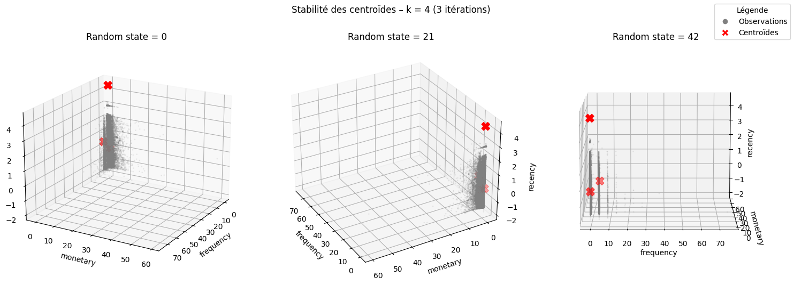
    


```python
# ==============================
# 6. MODÈLE FINAL K-MEANS : 4 CLUSTERS
# ==============================

# --- Choix final basé sur silhouette, stabilité et métier ---
final_k = 4
final_n_init = 20

# --- Entraînement du modèle final ---
kmeans_final = KMeans(
    n_clusters=final_k,
    n_init=final_n_init,
    random_state=42
)

df_k_means_rfm_scaled['cluster'] = kmeans_final.fit_predict(df_k_means_rfm_scaled)

# --- Réinjection des labels dans le dataframe brut ---
df_k_means_rfm_raw['cluster'] = df_k_means_rfm_scaled['cluster']

# --- Métriques finales ---
final_inertia = kmeans_final.inertia_
final_silhouette = silhouette_score(
    df_k_means_rfm_scaled.drop(columns=['cluster']),
    df_k_means_rfm_scaled['cluster']
)

print(f"Inertia finale : {final_inertia:.2f}")
print(f"Silhouette finale : {final_silhouette:.3f}")

# --- Répartition des clusters ---
print("\nRépartition des clusters (proportion) :")
display(
    df_k_means_rfm_raw['cluster']
    .value_counts(normalize=True)
    .sort_index()
    .round(3)
)
```

    Inertia finale : 95724.26
    Silhouette finale : 0.488
    
    Répartition des clusters (proportion) :
    


    cluster
    0    0.542
    1    0.026
    2    0.401
    3    0.031
    Name: proportion, dtype: float64


```python
# ==============================
# SAUVEGARDE DATAFRAME ET MODELE K-MEANS
# ==============================

# chemin de sauvegarde
path_data = r"C:\Users\barre\Documents\Pro\Reconversion_professionnelle\Formations\Data_Scientist_by_Openclassrooms\P05\data"

# --- sauvegarde du DataFrame final avec clusters ---
df_k_means_rfm_scaled.to_csv(f"{path_data}/df_k_means_rfm.csv", index=False)

# --- sauvegarde du modèle KMeans final ---
joblib.dump(kmeans_final, f"{path_data}/kmeans_rfm_4_clusters.joblib")

```


    ---------------------------------------------------------------------------

    NameError                                 Traceback (most recent call last)

    Cell In[28], line 9
          6 path_data = r"C:\Users\barre\Documents\Pro\Reconversion_professionnelle\Formations\Data_Scientist_by_Openclassrooms\P05\data"
          8 # --- sauvegarde du DataFrame final avec clusters ---
    ----> 9 df_k_means_rfm_scaled.to_csv(f"{path_data}/df_k_means_rfm.csv", index=False)
         11 # --- sauvegarde du modèle KMeans final ---
         12 joblib.dump(kmeans_final, f"{path_data}/kmeans_rfm_4_clusters.joblib")
    

    NameError: name 'df_k_means_rfm_scaled' is not defined


```python
# ==============================
# RECHARGEMENT DATAFRAME ET MODELE K-MEANS
# ==============================

# chemin
path_data = r"C:\Users\barre\Documents\Pro\Reconversion_professionnelle\Formations\Data_Scientist_by_Openclassrooms\P05\data"

# --- rechargement du DataFrame ---
df_k_means_rfm_scaled = pd.read_csv(f"{path_data}/df_k_means_rfm.csv")

# --- rechargement du modèle KMeans ---
kmeans_final = joblib.load(f"{path_data}/kmeans_rfm_4_clusters.joblib")

```

### **INTERPRÉTATION DES CLUSTERS**


```python
# ==============================
# PROFIL DU DATAFRAME
# ==============================

# Profil complet du dataframe
df_profile = profile_dataframe(df_k_means_rfm_raw, table_name="df_k_means_rfm_raw")
display(df_profile)

# Profil moyen par cluster pour toutes les variables continues
cols_continuous = ['recency', 'monetary', 'frequency']
cols_continuous = [c for c in cols_continuous if c in df_k_means_rfm_raw.columns]

cluster_means = df_k_means_rfm_raw.groupby('cluster')[cols_continuous].mean().round(2)
display(cluster_means)

# Heatmap du profil moyen
plt.figure(figsize=(7, 4))
sns.heatmap(cluster_means.T, annot=True, fmt=".2f", cmap="Greens")
plt.title("Profil moyen des clusters - Heatmap")
plt.show()

```

    
    === Table : df_k_means_rfm_raw ===
    Taille : 96096 lignes × 4 colonnes
    Clé primaire : non renseignée
    
    --- Tableau de profil ---
    


<div>
<style scoped>
    .dataframe tbody tr th:only-of-type {
        vertical-align: middle;
    }

    .dataframe tbody tr th {
        vertical-align: top;
    }

    .dataframe thead th {
        text-align: right;
    }
</style>
<table border="1" class="dataframe">
  <thead>
    <tr style="text-align: right;">
      <th></th>
      <th>column</th>
      <th>first_value</th>
      <th>dtype</th>
      <th>detailed_type</th>
      <th>n_unique</th>
      <th>pct_duplicates</th>
      <th>pct_missing</th>
      <th>pct_zeros</th>
      <th>min</th>
      <th>q25</th>
      <th>median</th>
      <th>q75</th>
      <th>max</th>
      <th>mean</th>
    </tr>
  </thead>
  <tbody>
    <tr>
      <th>0</th>
      <td>frequency</td>
      <td>1.0</td>
      <td>int64</td>
      <td>numérique</td>
      <td>9</td>
      <td>NaN</td>
      <td>0.0</td>
      <td>0.00</td>
      <td>1.0</td>
      <td>1.00</td>
      <td>1.00</td>
      <td>1.0000</td>
      <td>17.00</td>
      <td>1.03</td>
    </tr>
    <tr>
      <th>1</th>
      <td>recency</td>
      <td>160.0</td>
      <td>int64</td>
      <td>numérique</td>
      <td>630</td>
      <td>NaN</td>
      <td>0.0</td>
      <td>0.00</td>
      <td>0.0</td>
      <td>163.00</td>
      <td>268.00</td>
      <td>397.0000</td>
      <td>772.00</td>
      <td>287.74</td>
    </tr>
    <tr>
      <th>2</th>
      <td>monetary</td>
      <td>141.9</td>
      <td>float64</td>
      <td>numérique</td>
      <td>31718</td>
      <td>NaN</td>
      <td>0.0</td>
      <td>0.70</td>
      <td>0.0</td>
      <td>62.39</td>
      <td>107.27</td>
      <td>182.2375</td>
      <td>13664.08</td>
      <td>164.87</td>
    </tr>
    <tr>
      <th>3</th>
      <td>cluster</td>
      <td>0.0</td>
      <td>int32</td>
      <td>numérique</td>
      <td>4</td>
      <td>NaN</td>
      <td>0.0</td>
      <td>54.19</td>
      <td>0.0</td>
      <td>0.00</td>
      <td>0.00</td>
      <td>1.0000</td>
      <td>3.00</td>
      <td>0.54</td>
    </tr>
  </tbody>
</table>
</div>


<div>
<style scoped>
    .dataframe tbody tr th:only-of-type {
        vertical-align: middle;
    }

    .dataframe tbody tr th {
        vertical-align: top;
    }

    .dataframe thead th {
        text-align: right;
    }
</style>
<table border="1" class="dataframe">
  <thead>
    <tr style="text-align: right;">
      <th></th>
      <th>recency</th>
      <th>monetary</th>
      <th>frequency</th>
    </tr>
    <tr>
      <th>cluster</th>
      <th></th>
      <th></th>
      <th></th>
    </tr>
  </thead>
  <tbody>
    <tr>
      <th>0</th>
      <td>177.49</td>
      <td>134.23</td>
      <td>1.00</td>
    </tr>
    <tr>
      <th>1</th>
      <td>437.99</td>
      <td>132.01</td>
      <td>1.00</td>
    </tr>
    <tr>
      <th>2</th>
      <td>268.24</td>
      <td>285.94</td>
      <td>2.12</td>
    </tr>
    <tr>
      <th>3</th>
      <td>289.72</td>
      <td>1165.63</td>
      <td>1.01</td>
    </tr>
  </tbody>
</table>
</div>


    
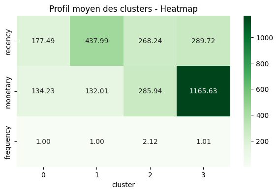
    


```python
# ==============================
# 2. RÉPARTITION DES CLIENTS
# ==============================

# Tableau chiffré des effectifs
cluster_counts = df_k_means_rfm_raw['cluster'].value_counts().sort_index().reset_index()
cluster_counts.columns = ['cluster', 'nb_clients']
display(cluster_counts)

# Barplot
plot_distributions(
    df=cluster_counts,
    columns=["cluster"],
    table_name="cluster_counts",
    show_values={"cluster": "both"},
    agg_col="nb_clients"
)

```


<div>
<style scoped>
    .dataframe tbody tr th:only-of-type {
        vertical-align: middle;
    }

    .dataframe tbody tr th {
        vertical-align: top;
    }

    .dataframe thead th {
        text-align: right;
    }
</style>
<table border="1" class="dataframe">
  <thead>
    <tr style="text-align: right;">
      <th></th>
      <th>cluster</th>
      <th>nb_clients</th>
    </tr>
  </thead>
  <tbody>
    <tr>
      <th>0</th>
      <td>0</td>
      <td>52073</td>
    </tr>
    <tr>
      <th>1</th>
      <td>1</td>
      <td>38558</td>
    </tr>
    <tr>
      <th>2</th>
      <td>2</td>
      <td>2963</td>
    </tr>
    <tr>
      <th>3</th>
      <td>3</td>
      <td>2502</td>
    </tr>
  </tbody>
</table>
</div>


    C:\Users\barre\AppData\Local\Temp\ipykernel_17044\1313166627.py:87: FutureWarning: 
    
    Passing `palette` without assigning `hue` is deprecated and will be removed in v0.14.0. Assign the `x` variable to `hue` and set `legend=False` for the same effect.
    
      ax = sns.barplot(x=x, y=y, palette=colors)
    


    
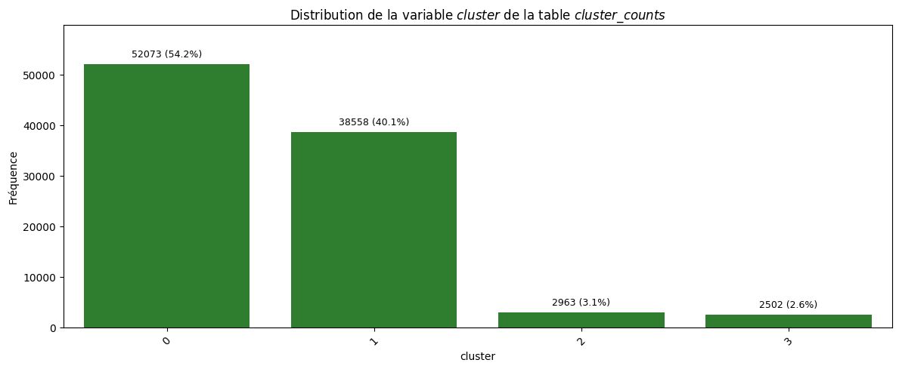
    


```python
# ==============================
# 3. DISTRIBUTIONS DES VARIABLES
# ==============================

features_to_plot = ['recency', 'monetary', 'frequency']
features_to_plot = [f for f in features_to_plot if f in df_k_means_rfm_raw.columns]

# Boucle boxplots + tableau chiffré
for feature in features_to_plot:
    
    # Tableau descriptif par cluster
    desc = (
        df_k_means_rfm_raw
        .groupby('cluster')[feature]
        .describe()
        .T
        .round(2)
    )

    print(f"\nTable descriptive – variable : {feature} | table : df_k_means_rfm_raw")
    display(desc)

    # Boxplot
    plot_distributions(
        df=df_k_means_rfm_raw,
        columns=feature,
        table_name="df_k_means_rfm_raw"
    )

```

    
    Table descriptive – variable : recency | table : df_k_means_rfm_raw
    


<div>
<style scoped>
    .dataframe tbody tr th:only-of-type {
        vertical-align: middle;
    }

    .dataframe tbody tr th {
        vertical-align: top;
    }

    .dataframe thead th {
        text-align: right;
    }
</style>
<table border="1" class="dataframe">
  <thead>
    <tr style="text-align: right;">
      <th>cluster</th>
      <th>0</th>
      <th>1</th>
      <th>2</th>
      <th>3</th>
    </tr>
  </thead>
  <tbody>
    <tr>
      <th>count</th>
      <td>52073.00</td>
      <td>38558.00</td>
      <td>2963.00</td>
      <td>2502.00</td>
    </tr>
    <tr>
      <th>mean</th>
      <td>177.49</td>
      <td>437.99</td>
      <td>268.24</td>
      <td>289.72</td>
    </tr>
    <tr>
      <th>std</th>
      <td>72.86</td>
      <td>96.62</td>
      <td>145.41</td>
      <td>152.62</td>
    </tr>
    <tr>
      <th>min</th>
      <td>0.00</td>
      <td>308.00</td>
      <td>0.00</td>
      <td>49.00</td>
    </tr>
    <tr>
      <th>25%</th>
      <td>114.00</td>
      <td>350.00</td>
      <td>152.00</td>
      <td>162.00</td>
    </tr>
    <tr>
      <th>50%</th>
      <td>179.00</td>
      <td>425.00</td>
      <td>248.00</td>
      <td>274.00</td>
    </tr>
    <tr>
      <th>75%</th>
      <td>239.00</td>
      <td>512.00</td>
      <td>366.50</td>
      <td>399.00</td>
    </tr>
    <tr>
      <th>max</th>
      <td>309.00</td>
      <td>772.00</td>
      <td>740.00</td>
      <td>742.00</td>
    </tr>
  </tbody>
</table>
</div>


    

    


    
    Table descriptive – variable : monetary | table : df_k_means_rfm_raw
    


<div>
<style scoped>
    .dataframe tbody tr th:only-of-type {
        vertical-align: middle;
    }

    .dataframe tbody tr th {
        vertical-align: top;
    }

    .dataframe thead th {
        text-align: right;
    }
</style>
<table border="1" class="dataframe">
  <thead>
    <tr style="text-align: right;">
      <th>cluster</th>
      <th>0</th>
      <th>1</th>
      <th>2</th>
      <th>3</th>
    </tr>
  </thead>
  <tbody>
    <tr>
      <th>count</th>
      <td>52073.00</td>
      <td>38558.00</td>
      <td>2963.00</td>
      <td>2502.00</td>
    </tr>
    <tr>
      <th>mean</th>
      <td>134.23</td>
      <td>132.01</td>
      <td>285.94</td>
      <td>1165.63</td>
    </tr>
    <tr>
      <th>std</th>
      <td>107.51</td>
      <td>108.53</td>
      <td>224.84</td>
      <td>677.29</td>
    </tr>
    <tr>
      <th>min</th>
      <td>0.00</td>
      <td>0.00</td>
      <td>0.00</td>
      <td>634.83</td>
    </tr>
    <tr>
      <th>25%</th>
      <td>60.60</td>
      <td>59.73</td>
      <td>142.46</td>
      <td>777.40</td>
    </tr>
    <tr>
      <th>50%</th>
      <td>103.53</td>
      <td>100.13</td>
      <td>221.93</td>
      <td>937.24</td>
    </tr>
    <tr>
      <th>75%</th>
      <td>170.46</td>
      <td>165.82</td>
      <td>353.15</td>
      <td>1332.66</td>
    </tr>
    <tr>
      <th>max</th>
      <td>685.88</td>
      <td>721.71</td>
      <td>2400.48</td>
      <td>13664.08</td>
    </tr>
  </tbody>
</table>
</div>


    
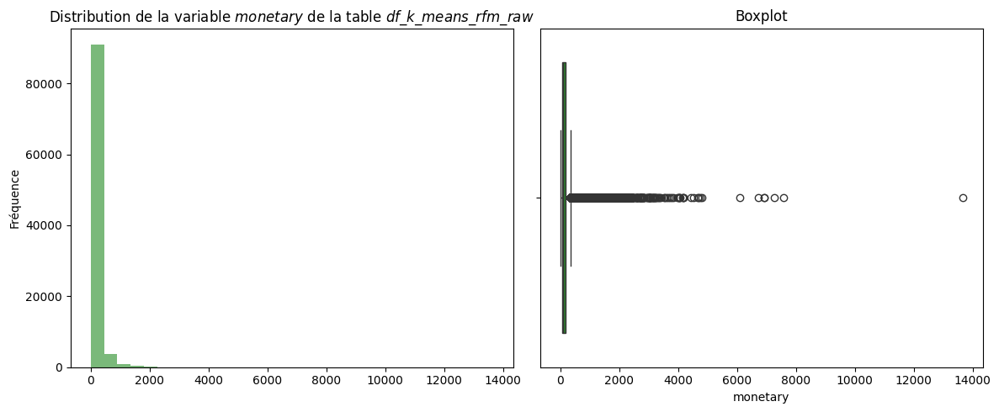
    


    
    Table descriptive – variable : frequency | table : df_k_means_rfm_raw
    


<div>
<style scoped>
    .dataframe tbody tr th:only-of-type {
        vertical-align: middle;
    }

    .dataframe tbody tr th {
        vertical-align: top;
    }

    .dataframe thead th {
        text-align: right;
    }
</style>
<table border="1" class="dataframe">
  <thead>
    <tr style="text-align: right;">
      <th>cluster</th>
      <th>0</th>
      <th>1</th>
      <th>2</th>
      <th>3</th>
    </tr>
  </thead>
  <tbody>
    <tr>
      <th>count</th>
      <td>52073.0</td>
      <td>38558.0</td>
      <td>2963.00</td>
      <td>2502.00</td>
    </tr>
    <tr>
      <th>mean</th>
      <td>1.0</td>
      <td>1.0</td>
      <td>2.12</td>
      <td>1.01</td>
    </tr>
    <tr>
      <th>std</th>
      <td>0.0</td>
      <td>0.0</td>
      <td>0.52</td>
      <td>0.13</td>
    </tr>
    <tr>
      <th>min</th>
      <td>1.0</td>
      <td>1.0</td>
      <td>2.00</td>
      <td>1.00</td>
    </tr>
    <tr>
      <th>25%</th>
      <td>1.0</td>
      <td>1.0</td>
      <td>2.00</td>
      <td>1.00</td>
    </tr>
    <tr>
      <th>50%</th>
      <td>1.0</td>
      <td>1.0</td>
      <td>2.00</td>
      <td>1.00</td>
    </tr>
    <tr>
      <th>75%</th>
      <td>1.0</td>
      <td>1.0</td>
      <td>2.00</td>
      <td>1.00</td>
    </tr>
    <tr>
      <th>max</th>
      <td>1.0</td>
      <td>1.0</td>
      <td>17.00</td>
      <td>4.00</td>
    </tr>
  </tbody>
</table>
</div>


    
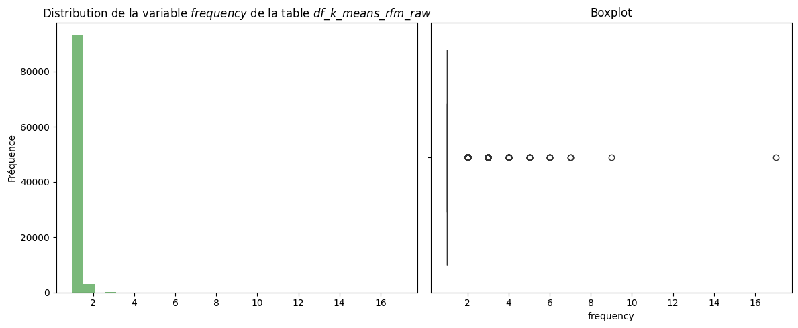
    


```python
# ==============================
# 4. AFFICHAGE 3D
# ==============================

# Choix explicite des variables métier
x_var = 'recency'
y_var = 'frequency'
z_var = 'monetary'

# Vérification de présence
vars_3d = [x_var, y_var, z_var]
vars_3d = [v for v in vars_3d if v in df_k_means_rfm_raw.columns]

# Angles de vue
angles = [
    (30, 45, "Vue 1"),
    (20, 120, "Vue 2"),
    (10, 200, "Vue 3")
]

fig = plt.figure(figsize=(18, 6))

# clusters uniques
clusters = sorted(df_k_means_rfm_raw['cluster'].unique())
colors = plt.cm.tab10(range(len(clusters)))

# mapping cluster -> couleur
cluster_color_map = {cluster: colors[i] for i, cluster in enumerate(clusters)}

for i, (elev, azim, title) in enumerate(angles, start=1):
    ax = fig.add_subplot(1, 3, i, projection='3d')

    for cluster in clusters:
        data = df_k_means_rfm_raw[df_k_means_rfm_raw['cluster'] == cluster]

        ax.scatter(
            data[x_var],
            data[y_var],
            data[z_var],
            c=[cluster_color_map[cluster]],
            alpha=0.6,
            s=40
        )

    ax.set_xlabel(x_var)
    ax.set_ylabel(y_var)
    ax.set_zlabel(z_var)
    ax.set_title(title)
    ax.view_init(elev=elev, azim=azim)

# légende globale
handles = [Line2D([0], [0], marker='o', color='w', label=f'Cluster {c}',
                  markerfacecolor=cluster_color_map[c], markersize=10) for c in clusters]
fig.legend(handles=handles, loc='upper right', title="Clusters")

plt.tight_layout()
plt.show()

```


    
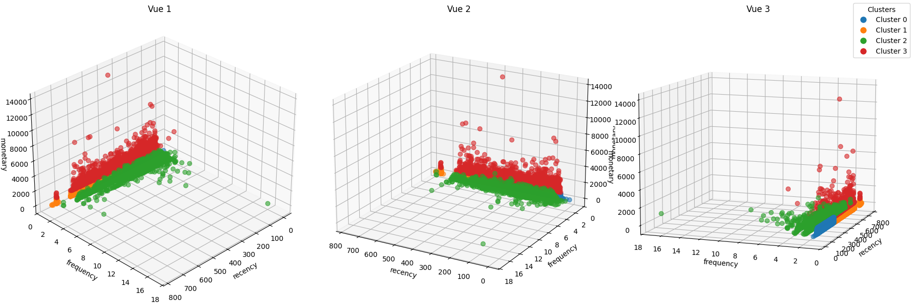
    


### **ANALYSE DU CLUSTERING K-MEANS V1 (RFM SANS REVIEW_SCORE)**

#### **STRUCTURE DU JEU DE DONNÉES**

| Élément | Valeur |
|------|------|
| Taille du jeu de données | 96 096 lignes |
| Variables quantitatives | frequency, recency, monetary |
| Variable de segmentation | cluster |
| Méthode de clustering | K-Means |
| Standardisation | oui (StandardScaler) |
| Valeurs manquantes | 0 % |
| Zéros | présents (monetary, recency) |
| Nombre de clusters retenu | 4 |
| Échantillonnage | non (jeu complet) |

Variables utilisées  
- `frequency` : nombre d’achats par client  
- `recency` : nombre de jours depuis le dernier achat (plus bas = plus récent)  
- `monetary` : valeur totale dépensée  

____
#### **CHOIX DU NOMBRE DE CLUSTERS**

| k | Silhouette score | Inertie |
|--|------------------|---------|
| 2 | **0.734** | 208 205 |
| 3 | 0.455 | 142 606 |
| 4 | **0.488** | **95 724** |
| 5 | 0.417 | 80 620 |
| 6 | 0.436 | 66 208 |

- k=2 maximise la silhouette mais produit une segmentation **trop grossière**.
- k=4 offre :
  - une nette baisse de l’inertie
  - une silhouette encore correcte (**0.488**)
  - des profils clients bien différenciés
- Au-delà de k=4 :
  - gain limité en inertie
  - perte de lisibilité métier

→ **k=4 retenu comme compromis optimal**.

____
#### **QUALITÉ GLOBALE DU CLUSTERING**

- Silhouette finale : **0.488**
- Inertie finale : **95 724**
- Clusters bien séparés sur :
  - `recency`
  - `monetary`
- `frequency` joue un rôle secondaire mais discriminant pour un cluster spécifique

→ Clustering **robuste et stable**, cohérent avec une segmentation RFM classique.

____
#### **RÉPARTITION DES CLUSTERS**

| Cluster | Nb clients | Part |
|------|-----------|------|
| 0 | 52 073 | 54.2 % |
| 1 | 38 558 | 40.1 % |
| 2 | 2 963 | 3.1 % |
| 3 | 2 502 | 2.6 % |

→ Segmentation très **déséquilibrée**, structure typique :
- deux clusters majoritaires
- deux segments spécifiques à forte valeur ou forte récurrence

____
#### **PROFIL MOYEN DES CLUSTERS**

| Cluster | Recency | Monetary | Frequency |
|------|--------|----------|-----------|
| 0 | 177.49 | 134.23 | 1.00 |
| 1 | 437.99 | 132.01 | 1.00 |
| 2 | 268.24 | 285.94 | 2.12 |
| 3 | 289.72 | 1165.63 | 1.01 |

____
#### **INTERPRÉTATION MÉTIER DES CLUSTERS**

**Cluster 0 — Clients récents standards**  
- Recency faible (≈ 177 jours)  
- Dépense faible à moyenne  
- Achat unique  
→ **Cœur de clientèle active**, volume principal.

**Cluster 1 — Clients anciens peu actifs**  
- Recency très élevée (> 430 jours)  
- Dépense comparable au cluster 0  
- Achat unique  
→ Clients **en dormance**, cible de réactivation.

**Cluster 2 — Clients fidèles à valeur intermédiaire**  
- Frequency > 2  
- Monetary intermédiaire  
- Recency moyenne  
→ Clients **fidèles**, bons candidats à des actions de fidélisation.

**Cluster 3 — Très gros dépensiers**  
- Monetary extrêmement élevé (> 1 100)  
- Frequency proche de 1  
- Segment très réduit  
→ Clients **stratégiques**, fortement contributeurs au CA.

____
#### **ANALYSE DÉTAILLÉE PAR VARIABLE**

**Recency**
- Variable la plus structurante :
  - cluster 0 très récent
  - cluster 1 très ancien
→ Séparation temporelle nette des comportements clients.

**Monetary**
- Rupture très marquée pour le cluster 3
- Cluster 2 se distingue clairement du reste
→ Bonne détection des clients à forte valeur.

**Frequency**
- Majoritairement égale à 1
- Cluster 2 isolé par une fréquence plus élevée
→ Variable secondaire mais clé pour identifier la fidélité.

____
#### **CONCLUSION GLOBALE**

- K-Means sans `review_score` produit une **segmentation RFM classique, stable et lisible**.
- Les axes majeurs de segmentation sont :
  - récence
  - valeur
  - fidélité
- Méthode bien adaptée pour :
  - segmentation opérationnelle
  - ciblage marketing à grande échelle
- Limites :
  - absence de dimension satisfaction client
  - clusters contraints à des formes sphériques
- Cette segmentation constitue une **base solide**, enrichissable par l’ajout de variables métier (ex. satisfaction, churn).


# **K-MEANS_V2**

### **FEATURE ENGINEERING**


```python
# ============================================================
# 1. AGRÉGATION AU NIVEAU COMMANDE (MONETARY)
# ============================================================

order_value = (
    order_items
    .groupby('order_id', as_index=False)
    .agg(
        order_total_value=('price', 'sum'),
        freight_total=('freight_value', 'sum')
    )
)
order_value['order_total_value'] += order_value['freight_total']


# ============================================================
# 2. ENRICHISSEMENT DES COMMANDES
# ============================================================

orders_rfm = (
    orders
    .merge(order_value, on='order_id', how='left')
    .merge(
        customers[['customer_id', 'customer_unique_id']],
        on='customer_id',
        how='left'
    )
)

orders_rfm['order_purchase_timestamp'] = pd.to_datetime(
    orders_rfm['order_purchase_timestamp']
)


# ============================================================
# 3. AGRÉGATION CLIENT — VARIABLES RFM
# ============================================================

df_rfm = (
    orders_rfm
    .groupby('customer_unique_id', as_index=False)
    .agg(
        frequency=('order_id', 'nunique'),
        monetary=('order_total_value', 'sum'),
        last_order_date=('order_purchase_timestamp', 'max')
    )
)

# ============================================================
# 4. CALCUL DE LA RECENCY
# ============================================================

reference_date = df_rfm['last_order_date'].max()

df_rfm['recency'] = (
    reference_date - df_rfm['last_order_date']
).dt.days


# ============================================================
# 5. AJOUT DU REVIEW_SCORE MOYEN PAR CLIENT
# ============================================================

# Agrégation review_score au niveau client
df_review_score = (
    order_reviews
    .groupby('order_id', as_index=False)
    .agg(review_score=('review_score', 'mean'))
    .merge(orders[['order_id', 'customer_id']], on='order_id', how='left')
    .merge(customers[['customer_id', 'customer_unique_id']], on='customer_id', how='left')
)

# Moyenne du review_score par client
df_review_score = (
    df_review_score
    .groupby('customer_unique_id', as_index=False)
    .agg(review_score=('review_score', 'mean'))
)

# ============================================================
# 6. TABLE FINALE RFM + REVIEW
# ============================================================

df_review_score = df_rfm.merge(df_review_score, on='customer_unique_id', how='left')

```


```python
# ==============================
# PROFIL – REMPLACEMENT DES NaN
# ==============================

# Remplacer les NaN dans review_score par 5 (clients considérés satisfaits)
df_review_score['review_score'] = df_review_score['review_score'].fillna(5)

# --- Profil du dataframe ---
profile_df_rfm = profile_dataframe(df_review_score, "df_review_score")
display(profile_df_rfm)

# --- Affichage des distributions ---
plot_distributions(
    df_review_score,
    ['frequency', 'recency', 'monetary', 'review_score'],
    table_name="df_review_score"
)
```

    
    === Table : df_review_score ===
    Taille : 96096 lignes × 6 colonnes
    Clé primaire : non renseignée
    
    --- Tableau de profil ---
    


<div>
<style scoped>
    .dataframe tbody tr th:only-of-type {
        vertical-align: middle;
    }

    .dataframe tbody tr th {
        vertical-align: top;
    }

    .dataframe thead th {
        text-align: right;
    }
</style>
<table border="1" class="dataframe">
  <thead>
    <tr style="text-align: right;">
      <th></th>
      <th>column</th>
      <th>first_value</th>
      <th>dtype</th>
      <th>detailed_type</th>
      <th>n_unique</th>
      <th>pct_duplicates</th>
      <th>pct_missing</th>
      <th>pct_zeros</th>
      <th>min</th>
      <th>q25</th>
      <th>median</th>
      <th>q75</th>
      <th>max</th>
      <th>mean</th>
    </tr>
  </thead>
  <tbody>
    <tr>
      <th>0</th>
      <td>customer_unique_id</td>
      <td>0000366f3b9a7992bf8c76cfdf3221e2</td>
      <td>object</td>
      <td>texte</td>
      <td>96096</td>
      <td>NaN</td>
      <td>0.0</td>
      <td>NaN</td>
      <td>NaN</td>
      <td>NaN</td>
      <td>NaN</td>
      <td>NaN</td>
      <td>NaN</td>
      <td>NaN</td>
    </tr>
    <tr>
      <th>1</th>
      <td>frequency</td>
      <td>1</td>
      <td>int64</td>
      <td>numérique</td>
      <td>9</td>
      <td>NaN</td>
      <td>0.0</td>
      <td>0.0</td>
      <td>1</td>
      <td>1.0</td>
      <td>1.0</td>
      <td>1.0</td>
      <td>17</td>
      <td>1.03</td>
    </tr>
    <tr>
      <th>2</th>
      <td>monetary</td>
      <td>141.9</td>
      <td>float64</td>
      <td>numérique</td>
      <td>31718</td>
      <td>NaN</td>
      <td>0.0</td>
      <td>0.7</td>
      <td>0.0</td>
      <td>62.39</td>
      <td>107.27</td>
      <td>182.2375</td>
      <td>13664.08</td>
      <td>164.87</td>
    </tr>
    <tr>
      <th>3</th>
      <td>last_order_date</td>
      <td>2018-05-10 10:56:27</td>
      <td>datetime64[ns]</td>
      <td>date</td>
      <td>95834</td>
      <td>NaN</td>
      <td>0.0</td>
      <td>NaN</td>
      <td>2016-09-04 21:15:19</td>
      <td>2017-09-15 09:04:17.249999872</td>
      <td>2018-01-21 19:39:16</td>
      <td>2018-05-06 20:14:49.750000128</td>
      <td>2018-10-17 17:30:18</td>
      <td>NaN</td>
    </tr>
    <tr>
      <th>4</th>
      <td>recency</td>
      <td>160</td>
      <td>int64</td>
      <td>numérique</td>
      <td>630</td>
      <td>NaN</td>
      <td>0.0</td>
      <td>0.0</td>
      <td>0</td>
      <td>163.0</td>
      <td>268.0</td>
      <td>397.0</td>
      <td>772</td>
      <td>287.74</td>
    </tr>
    <tr>
      <th>5</th>
      <td>review_score</td>
      <td>5.0</td>
      <td>float64</td>
      <td>numérique</td>
      <td>34</td>
      <td>NaN</td>
      <td>0.0</td>
      <td>0.0</td>
      <td>1.0</td>
      <td>4.0</td>
      <td>5.0</td>
      <td>5.0</td>
      <td>5.0</td>
      <td>4.09</td>
    </tr>
  </tbody>
</table>
</div>


    
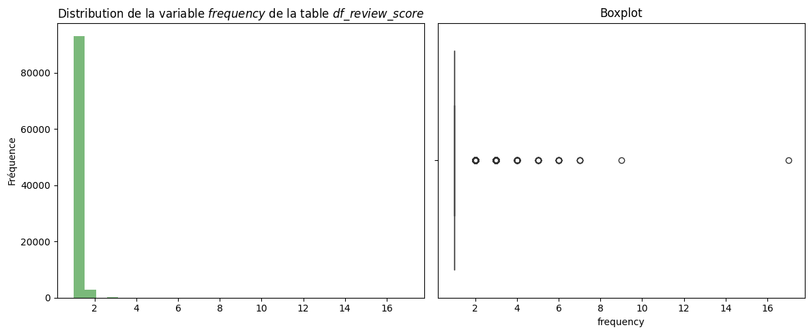
    


    
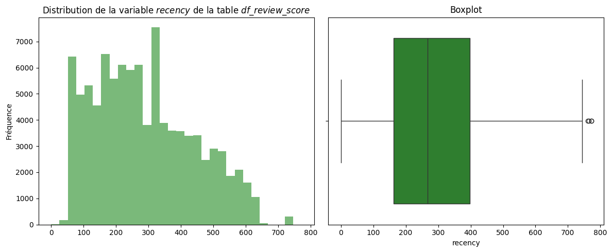
    


    
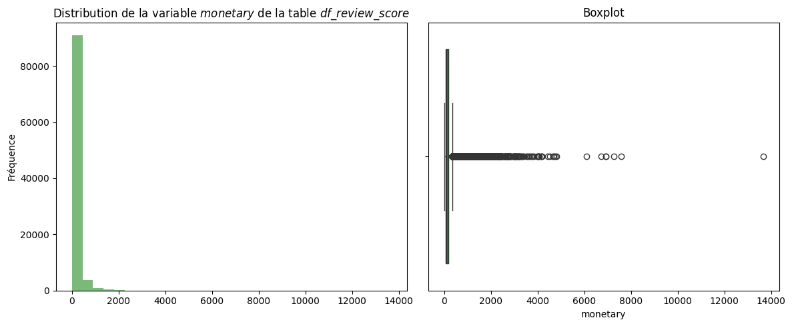
    


    

    


### **ENTRAÎNEMENT**


```python
# ==============================
# 1. PRÉPARATION DES DONNÉES
# ==============================

# --- Copie pour analyse métier (brute) ---
df_k_means_review_score_raw = df_review_score.copy()

# --- Exclusion explicite de l'identifiant ---
id_col = 'customer_unique_id'
df_k_means_review_score_raw = df_k_means_review_score_raw.drop(columns=[id_col])

# --- Copie pour clustering (standardisée) ---
df_k_means_review_score_scaled = df_k_means_review_score_raw.select_dtypes(include=['int64', 'float64']).copy()

# --- Standardisation ---
scaler = StandardScaler()
df_k_means_review_score_scaled.loc[:, :] = scaler.fit_transform(df_k_means_review_score_scaled)
```

    C:\Users\barre\AppData\Local\Temp\ipykernel_10792\1622625438.py:17: FutureWarning: Setting an item of incompatible dtype is deprecated and will raise in a future error of pandas. Value '[-0.16236828 -0.16236828 -0.16236828 ... -0.16236828 -0.16236828
     -0.16236828]' has dtype incompatible with int64, please explicitly cast to a compatible dtype first.
      df_k_means_review_score_scaled.loc[:, :] = scaler.fit_transform(df_k_means_review_score_scaled)
    C:\Users\barre\AppData\Local\Temp\ipykernel_10792\1622625438.py:17: FutureWarning: Setting an item of incompatible dtype is deprecated and will raise in a future error of pandas. Value '[-0.83262149 -0.81306654  1.93766244 ...  2.14624852 -0.78047497
      1.59219173]' has dtype incompatible with int64, please explicitly cast to a compatible dtype first.
      df_k_means_review_score_scaled.loc[:, :] = scaler.fit_transform(df_k_means_review_score_scaled)
    


```python
# ==============================
# 2. ÉVALUATION DU NOMBRE DE CLUSTERS (SILHOUETTE + COUDE)
# ==============================

range_n_clusters = range(2, 7)
silhouette_scores = []
inertias = []

for k in range_n_clusters:
    kmeans = KMeans(n_clusters=k, n_init=10, random_state=42)
    labels = kmeans.fit_predict(df_k_means_review_score_scaled)

    silhouette_scores.append(
        silhouette_score(df_k_means_review_score_scaled, labels)
    )
    inertias.append(
        kmeans.inertia_
    )

# --- tableau récap ---
df_kmeans_eval = pd.DataFrame({
    "n_clusters": list(range_n_clusters),
    "silhouette_score": silhouette_scores,
    "inertia": inertias
})

# afficher le tableau
display(df_kmeans_eval)

# --- Courbe silhouette ---
plt.figure(figsize=(6, 4))
plt.plot(
    df_kmeans_eval["n_clusters"],
    df_kmeans_eval["silhouette_score"],
    marker='o',
    color='forestgreen'
)
plt.xlabel("Nombre de clusters (k)")
plt.ylabel("Silhouette score")
plt.title("Silhouette en fonction de k")
plt.grid(True)
plt.show()

# --- Courbe du coude (inertie) ---
plt.figure(figsize=(6, 4))
plt.plot(
    df_kmeans_eval["n_clusters"],
    df_kmeans_eval["inertia"],
    marker='o',
    color='forestgreen'
)
plt.xlabel("Nombre de clusters (k)")
plt.ylabel("Inertie")
plt.title("Méthode du coude")
plt.grid(True)
plt.show()

```


<div>
<style scoped>
    .dataframe tbody tr th:only-of-type {
        vertical-align: middle;
    }

    .dataframe tbody tr th {
        vertical-align: top;
    }

    .dataframe thead th {
        text-align: right;
    }
</style>
<table border="1" class="dataframe">
  <thead>
    <tr style="text-align: right;">
      <th></th>
      <th>n_clusters</th>
      <th>silhouette_score</th>
      <th>inertia</th>
    </tr>
  </thead>
  <tbody>
    <tr>
      <th>0</th>
      <td>2</td>
      <td>0.375333</td>
      <td>306266.952221</td>
    </tr>
    <tr>
      <th>1</th>
      <td>3</td>
      <td>0.411639</td>
      <td>227779.895992</td>
    </tr>
    <tr>
      <th>2</th>
      <td>4</td>
      <td>0.395233</td>
      <td>172570.603043</td>
    </tr>
    <tr>
      <th>3</th>
      <td>5</td>
      <td>0.417788</td>
      <td>127698.361297</td>
    </tr>
    <tr>
      <th>4</th>
      <td>6</td>
      <td>0.424773</td>
      <td>114458.208673</td>
    </tr>
  </tbody>
</table>
</div>


    
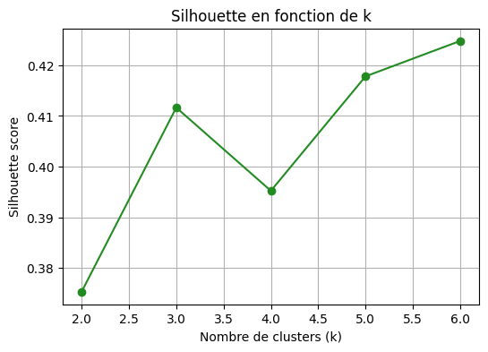
    


    
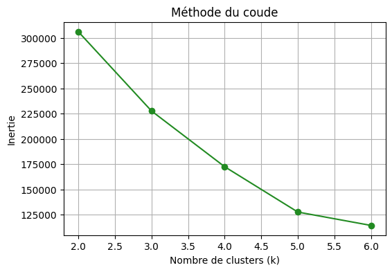
    


```python
# ==============================
# 3. STABILITÉ DES CLUSTERS (k FIXÉ À 5)
# ==============================

k = 5
random_states = [0, 21, 42, 99, 123]
centroids = []

for rs in random_states:
    kmeans = KMeans(n_clusters=k, n_init=10, random_state=rs)
    kmeans.fit(df_k_means_review_score_scaled)
    centroids.append(kmeans.cluster_centers_)

```


```python
# ==============================
# 4. COMPARAISON DES CENTROÏDES ENTRE ITÉRATIONS
# ==============================

reference_centroids = centroids[0]
centroid_distances = []

for c in centroids[1:]:
    distance = np.linalg.norm(reference_centroids - c)
    centroid_distances.append(distance)

centroid_distances
```


    [np.float64(10.72119168340066),
     np.float64(8.069741916776325),
     np.float64(7.763001772462415),
     np.float64(10.481383812788078)]


```python
# ==============================
# 5. VISUALISATION 3D DES CENTROÏDES
# ==============================

# sélection de 3 itérations représentatives
centroids_to_plot = centroids[:3]
random_states_to_plot = random_states[:3]

# angles différents pour chaque graphique (élévation, azimut)
angles = [
    (20, 30),
    (30, 150),
    (10, 270)
]

fig = plt.figure(figsize=(15, 5))

for i, ((c, rs), (elev, azim)) in enumerate(zip(zip(centroids_to_plot, random_states_to_plot), angles), start=1):
    ax = fig.add_subplot(1, 3, i, projection='3d')
    
    # nuage de points (données)
    ax.scatter(
        df_k_means_review_score_scaled.iloc[:, 0],
        df_k_means_review_score_scaled.iloc[:, 1],
        df_k_means_review_score_scaled.iloc[:, 2],
        s=1,
        alpha=0.1,
        color='gray'  # couleur uniforme pour observations
    )
    
    # centroïdes
    ax.scatter(
        c[:, 0],
        c[:, 1],
        c[:, 2],
        s=120,
        marker='X',
        color='red'
    )
    
    ax.set_title(f"Random state = {rs}")
    ax.set_xlabel(df_k_means_review_score_scaled.columns[0])
    ax.set_ylabel(df_k_means_review_score_scaled.columns[1])
    ax.set_zlabel(df_k_means_review_score_scaled.columns[2])
    
    ax.view_init(elev=elev, azim=azim)

# --- légende globale ---
handles = [
    plt.Line2D([0], [0], marker='o', color='w', label='Observations', markerfacecolor='gray', markersize=8),
    plt.Line2D([0], [0], marker='X', color='w', label='Centroïdes', markerfacecolor='red', markersize=10)
]
fig.legend(handles=handles, loc='upper right', title="Légende")

plt.suptitle("Stabilité des centroïdes – k = 4 (3 itérations)", y=1.05)
plt.tight_layout()
plt.show()

```


    
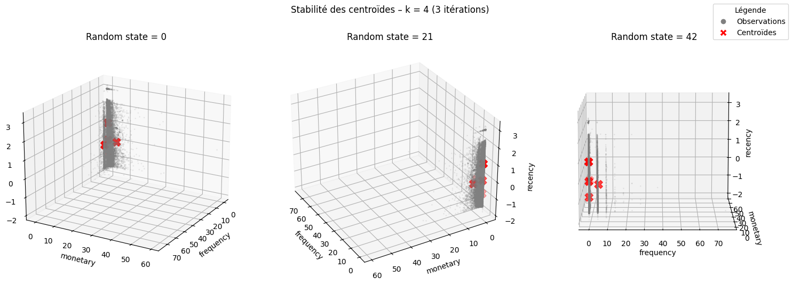
    


```python
# ============================================================
# 6. MODÈLE FINAL K-MEANS
# ============================================================

final_k = 5
final_n_init = 20

kmeans_final = KMeans(n_clusters=final_k, n_init=final_n_init, random_state=42)

# --- Ajout des clusters au df standardisé ---
df_k_means_review_score_scaled['cluster'] = kmeans_final.fit_predict(df_k_means_review_score_scaled)

# --- Réinjection des labels dans le dataframe brut ---
df_k_means_review_score_raw['cluster'] = df_k_means_review_score_scaled['cluster']

# --- S'assurer que les colonnes nécessaires à la maintenance sont présentes ---
if 'customer_unique_id' not in df_k_means_review_score_raw.columns:
    df_k_means_review_score_raw['customer_unique_id'] = df_rfm['customer_unique_id']

if 'last_order_date' not in df_k_means_review_score_raw.columns:
    df_k_means_review_score_raw['last_order_date'] = df_rfm['last_order_date']

# --- Métriques finales ---
final_inertia = kmeans_final.inertia_
final_silhouette = silhouette_score(
    df_k_means_review_score_scaled.drop(columns=['cluster']),
    df_k_means_review_score_scaled['cluster']
)
print(f"Inertia finale : {final_inertia:.2f}")
print(f"Silhouette finale : {final_silhouette:.3f}")

# --- Répartition des clusters ---
display(df_k_means_review_score_raw['cluster'].value_counts(normalize=True).sort_index().round(3))

```

    Inertia finale : 127698.35
    Silhouette finale : 0.418
    


    cluster
    0    0.441
    1    0.332
    2    0.031
    3    0.175
    4    0.022
    Name: proportion, dtype: float64


```python
# ============================================================
# SAUVEGARDE DATAFRAME ET MODELE
# ============================================================

path_data = r"C:\Users\barre\Documents\Pro\Reconversion_professionnelle\Formations\Data_Scientist_by_Openclassrooms\P05\data"

# Sauvegarde df standardisé et modèle
df_k_means_review_score_scaled.to_csv(f"{path_data}/df_k_means_review_score_scaled.csv", index=False)
joblib.dump(kmeans_final, f"{path_data}/kmeans_review_score_final.joblib")

# Rechargement
df_k_means_review_score_scaled = pd.read_csv(f"{path_data}/df_k_means_review_score_scaled.csv")
kmeans_final = joblib.load(f"{path_data}/kmeans_review_score_final.joblib")

```


```python
# ==============================
# RECHARGEMENT DATAFRAME ET MODELE K-MEANS
# ==============================

# --- rechargement du DataFrame ---
df_k_means_review_score_scaled = pd.read_csv(f"{path_data}/df_k_means_review_score.csv")

# --- rechargement du modèle KMeans ---
kmeans_final = joblib.load(f"{path_data}/kmeans_review_score_5_clusters.joblib")
```

### **INTERPRÉTATION DES CLUSTERS**


```python
# ==============================
# PROFIL DU DATAFRAME
# ==============================

# Profil complet
df_profile = profile_dataframe(df_k_means_review_score_raw, table_name="df_k_means_review_score_raw")
display(df_profile)

# Profil moyen par cluster
cols_continuous = ['recency', 'monetary', 'frequency', 'review_score']
cluster_means = df_k_means_review_score_raw.groupby('cluster')[cols_continuous].mean().round(2)
display(cluster_means)

# Heatmap
plt.figure(figsize=(8, 4))
sns.heatmap(cluster_means.T, annot=True, fmt=".2f", cmap="Greens")
plt.title("Profil moyen des clusters - Heatmap")
plt.show()

```

    
    === Table : df_k_means_review_score_raw ===
    Taille : 96096 lignes × 7 colonnes
    Clé primaire : non renseignée
    
    --- Tableau de profil ---
    


<div>
<style scoped>
    .dataframe tbody tr th:only-of-type {
        vertical-align: middle;
    }

    .dataframe tbody tr th {
        vertical-align: top;
    }

    .dataframe thead th {
        text-align: right;
    }
</style>
<table border="1" class="dataframe">
  <thead>
    <tr style="text-align: right;">
      <th></th>
      <th>column</th>
      <th>first_value</th>
      <th>dtype</th>
      <th>detailed_type</th>
      <th>n_unique</th>
      <th>pct_duplicates</th>
      <th>pct_missing</th>
      <th>pct_zeros</th>
      <th>min</th>
      <th>q25</th>
      <th>median</th>
      <th>q75</th>
      <th>max</th>
      <th>mean</th>
    </tr>
  </thead>
  <tbody>
    <tr>
      <th>0</th>
      <td>frequency</td>
      <td>1</td>
      <td>int64</td>
      <td>numérique</td>
      <td>9</td>
      <td>NaN</td>
      <td>0.0</td>
      <td>0.00</td>
      <td>1</td>
      <td>1.0</td>
      <td>1.0</td>
      <td>1.0</td>
      <td>17</td>
      <td>1.03</td>
    </tr>
    <tr>
      <th>1</th>
      <td>monetary</td>
      <td>141.9</td>
      <td>float64</td>
      <td>numérique</td>
      <td>31718</td>
      <td>NaN</td>
      <td>0.0</td>
      <td>0.70</td>
      <td>0.0</td>
      <td>62.39</td>
      <td>107.27</td>
      <td>182.2375</td>
      <td>13664.08</td>
      <td>164.87</td>
    </tr>
    <tr>
      <th>2</th>
      <td>last_order_date</td>
      <td>2018-05-10 10:56:27</td>
      <td>datetime64[ns]</td>
      <td>date</td>
      <td>95834</td>
      <td>NaN</td>
      <td>0.0</td>
      <td>NaN</td>
      <td>2016-09-04 21:15:19</td>
      <td>2017-09-15 09:04:17.249999872</td>
      <td>2018-01-21 19:39:16</td>
      <td>2018-05-06 20:14:49.750000128</td>
      <td>2018-10-17 17:30:18</td>
      <td>NaN</td>
    </tr>
    <tr>
      <th>3</th>
      <td>recency</td>
      <td>160</td>
      <td>int64</td>
      <td>numérique</td>
      <td>630</td>
      <td>NaN</td>
      <td>0.0</td>
      <td>0.00</td>
      <td>0</td>
      <td>163.0</td>
      <td>268.0</td>
      <td>397.0</td>
      <td>772</td>
      <td>287.74</td>
    </tr>
    <tr>
      <th>4</th>
      <td>review_score</td>
      <td>5.0</td>
      <td>float64</td>
      <td>numérique</td>
      <td>34</td>
      <td>NaN</td>
      <td>0.0</td>
      <td>0.00</td>
      <td>1.0</td>
      <td>4.0</td>
      <td>5.0</td>
      <td>5.0</td>
      <td>5.0</td>
      <td>4.09</td>
    </tr>
    <tr>
      <th>5</th>
      <td>cluster</td>
      <td>0</td>
      <td>int32</td>
      <td>numérique</td>
      <td>5</td>
      <td>NaN</td>
      <td>0.0</td>
      <td>44.08</td>
      <td>0</td>
      <td>0.0</td>
      <td>1.0</td>
      <td>1.0</td>
      <td>4</td>
      <td>1.00</td>
    </tr>
    <tr>
      <th>6</th>
      <td>customer_unique_id</td>
      <td>0000366f3b9a7992bf8c76cfdf3221e2</td>
      <td>object</td>
      <td>texte</td>
      <td>96096</td>
      <td>NaN</td>
      <td>0.0</td>
      <td>NaN</td>
      <td>NaN</td>
      <td>NaN</td>
      <td>NaN</td>
      <td>NaN</td>
      <td>NaN</td>
      <td>NaN</td>
    </tr>
  </tbody>
</table>
</div>


<div>
<style scoped>
    .dataframe tbody tr th:only-of-type {
        vertical-align: middle;
    }

    .dataframe tbody tr th {
        vertical-align: top;
    }

    .dataframe thead th {
        text-align: right;
    }
</style>
<table border="1" class="dataframe">
  <thead>
    <tr style="text-align: right;">
      <th></th>
      <th>recency</th>
      <th>monetary</th>
      <th>frequency</th>
      <th>review_score</th>
    </tr>
    <tr>
      <th>cluster</th>
      <th></th>
      <th></th>
      <th></th>
      <th></th>
    </tr>
  </thead>
  <tbody>
    <tr>
      <th>0</th>
      <td>171.16</td>
      <td>133.05</td>
      <td>1.00</td>
      <td>4.67</td>
    </tr>
    <tr>
      <th>1</th>
      <td>442.25</td>
      <td>133.83</td>
      <td>1.00</td>
      <td>4.64</td>
    </tr>
    <tr>
      <th>2</th>
      <td>268.24</td>
      <td>285.94</td>
      <td>2.12</td>
      <td>4.12</td>
    </tr>
    <tr>
      <th>3</th>
      <td>291.99</td>
      <td>146.90</td>
      <td>1.00</td>
      <td>1.60</td>
    </tr>
    <tr>
      <th>4</th>
      <td>285.57</td>
      <td>1257.85</td>
      <td>1.02</td>
      <td>4.01</td>
    </tr>
  </tbody>
</table>
</div>


    
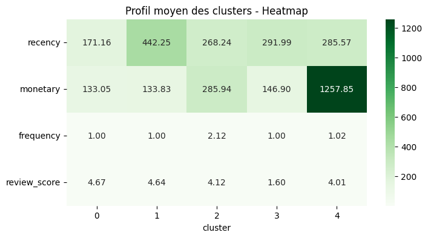
    


```python
# ==============================
# 2. RÉPARTITION DES CLIENTS
# ==============================

# Tableau chiffré des effectifs
cluster_counts = df_k_means_review_score_raw['cluster'].value_counts().sort_index().reset_index()
cluster_counts.columns = ['cluster', 'nb_clients']
display(cluster_counts)

# Barplot
plot_distributions(
    df=cluster_counts,
    columns=["cluster"],
    table_name="cluster_counts",
    show_values={"cluster": "both"},
    agg_col="nb_clients"
)
```


<div>
<style scoped>
    .dataframe tbody tr th:only-of-type {
        vertical-align: middle;
    }

    .dataframe tbody tr th {
        vertical-align: top;
    }

    .dataframe thead th {
        text-align: right;
    }
</style>
<table border="1" class="dataframe">
  <thead>
    <tr style="text-align: right;">
      <th></th>
      <th>cluster</th>
      <th>nb_clients</th>
    </tr>
  </thead>
  <tbody>
    <tr>
      <th>0</th>
      <td>0</td>
      <td>42358</td>
    </tr>
    <tr>
      <th>1</th>
      <td>1</td>
      <td>31898</td>
    </tr>
    <tr>
      <th>2</th>
      <td>2</td>
      <td>2963</td>
    </tr>
    <tr>
      <th>3</th>
      <td>3</td>
      <td>16790</td>
    </tr>
    <tr>
      <th>4</th>
      <td>4</td>
      <td>2087</td>
    </tr>
  </tbody>
</table>
</div>


    C:\Users\barre\AppData\Local\Temp\ipykernel_4968\1313166627.py:87: FutureWarning: 
    
    Passing `palette` without assigning `hue` is deprecated and will be removed in v0.14.0. Assign the `x` variable to `hue` and set `legend=False` for the same effect.
    
      ax = sns.barplot(x=x, y=y, palette=colors)
    


    
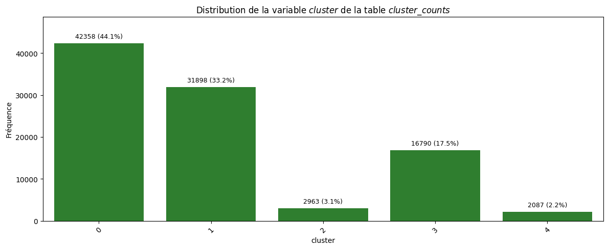
    


```python
# ==============================
# 3. DISTRIBUTIONS DES VARIABLES
# ==============================

features_to_plot = ['recency', 'monetary', 'frequency', 'review_score']
features_to_plot = [f for f in features_to_plot if f in df_k_means_review_score_raw.columns]

# Boucle boxplots + tableau chiffré
for feature in features_to_plot:
    
    # Tableau descriptif par cluster
    desc = (
        df_k_means_review_score_raw
        .groupby('cluster')[feature]
        .describe()
        .T
        .round(2)
    )
    
    # Titre explicite au-dessus du tableau
    print(f"\nTable descriptive – variable : {feature} | table : df_k_means_review_score_raw")
    display(desc)

    # Boxplot
    plot_distributions(
        df=df_k_means_review_score_raw,
        columns=feature,
        table_name="df_k_means_review_score_raw"
    )
```

    
    Table descriptive – variable : recency | table : df_k_means_review_score_raw
    


<div>
<style scoped>
    .dataframe tbody tr th:only-of-type {
        vertical-align: middle;
    }

    .dataframe tbody tr th {
        vertical-align: top;
    }

    .dataframe thead th {
        text-align: right;
    }
</style>
<table border="1" class="dataframe">
  <thead>
    <tr style="text-align: right;">
      <th>cluster</th>
      <th>0</th>
      <th>1</th>
      <th>2</th>
      <th>3</th>
      <th>4</th>
    </tr>
  </thead>
  <tbody>
    <tr>
      <th>count</th>
      <td>42358.00</td>
      <td>31898.00</td>
      <td>2963.00</td>
      <td>16790.00</td>
      <td>2087.00</td>
    </tr>
    <tr>
      <th>mean</th>
      <td>171.16</td>
      <td>442.25</td>
      <td>268.24</td>
      <td>291.99</td>
      <td>285.57</td>
    </tr>
    <tr>
      <th>std</th>
      <td>72.77</td>
      <td>95.23</td>
      <td>145.41</td>
      <td>133.19</td>
      <td>153.39</td>
    </tr>
    <tr>
      <th>min</th>
      <td>41.00</td>
      <td>306.00</td>
      <td>0.00</td>
      <td>0.00</td>
      <td>52.00</td>
    </tr>
    <tr>
      <th>25%</th>
      <td>108.00</td>
      <td>358.00</td>
      <td>152.00</td>
      <td>209.00</td>
      <td>157.50</td>
    </tr>
    <tr>
      <th>50%</th>
      <td>168.00</td>
      <td>432.00</td>
      <td>248.00</td>
      <td>272.00</td>
      <td>266.00</td>
    </tr>
    <tr>
      <th>75%</th>
      <td>233.00</td>
      <td>514.00</td>
      <td>366.50</td>
      <td>355.00</td>
      <td>399.50</td>
    </tr>
    <tr>
      <th>max</th>
      <td>307.00</td>
      <td>744.00</td>
      <td>740.00</td>
      <td>772.00</td>
      <td>742.00</td>
    </tr>
  </tbody>
</table>
</div>


    
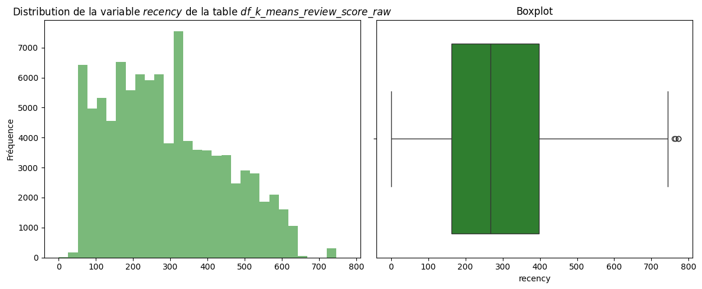
    


    
    Table descriptive – variable : monetary | table : df_k_means_review_score_raw
    


<div>
<style scoped>
    .dataframe tbody tr th:only-of-type {
        vertical-align: middle;
    }

    .dataframe tbody tr th {
        vertical-align: top;
    }

    .dataframe thead th {
        text-align: right;
    }
</style>
<table border="1" class="dataframe">
  <thead>
    <tr style="text-align: right;">
      <th>cluster</th>
      <th>0</th>
      <th>1</th>
      <th>2</th>
      <th>3</th>
      <th>4</th>
    </tr>
  </thead>
  <tbody>
    <tr>
      <th>count</th>
      <td>42358.00</td>
      <td>31898.00</td>
      <td>2963.00</td>
      <td>16790.00</td>
      <td>2087.00</td>
    </tr>
    <tr>
      <th>mean</th>
      <td>133.05</td>
      <td>133.83</td>
      <td>285.94</td>
      <td>146.90</td>
      <td>1257.85</td>
    </tr>
    <tr>
      <th>std</th>
      <td>108.80</td>
      <td>112.95</td>
      <td>224.84</td>
      <td>129.01</td>
      <td>705.96</td>
    </tr>
    <tr>
      <th>min</th>
      <td>0.00</td>
      <td>0.00</td>
      <td>0.00</td>
      <td>0.00</td>
      <td>689.93</td>
    </tr>
    <tr>
      <th>25%</th>
      <td>59.43</td>
      <td>60.42</td>
      <td>142.46</td>
      <td>62.41</td>
      <td>847.69</td>
    </tr>
    <tr>
      <th>50%</th>
      <td>102.13</td>
      <td>100.12</td>
      <td>221.93</td>
      <td>108.51</td>
      <td>1034.72</td>
    </tr>
    <tr>
      <th>75%</th>
      <td>167.86</td>
      <td>165.65</td>
      <td>353.15</td>
      <td>186.93</td>
      <td>1423.36</td>
    </tr>
    <tr>
      <th>max</th>
      <td>739.79</td>
      <td>818.12</td>
      <td>2400.48</td>
      <td>814.60</td>
      <td>13664.08</td>
    </tr>
  </tbody>
</table>
</div>


    
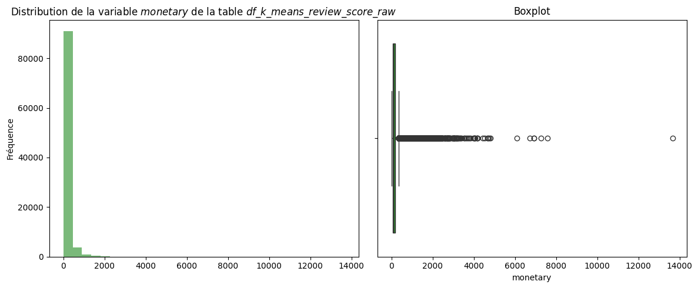
    


    
    Table descriptive – variable : frequency | table : df_k_means_review_score_raw
    


<div>
<style scoped>
    .dataframe tbody tr th:only-of-type {
        vertical-align: middle;
    }

    .dataframe tbody tr th {
        vertical-align: top;
    }

    .dataframe thead th {
        text-align: right;
    }
</style>
<table border="1" class="dataframe">
  <thead>
    <tr style="text-align: right;">
      <th>cluster</th>
      <th>0</th>
      <th>1</th>
      <th>2</th>
      <th>3</th>
      <th>4</th>
    </tr>
  </thead>
  <tbody>
    <tr>
      <th>count</th>
      <td>42358.0</td>
      <td>31898.0</td>
      <td>2963.00</td>
      <td>16790.0</td>
      <td>2087.00</td>
    </tr>
    <tr>
      <th>mean</th>
      <td>1.0</td>
      <td>1.0</td>
      <td>2.12</td>
      <td>1.0</td>
      <td>1.02</td>
    </tr>
    <tr>
      <th>std</th>
      <td>0.0</td>
      <td>0.0</td>
      <td>0.52</td>
      <td>0.0</td>
      <td>0.15</td>
    </tr>
    <tr>
      <th>min</th>
      <td>1.0</td>
      <td>1.0</td>
      <td>2.00</td>
      <td>1.0</td>
      <td>1.00</td>
    </tr>
    <tr>
      <th>25%</th>
      <td>1.0</td>
      <td>1.0</td>
      <td>2.00</td>
      <td>1.0</td>
      <td>1.00</td>
    </tr>
    <tr>
      <th>50%</th>
      <td>1.0</td>
      <td>1.0</td>
      <td>2.00</td>
      <td>1.0</td>
      <td>1.00</td>
    </tr>
    <tr>
      <th>75%</th>
      <td>1.0</td>
      <td>1.0</td>
      <td>2.00</td>
      <td>1.0</td>
      <td>1.00</td>
    </tr>
    <tr>
      <th>max</th>
      <td>1.0</td>
      <td>1.0</td>
      <td>17.00</td>
      <td>1.0</td>
      <td>4.00</td>
    </tr>
  </tbody>
</table>
</div>


    
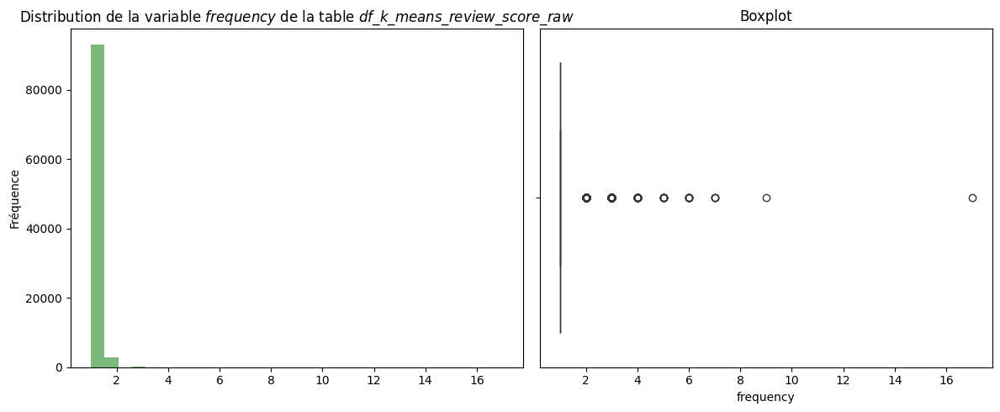
    


    
    Table descriptive – variable : review_score | table : df_k_means_review_score_raw
    


<div>
<style scoped>
    .dataframe tbody tr th:only-of-type {
        vertical-align: middle;
    }

    .dataframe tbody tr th {
        vertical-align: top;
    }

    .dataframe thead th {
        text-align: right;
    }
</style>
<table border="1" class="dataframe">
  <thead>
    <tr style="text-align: right;">
      <th>cluster</th>
      <th>0</th>
      <th>1</th>
      <th>2</th>
      <th>3</th>
      <th>4</th>
    </tr>
  </thead>
  <tbody>
    <tr>
      <th>count</th>
      <td>42358.00</td>
      <td>31898.00</td>
      <td>2963.00</td>
      <td>16790.00</td>
      <td>2087.00</td>
    </tr>
    <tr>
      <th>mean</th>
      <td>4.67</td>
      <td>4.64</td>
      <td>4.12</td>
      <td>1.60</td>
      <td>4.01</td>
    </tr>
    <tr>
      <th>std</th>
      <td>0.56</td>
      <td>0.59</td>
      <td>1.15</td>
      <td>0.82</td>
      <td>1.42</td>
    </tr>
    <tr>
      <th>min</th>
      <td>3.00</td>
      <td>2.00</td>
      <td>1.00</td>
      <td>1.00</td>
      <td>1.00</td>
    </tr>
    <tr>
      <th>25%</th>
      <td>4.00</td>
      <td>4.00</td>
      <td>3.50</td>
      <td>1.00</td>
      <td>4.00</td>
    </tr>
    <tr>
      <th>50%</th>
      <td>5.00</td>
      <td>5.00</td>
      <td>4.50</td>
      <td>1.00</td>
      <td>5.00</td>
    </tr>
    <tr>
      <th>75%</th>
      <td>5.00</td>
      <td>5.00</td>
      <td>5.00</td>
      <td>2.00</td>
      <td>5.00</td>
    </tr>
    <tr>
      <th>max</th>
      <td>5.00</td>
      <td>5.00</td>
      <td>5.00</td>
      <td>3.00</td>
      <td>5.00</td>
    </tr>
  </tbody>
</table>
</div>


    
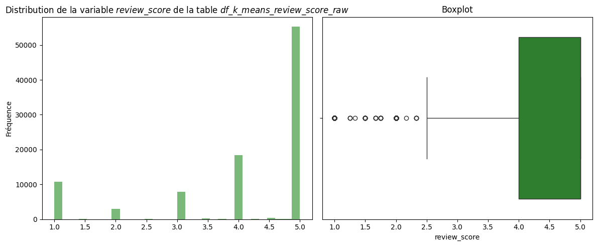
    


```python
# ==============================
# 4. AFFICHAGE 3
# ==============================

# Définir 6 vues pertinentes
views = [
    {'x': 'recency', 'y': 'monetary', 'z': 'review_score', 'title': 'Vue 1 : Recency / Monetary / Review_score'},
    {'x': 'frequency', 'y': 'monetary', 'z': 'review_score', 'title': 'Vue 2 : Frequency / Monetary / Review_score'},
    {'x': 'recency', 'y': 'monetary', 'z': 'frequency', 'title': 'Vue 3 : Recency / Monetary / Frequency'},
    {'x': 'frequency', 'y': 'recency', 'z': 'review_score', 'title': 'Vue 4 : Frequency / Recency / Review_score'},
    {'x': 'monetary', 'y': 'frequency', 'z': 'review_score', 'title': 'Vue 5 : Monetary / Frequency / Review_score'},
    {'x': 'recency', 'y': 'frequency', 'z': 'monetary', 'title': 'Vue 6 : Recency / Frequency / Monetary'}
]

fig = plt.figure(figsize=(18, 12))

for i, view in enumerate(views, start=1):
    x_var, y_var, z_var = view['x'], view['y'], view['z']
    ax = fig.add_subplot(2, 3, i, projection='3d')

    scatter = ax.scatter(
        df_k_means_review_score_raw[x_var],
        df_k_means_review_score_raw[y_var],
        df_k_means_review_score_raw[z_var],
        c=df_k_means_review_score_raw['cluster'],
        cmap=plt.cm.tab10,
        alpha=0.6,
        s=40
    )

    ax.set_xlabel(x_var)
    ax.set_ylabel(y_var)
    ax.set_zlabel(z_var)
    ax.set_title(view['title'])
    ax.view_init(elev=30, azim=45)

    if i == 1:
        unique_labels = np.sort(df_k_means_review_score_raw['cluster'].unique())
        legend_elements = [
            Line2D([0], [0], marker='o', color='w',
                   markerfacecolor=plt.cm.tab10(j / (len(unique_labels)-1)),
                   label=f"Cluster {l}", markersize=8)
            for j, l in enumerate(unique_labels)
        ]
        ax.legend(handles=legend_elements, title="Clusters")

plt.tight_layout()
plt.show()
```


    
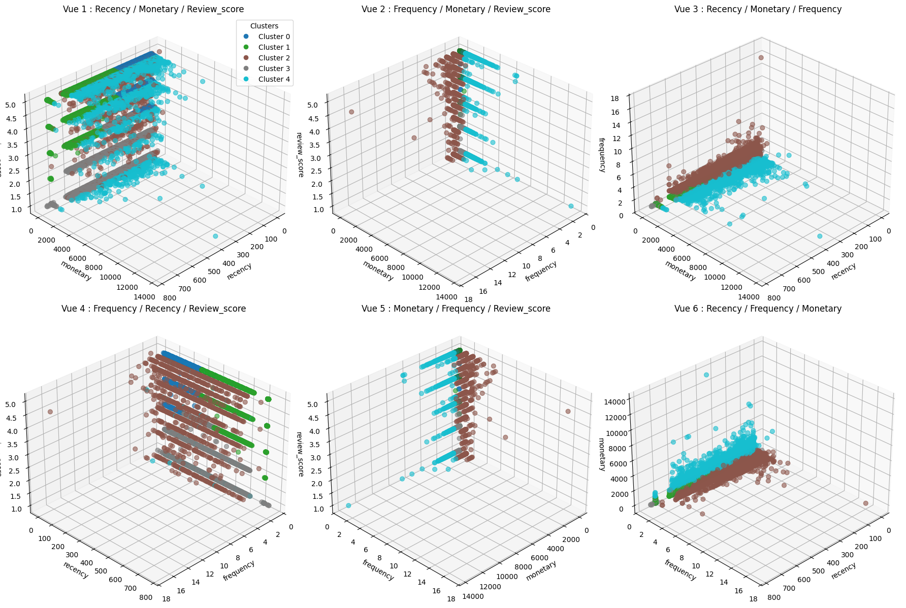
    


#### **Justification des vues 3D**

- **Vue 1 : Recency / Monetary / Review_score**  
  Met en évidence les clients récents et gros dépensiers, ainsi que leur satisfaction.

- **Vue 2 : Frequency / Monetary / Review_score**  
  Visualise les clients réguliers par rapport à leurs dépenses et leur review_score.

- **Vue 3 : Recency / Monetary / Frequency**  
  Compare l’activité récente et la dépense par rapport à la fréquence des commandes.

- **Vue 4 : Frequency / Recency / Review_score**  
  Identifie les clients fréquents mais récents ou anciens, en lien avec leur satisfaction.

- **Vue 5 : Monetary / Frequency / Review_score**  
  Met en avant les gros dépensiers réguliers et leur review_score.

- **Vue 6 : Recency / Frequency / Monetary**  
  Visualise les clients dormants vs actifs selon fréquence et dépense.


### **ANALYSE DU CLUSTERING K-MEANS V2 (RFM + REVIEW_SCORE)**

____
**STRUCTURE DU JEU DE DONNÉES**

| Élément | Valeur |
|------|------|
| Taille du jeu de données | 96 096 lignes (clients) × 6 colonnes |
| Variables quantitatives | frequency, monetary, recency, review_score |
| Variable de segmentation | cluster |
| Standardisation | oui |
| Valeurs manquantes | 0 % |
| Zéros | 0 % (hors cluster) |
| Nombre de clusters | 5 |

Variables utilisées
- `frequency` : intensité d’achat  
- `monetary` : valeur générée  
- `recency` : récence d’achat (plus bas = plus récent)  
- `review_score` : satisfaction client

____
**RÉPARTITION DES CLUSTERS**

| Cluster | Nb clients | Part |
|------|-----------|------|
| 0 | 42 298 | 44.0 % |
| 1 | 2 090 | 2.2 % |
| 2 | 31 815 | 33.1 % |
| 3 | 2 963 | 3.1 % |
| 4 | 16 930 | 17.6 % |

→ Segmentation déséquilibrée mais plus fine qu’avec 4 clusters  
Un cluster majoritaire, plusieurs clusters à forte valeur et/ou fréquence, et un cluster à faible satisfaction.

____
**PROFIL MOYEN DES CLUSTERS**

| Cluster | Recency | Monetary | Frequency | Review_score |
|------|--------|----------|-----------|--------------|
| 0 | 170.9 | 133.0 | 1.00 | 4.65 |
| 1 | 285.9 | 1257.2 | 1.02 | 3.96 |
| 2 | 441.6 | 133.7 | 1.00 | 4.63 |
| 3 | 268.2 | 285.9 | 2.12 | 4.10 |
| 4 | 294.0 | 147.0 | 1.00 | 1.49 |

____
**INTERPRÉTATION MÉTIER DES CLUSTERS**

**Cluster 0 — Clients majoritaires (44 %)**
- Recency faible/modérée  
- Monetary faible  
- Frequency faible  
- Review_score élevé (4.65)  
→ Clients **occasionnels mais satisfaits**, contribution modérée au chiffre d’affaires

**Cluster 1 — Clients premium mais peu nombreux (2 %)**
- Recency élevée  
- Monetary très élevé  
- Frequency faible  
- Review_score faible (3.96)  
→ Clients à **forte valeur potentielle mais insatisfaits**, prioritaire pour fidélisation

**Cluster 2 — Clients anciens (33 %)**
- Recency très élevée  
- Monetary faible  
- Frequency faible  
- Review_score élevé (4.63)  
→ Clients **anciens et satisfaits**, faible valeur économique

**Cluster 3 — Clients actifs moyens (3 %)**
- Recency modérée  
- Monetary modéré  
- Frequency élevée  
- Review_score correct (4.10)  
→ Clients **actifs**, contribution moyenne au chiffre d’affaires

**Cluster 4 — Clients insatisfaits (18 %)**
- Recency modérée  
- Monetary faible  
- Frequency faible  
- Review_score très faible (1.49)  
→ Segment **à risque**, nécessite actions correctives

____
**ANALYSE DÉTAILLÉE PAR VARIABLE**

**Recency**
- Cluster 0 : achats récents  
- Cluster 2 : achats anciens  
- Clusters 1, 3, 4 : recency moyenne  

**Monetary**
- Cluster 1 : très fort  
- Cluster 3 : modéré  
- Clusters 0, 2, 4 : faible

**Frequency**
- Cluster 3 : élevé → variable structurante  
- Clusters 0, 2, 4 : faible  
- Cluster 1 : faible/modéré

**Review_score**
- Cluster 4 : très faible → insatisfaction marquée  
- Clusters 0, 2, 3 : corrects  
- Cluster 1 : faible malgré forte valeur économique

____
**CONCLUSION GLOBALE**

- Clustering **plus détaillé** avec 5 groupes, capture mieux les nuances comportementales.  
- Segmentation utile pour :
  - Identifier les clients premium mais insatisfaits (Cluster 1)  
  - Repérer le segment à risque (Cluster 4)  
  - Suivre les clients actifs (Cluster 3) et majoritaires satisfaits (Cluster 0)  
- Utile pour **prioriser actions marketing, fidélisation et stratégies de satisfaction**.


### **COMPARAISON DES 2 VERSIONS DE K-MEANS V2 : SANS ET AVEC REVIEW_SCORE**


```python
# ==============================
# 1. Préparation du DataFrame pour comparaison
# ==============================

df_compare = pd.DataFrame({
    "customer_id": df_rfm['customer_unique_id'],   # ID original
    "cluster_old": df_k_means_rfm_raw['cluster'].values,  # clusters sans review_score
    "cluster_new": df_k_means_review_score_raw['cluster'].values  # clusters avec review_score
})

```


```python
# ==============================
# 2. Tableaux croisés
# ==============================

# Tableau croisé en nombres
cross_tab = pd.crosstab(df_compare['cluster_old'], df_compare['cluster_new'], 
                        margins=True, margins_name="Total")
display(cross_tab)

# Tableau croisé en pourcentages (par cluster_old)
cross_tab_pct = cross_tab.div(cross_tab["Total"], axis=0).round(2)
display(cross_tab_pct)

```


<div>
<style scoped>
    .dataframe tbody tr th:only-of-type {
        vertical-align: middle;
    }

    .dataframe tbody tr th {
        vertical-align: top;
    }

    .dataframe thead th {
        text-align: right;
    }
</style>
<table border="1" class="dataframe">
  <thead>
    <tr style="text-align: right;">
      <th>cluster_new</th>
      <th>0</th>
      <th>1</th>
      <th>2</th>
      <th>3</th>
      <th>4</th>
      <th>Total</th>
    </tr>
    <tr>
      <th>cluster_old</th>
      <th></th>
      <th></th>
      <th></th>
      <th></th>
      <th></th>
      <th></th>
    </tr>
  </thead>
  <tbody>
    <tr>
      <th>0</th>
      <td>128</td>
      <td>42240</td>
      <td>0</td>
      <td>9705</td>
      <td>0</td>
      <td>52073</td>
    </tr>
    <tr>
      <th>1</th>
      <td>137</td>
      <td>118</td>
      <td>0</td>
      <td>160</td>
      <td>2087</td>
      <td>2502</td>
    </tr>
    <tr>
      <th>2</th>
      <td>31633</td>
      <td>0</td>
      <td>0</td>
      <td>6925</td>
      <td>0</td>
      <td>38558</td>
    </tr>
    <tr>
      <th>3</th>
      <td>0</td>
      <td>0</td>
      <td>2963</td>
      <td>0</td>
      <td>0</td>
      <td>2963</td>
    </tr>
    <tr>
      <th>Total</th>
      <td>31898</td>
      <td>42358</td>
      <td>2963</td>
      <td>16790</td>
      <td>2087</td>
      <td>96096</td>
    </tr>
  </tbody>
</table>
</div>


<div>
<style scoped>
    .dataframe tbody tr th:only-of-type {
        vertical-align: middle;
    }

    .dataframe tbody tr th {
        vertical-align: top;
    }

    .dataframe thead th {
        text-align: right;
    }
</style>
<table border="1" class="dataframe">
  <thead>
    <tr style="text-align: right;">
      <th>cluster_new</th>
      <th>0</th>
      <th>1</th>
      <th>2</th>
      <th>3</th>
      <th>4</th>
      <th>Total</th>
    </tr>
    <tr>
      <th>cluster_old</th>
      <th></th>
      <th></th>
      <th></th>
      <th></th>
      <th></th>
      <th></th>
    </tr>
  </thead>
  <tbody>
    <tr>
      <th>0</th>
      <td>0.00</td>
      <td>0.81</td>
      <td>0.00</td>
      <td>0.19</td>
      <td>0.00</td>
      <td>1.0</td>
    </tr>
    <tr>
      <th>1</th>
      <td>0.05</td>
      <td>0.05</td>
      <td>0.00</td>
      <td>0.06</td>
      <td>0.83</td>
      <td>1.0</td>
    </tr>
    <tr>
      <th>2</th>
      <td>0.82</td>
      <td>0.00</td>
      <td>0.00</td>
      <td>0.18</td>
      <td>0.00</td>
      <td>1.0</td>
    </tr>
    <tr>
      <th>3</th>
      <td>0.00</td>
      <td>0.00</td>
      <td>1.00</td>
      <td>0.00</td>
      <td>0.00</td>
      <td>1.0</td>
    </tr>
    <tr>
      <th>Total</th>
      <td>0.33</td>
      <td>0.44</td>
      <td>0.03</td>
      <td>0.17</td>
      <td>0.02</td>
      <td>1.0</td>
    </tr>
  </tbody>
</table>
</div>


```python
# ==============================
# 3. Heatmap de redistribution + tableau
# ==============================

# Colonnes et lignes sans Total
cluster_cols = [c for c in cross_tab_pct.columns if c != "Total"]
cluster_rows = [r for r in cross_tab_pct.index if r != "Total"]

# Heatmap
plt.figure(figsize=(8,5))
sns.heatmap(cross_tab_pct.loc[cluster_rows, cluster_cols],
            annot=True, fmt=".2f", cmap="Greens", cbar_kws={'label': 'Proportion'})
plt.xlabel("Clusters nouveaux")
plt.ylabel("Clusters anciens")
plt.title("Redistribution des clients entre clusters avant/après ajout de review_score")
plt.show()

# Tableau correspondant
display(cross_tab_pct.loc[cluster_rows, cluster_cols])

```


    
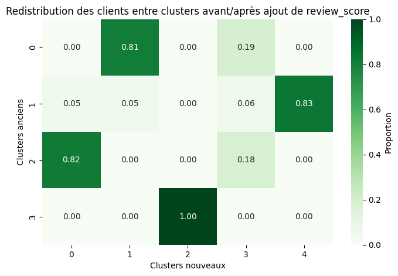
    


<div>
<style scoped>
    .dataframe tbody tr th:only-of-type {
        vertical-align: middle;
    }

    .dataframe tbody tr th {
        vertical-align: top;
    }

    .dataframe thead th {
        text-align: right;
    }
</style>
<table border="1" class="dataframe">
  <thead>
    <tr style="text-align: right;">
      <th>cluster_new</th>
      <th>0</th>
      <th>1</th>
      <th>2</th>
      <th>3</th>
      <th>4</th>
    </tr>
    <tr>
      <th>cluster_old</th>
      <th></th>
      <th></th>
      <th></th>
      <th></th>
      <th></th>
    </tr>
  </thead>
  <tbody>
    <tr>
      <th>0</th>
      <td>0.00</td>
      <td>0.81</td>
      <td>0.0</td>
      <td>0.19</td>
      <td>0.00</td>
    </tr>
    <tr>
      <th>1</th>
      <td>0.05</td>
      <td>0.05</td>
      <td>0.0</td>
      <td>0.06</td>
      <td>0.83</td>
    </tr>
    <tr>
      <th>2</th>
      <td>0.82</td>
      <td>0.00</td>
      <td>0.0</td>
      <td>0.18</td>
      <td>0.00</td>
    </tr>
    <tr>
      <th>3</th>
      <td>0.00</td>
      <td>0.00</td>
      <td>1.0</td>
      <td>0.00</td>
      <td>0.00</td>
    </tr>
  </tbody>
</table>
</div>


```python
# ==============================
# 4. Analyse synthétique par cluster
# ==============================

# récupérer uniquement les colonnes correspondant aux clusters (exclut "Total")
cluster_cols = [c for c in cross_tab_pct.columns if c != "Total"]

for old in sorted(df_compare['cluster_old'].unique()):
    subset = cross_tab_pct.loc[old, cluster_cols]  # par label, pas par position
    dominant_new = subset.idxmax()
    prop = subset.max()
    print(f"Cluster ancien {old} : {prop*100:.1f}% des clients restent ou vont vers cluster nouveau {dominant_new}")

```

    Cluster ancien 0 : 81.0% des clients restent ou vont vers cluster nouveau 1
    Cluster ancien 1 : 83.0% des clients restent ou vont vers cluster nouveau 4
    Cluster ancien 2 : 82.0% des clients restent ou vont vers cluster nouveau 0
    Cluster ancien 3 : 100.0% des clients restent ou vont vers cluster nouveau 2
    

### **ANALYSE COMPARATIVE DES CLUSTERS AVANT/APRÈS AJOUT DE `review_score`**

#### **STRUCTURE DU JEU DE DONNÉES**

| Élément | Valeur |
|------|------|
| Taille du jeu de données | 96 096 lignes |
| Variables quantitatives | frequency, recency, monetary |
| Variable additionnelle | review_score |
| Méthode de clustering | K-Means |
| Standardisation | oui (StandardScaler) |
| Valeurs manquantes | 0 % |
| Zéros | présents (monetary, recency) |
| Nombre de clusters retenu | 5 |
| Échantillonnage | non (jeu complet) |

Variables utilisées  
- `frequency` : nombre d’achats par client  
- `recency` : nombre de jours depuis le dernier achat (plus bas = plus récent)  
- `monetary` : valeur totale dépensée  
- `review_score` : satisfaction moyenne client (1 à 5)

____
#### **CHOIX DU NOMBRE DE CLUSTERS**

| k | Silhouette score | Inertie |
|--|------------------|---------|
| 2 | 0.375 | 306 267 |
| 3 | 0.412 | 227 780 |
| 4 | 0.395 | 172 571 |
| 5 | **0.418** | **127 698** |
| 6 | **0.425** | 114 458 |

- La silhouette augmente progressivement avec k.
- k=6 maximise légèrement la silhouette mais :
  - complexifie la lecture métier
  - segmente excessivement des groupes déjà rares
- k=5 constitue un **bon compromis** :
  - silhouette correcte (**0.418**)
  - inertie fortement réduite
  - profils clients distincts et interprétables

→ **k=5 retenu pour l’analyse métier**.

____
#### **QUALITÉ GLOBALE DU CLUSTERING**

- Silhouette finale : **0.418**
- Inertie finale : **127 698**
- Clusters bien séparés sur :
  - la valeur (`monetary`)
  - la satisfaction (`review_score`)
- Séparation plus faible sur :
  - `frequency` (majoritairement égale à 1)

→ Clustering **cohérent mais moins tranché** qu’un clustering hiérarchique, ce qui est attendu avec K-Means sur données RFM réelles.

____
#### **RÉPARTITION DES CLUSTERS**

| Cluster | Nb clients | Part |
|------|-----------|------|
| 0 | 31 898 | 33.2 % |
| 1 | 42 358 | 44.1 % |
| 2 | 2 963 | 3.1 % |
| 3 | 16 790 | 17.5 % |
| 4 | 2 087 | 2.2 % |

→ Segmentation **déséquilibrée**, typique d’une base clients réelle :
- deux clusters majoritaires
- plusieurs segments spécifiques à forte valeur ou à risque

____
#### **PROFIL MOYEN DES CLUSTERS**

| Cluster | Recency | Monetary | Frequency | Review_score |
|------|--------|----------|-----------|--------------|
| 0 | 442.25 | 133.83 | 1.00 | 4.64 |
| 1 | 171.16 | 133.05 | 1.00 | 4.67 |
| 2 | 268.24 | 285.94 | 2.12 | 4.12 |
| 3 | 291.99 | 146.90 | 1.00 | 1.60 |
| 4 | 285.57 | 1257.85 | 1.02 | 4.01 |

____
#### **INTERPRÉTATION MÉTIER DES CLUSTERS**

**Cluster 1 — Clients récents satisfaits (cœur de clientèle)**  
- Recency très faible (≈ 171 jours)  
- Dépense modérée  
- Review_score très élevé  
→ Clients **actifs et satisfaits**, segment principal à préserver.

**Cluster 0 — Clients anciens satisfaits**  
- Recency élevée (> 440 jours)  
- Dépense modérée  
- Satisfaction élevée  
→ Clients **peu actifs mais positifs**, cible de réactivation.

**Cluster 2 — Clients fidèles à valeur intermédiaire**  
- Frequency > 2  
- Monetary intermédiaire  
- Satisfaction élevée  
→ Clients **fidèles**, bons candidats à des programmes de fidélisation.

**Cluster 3 — Clients insatisfaits**  
- Review_score très bas (≈ 1.6)  
- Valeur faible à moyenne  
→ Clients **à risque**, potentiels churn ou générateurs de litiges.

**Cluster 4 — Très gros dépensiers**  
- Monetary extrêmement élevé (> 1 250)  
- Satisfaction élevée  
- Segment très réduit  
→ Clients **stratégiques**, à traiter individuellement.

____
#### **ANALYSE DÉTAILLÉE PAR VARIABLE**

**Recency**
- Sépare fortement clients récents (cluster 1) et anciens (cluster 0)
- Variable structurante du clustering

**Monetary**
- Rupture très nette sur le cluster 4 (outliers de valeur)
- Bonne identification des clients à fort CA

**Frequency**
- Majoritairement égale à 1
- Cluster 2 se distingue par une vraie récurrence
→ Variable secondaire mais utile pour détecter la fidélité

**Review_score**
- Variable clé :
  - cluster 3 clairement isolé par l’insatisfaction
  - autres clusters globalement satisfaits
→ Apport métier fort par rapport à un RFM classique

____
#### **CONCLUSION GLOBALE**

- K-Means permet une **segmentation client exploitable à grande échelle**.
- L’ajout de `review_score` enrichit fortement l’analyse métier :
  - identification claire des clients à risque
  - distinction valeur / satisfaction
- Méthode adaptée pour :
  - segmentation opérationnelle
  - scoring client
- Limites :
  - clusters sphériques imposés
  - sensibilité aux outliers (monetary)
- Très bon complément du clustering hiérarchique :
  - K-Means pour la **production**
  - Agglomerative pour la **compréhension exploratoire**


# **AGGLOMERATIVE CLUSTERING**

### **ENTRAÎNEMENT**


```python
# ==============================
# 1. PRÉPARATION DES DONNÉES
# ==============================

# --- échantillonnage ---
df_AC_review_score_raw = (
    df_review_score
    .sample(n=2000, random_state=42)
    .drop(columns=['customer_unique_id'])
    .copy()
)

# --- données pour clustering ---
df_AC_review_score_scaled = df_AC_review_score_raw.select_dtypes(
    include=['int64', 'float64']
).copy()

# --- standardisation ---
scaler_AC = StandardScaler()
df_AC_review_score_scaled.loc[:, :] = scaler_AC.fit_transform(
    df_AC_review_score_scaled
)
```

    C:\Users\barre\AppData\Local\Temp\ipykernel_17200\1397629064.py:20: FutureWarning: Setting an item of incompatible dtype is deprecated and will raise in a future error of pandas. Value '[-0.17774285 -0.17774285 -0.17774285 ...  4.90062431 -0.17774285
     -0.17774285]' has dtype incompatible with int64, please explicitly cast to a compatible dtype first.
      df_AC_review_score_scaled.loc[:, :] = scaler_AC.fit_transform(
    C:\Users\barre\AppData\Local\Temp\ipykernel_17200\1397629064.py:20: FutureWarning: Setting an item of incompatible dtype is deprecated and will raise in a future error of pandas. Value '[ 0.5739372   0.41252846  0.31568321 ...  0.10262368  1.05170707
     -1.41461848]' has dtype incompatible with int64, please explicitly cast to a compatible dtype first.
      df_AC_review_score_scaled.loc[:, :] = scaler_AC.fit_transform(
    


```python
# ==============================
# 2. CHOIX DU NOMBRE DE CLUSTERS
# ==============================

range_n_clusters = range(2, 8)
silhouette_scores = []

for k in range_n_clusters:
    model = AgglomerativeClustering(
        n_clusters=k,
        linkage='ward'
    )
    labels = model.fit_predict(df_AC_review_score_scaled)

    silhouette_scores.append(
        silhouette_score(df_AC_review_score_scaled, labels)
    )

# --- tableau brut ---
df_silhouette_AC = pd.DataFrame({
    'k': list(range_n_clusters),
    'silhouette_score': silhouette_scores
})
display(df_silhouette_AC)

# --- courbe silhouette ---
plt.figure(figsize=(6, 4))
plt.plot(
    df_silhouette_AC['k'],
    df_silhouette_AC['silhouette_score'],
    marker='o',
    color='forestgreen'
)
plt.xlabel("Nombre de clusters (k)")
plt.ylabel("Silhouette score")
plt.title("Agglomerative – Silhouette")
plt.grid(True)
plt.show()

```


<div>
<style scoped>
    .dataframe tbody tr th:only-of-type {
        vertical-align: middle;
    }

    .dataframe tbody tr th {
        vertical-align: top;
    }

    .dataframe thead th {
        text-align: right;
    }
</style>
<table border="1" class="dataframe">
  <thead>
    <tr style="text-align: right;">
      <th></th>
      <th>k</th>
      <th>silhouette_score</th>
    </tr>
  </thead>
  <tbody>
    <tr>
      <th>0</th>
      <td>2</td>
      <td>0.661215</td>
    </tr>
    <tr>
      <th>1</th>
      <td>3</td>
      <td>0.419391</td>
    </tr>
    <tr>
      <th>2</th>
      <td>4</td>
      <td>0.450921</td>
    </tr>
    <tr>
      <th>3</th>
      <td>5</td>
      <td>0.396276</td>
    </tr>
    <tr>
      <th>4</th>
      <td>6</td>
      <td>0.340460</td>
    </tr>
    <tr>
      <th>5</th>
      <td>7</td>
      <td>0.345009</td>
    </tr>
  </tbody>
</table>
</div>


    
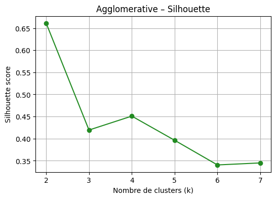
    


```python
# ==============================
# 3. STABILITÉ DES CLUSTERS
# ==============================

k = 5
random_states = [0, 21, 42, 99, 123]

stability_tables = []

for rs in random_states:
    # échantillonnage
    df_tmp = (
        df_review_score
        .sample(n=2000, random_state=rs)
        .drop(columns=['customer_unique_id'])
        .reset_index(drop=True)
    )

    # features numériques
    X_tmp = df_tmp.select_dtypes(include=['int64', 'float64'])

    # standardisation (scaler déjà fitted)
    X_tmp_scaled = scaler_AC.transform(X_tmp)

    # clustering
    model = AgglomerativeClustering(
        n_clusters=k,
        linkage='ward'
    )
    labels = model.fit_predict(X_tmp_scaled)

    # ajout labels
    df_tmp['cluster'] = labels

    # profil moyen par cluster
    profile = (
        df_tmp
        .groupby('cluster')
        .mean()
        .assign(random_state=rs)
        .reset_index()
    )

    stability_tables.append(profile)

# --- tableau final ---

df_AC_cluster_stability = pd.concat(
    stability_tables,
    ignore_index=True
)

display(df_AC_cluster_stability)
```


<div>
<style scoped>
    .dataframe tbody tr th:only-of-type {
        vertical-align: middle;
    }

    .dataframe tbody tr th {
        vertical-align: top;
    }

    .dataframe thead th {
        text-align: right;
    }
</style>
<table border="1" class="dataframe">
  <thead>
    <tr style="text-align: right;">
      <th></th>
      <th>cluster</th>
      <th>frequency</th>
      <th>monetary</th>
      <th>last_order_date</th>
      <th>recency</th>
      <th>review_score</th>
      <th>random_state</th>
    </tr>
  </thead>
  <tbody>
    <tr>
      <th>0</th>
      <td>0</td>
      <td>1.000000</td>
      <td>154.710176</td>
      <td>2018-03-11 23:24:44.176605440</td>
      <td>219.299694</td>
      <td>4.494266</td>
      <td>0</td>
    </tr>
    <tr>
      <th>1</th>
      <td>1</td>
      <td>2.095238</td>
      <td>269.075238</td>
      <td>2018-01-28 12:25:21.349206528</td>
      <td>261.698413</td>
      <td>4.156085</td>
      <td>0</td>
    </tr>
    <tr>
      <th>2</th>
      <td>2</td>
      <td>1.000000</td>
      <td>155.566187</td>
      <td>2017-11-19 14:59:51.809352704</td>
      <td>331.633094</td>
      <td>1.451439</td>
      <td>0</td>
    </tr>
    <tr>
      <th>3</th>
      <td>3</td>
      <td>1.000000</td>
      <td>108.605794</td>
      <td>2017-05-28 11:53:48.050000128</td>
      <td>506.767647</td>
      <td>4.814706</td>
      <td>0</td>
    </tr>
    <tr>
      <th>4</th>
      <td>4</td>
      <td>1.090909</td>
      <td>2085.325455</td>
      <td>2017-12-20 23:46:56.272727296</td>
      <td>300.363636</td>
      <td>4.363636</td>
      <td>0</td>
    </tr>
    <tr>
      <th>5</th>
      <td>0</td>
      <td>1.000000</td>
      <td>136.973208</td>
      <td>2018-02-28 13:58:01.868003328</td>
      <td>230.690058</td>
      <td>4.756057</td>
      <td>21</td>
    </tr>
    <tr>
      <th>6</th>
      <td>1</td>
      <td>1.000000</td>
      <td>1057.544268</td>
      <td>2017-10-17 01:29:26.524390400</td>
      <td>365.256098</td>
      <td>3.987805</td>
      <td>21</td>
    </tr>
    <tr>
      <th>7</th>
      <td>2</td>
      <td>2.053571</td>
      <td>296.502857</td>
      <td>2018-01-19 16:26:03.553571328</td>
      <td>270.535714</td>
      <td>4.041667</td>
      <td>21</td>
    </tr>
    <tr>
      <th>8</th>
      <td>3</td>
      <td>1.000000</td>
      <td>144.135089</td>
      <td>2018-01-27 08:23:09.501272320</td>
      <td>262.900763</td>
      <td>1.684478</td>
      <td>21</td>
    </tr>
    <tr>
      <th>9</th>
      <td>4</td>
      <td>1.000000</td>
      <td>128.733051</td>
      <td>2017-05-02 03:10:47.312499968</td>
      <td>533.121324</td>
      <td>4.463235</td>
      <td>21</td>
    </tr>
    <tr>
      <th>10</th>
      <td>0</td>
      <td>1.000000</td>
      <td>117.819751</td>
      <td>2018-03-11 04:44:05.892282880</td>
      <td>220.072347</td>
      <td>4.549035</td>
      <td>42</td>
    </tr>
    <tr>
      <th>11</th>
      <td>1</td>
      <td>1.000000</td>
      <td>1035.180864</td>
      <td>2017-12-05 15:38:18.148147968</td>
      <td>315.666667</td>
      <td>4.259259</td>
      <td>42</td>
    </tr>
    <tr>
      <th>12</th>
      <td>2</td>
      <td>1.000000</td>
      <td>148.971474</td>
      <td>2017-11-22 15:55:43.951922944</td>
      <td>328.583333</td>
      <td>1.512821</td>
      <td>42</td>
    </tr>
    <tr>
      <th>13</th>
      <td>3</td>
      <td>2.076923</td>
      <td>296.595846</td>
      <td>2018-01-23 04:58:59.353846272</td>
      <td>266.953846</td>
      <td>4.273077</td>
      <td>42</td>
    </tr>
    <tr>
      <th>14</th>
      <td>4</td>
      <td>1.000000</td>
      <td>122.155336</td>
      <td>2017-05-15 02:57:51.765100800</td>
      <td>520.137584</td>
      <td>4.812081</td>
      <td>42</td>
    </tr>
    <tr>
      <th>15</th>
      <td>0</td>
      <td>1.000000</td>
      <td>1222.728750</td>
      <td>2017-12-20 21:06:30.812499968</td>
      <td>300.421875</td>
      <td>4.218750</td>
      <td>99</td>
    </tr>
    <tr>
      <th>16</th>
      <td>1</td>
      <td>2.111111</td>
      <td>326.074762</td>
      <td>2017-12-18 04:51:50.238095104</td>
      <td>303.063492</td>
      <td>4.148148</td>
      <td>99</td>
    </tr>
    <tr>
      <th>17</th>
      <td>2</td>
      <td>1.000000</td>
      <td>137.491072</td>
      <td>2018-01-10 05:43:16.885780992</td>
      <td>280.037296</td>
      <td>1.820513</td>
      <td>99</td>
    </tr>
    <tr>
      <th>18</th>
      <td>3</td>
      <td>1.000000</td>
      <td>133.154165</td>
      <td>2017-08-07 07:56:08.897035776</td>
      <td>435.914197</td>
      <td>4.725429</td>
      <td>99</td>
    </tr>
    <tr>
      <th>19</th>
      <td>4</td>
      <td>1.000000</td>
      <td>120.681594</td>
      <td>2018-05-01 05:06:30.798256640</td>
      <td>169.059776</td>
      <td>4.756538</td>
      <td>99</td>
    </tr>
    <tr>
      <th>20</th>
      <td>0</td>
      <td>1.000000</td>
      <td>143.834215</td>
      <td>2018-03-30 13:33:23.072543744</td>
      <td>200.688705</td>
      <td>4.685032</td>
      <td>123</td>
    </tr>
    <tr>
      <th>21</th>
      <td>1</td>
      <td>1.000000</td>
      <td>116.619072</td>
      <td>2017-07-17 20:56:22.723404288</td>
      <td>456.392650</td>
      <td>4.332689</td>
      <td>123</td>
    </tr>
    <tr>
      <th>22</th>
      <td>2</td>
      <td>2.037037</td>
      <td>256.722037</td>
      <td>2018-01-03 14:19:29.481481728</td>
      <td>286.629630</td>
      <td>4.172840</td>
      <td>123</td>
    </tr>
    <tr>
      <th>23</th>
      <td>3</td>
      <td>1.000000</td>
      <td>163.232200</td>
      <td>2017-12-13 11:03:29.236666624</td>
      <td>307.780000</td>
      <td>1.200000</td>
      <td>123</td>
    </tr>
    <tr>
      <th>24</th>
      <td>4</td>
      <td>1.000000</td>
      <td>1402.784750</td>
      <td>2017-12-05 06:22:11.675000064</td>
      <td>316.025000</td>
      <td>4.250000</td>
      <td>123</td>
    </tr>
  </tbody>
</table>
</div>


```python
# ==============================
# DENDROGRAMME
# ==============================

# --- calcul linkage (features déjà standardisées) ---
Z = linkage(df_AC_review_score_scaled, method="ward")

# --- dendrogramme ---
plt.figure(figsize=(14, 6))
dendrogram(
    Z,
    truncate_mode="level",
    p=5,
    leaf_rotation=90,
    leaf_font_size=10
)
plt.title("Dendrogramme – Agglomerative")
plt.xlabel("Observations / clusters fusionnés")
plt.ylabel("Distance")
plt.tight_layout()
plt.show()

# --- tableau des fusions ---
df_linkage = pd.DataFrame(
    Z,
    columns=[
        "cluster_1",
        "cluster_2",
        "distance",
        "n_observations"
    ]
)

display(df_linkage)

# --- tableau aide au choix du cut ---
df_cut_analysis = (
    df_linkage
    .assign(delta_distance=df_linkage["distance"].diff())
    .sort_values("distance", ascending=False)
)

display(df_cut_analysis.head(15))

```


    
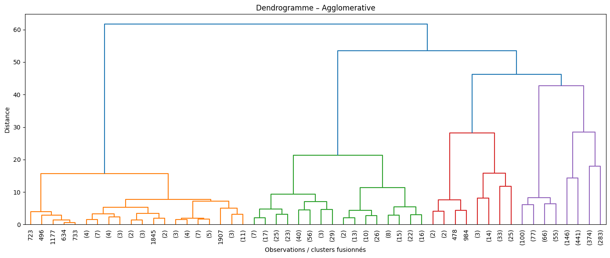
    


<div>
<style scoped>
    .dataframe tbody tr th:only-of-type {
        vertical-align: middle;
    }

    .dataframe tbody tr th {
        vertical-align: top;
    }

    .dataframe thead th {
        text-align: right;
    }
</style>
<table border="1" class="dataframe">
  <thead>
    <tr style="text-align: right;">
      <th></th>
      <th>cluster_1</th>
      <th>cluster_2</th>
      <th>distance</th>
      <th>n_observations</th>
    </tr>
  </thead>
  <tbody>
    <tr>
      <th>0</th>
      <td>31.0</td>
      <td>275.0</td>
      <td>0.000000</td>
      <td>2.0</td>
    </tr>
    <tr>
      <th>1</th>
      <td>417.0</td>
      <td>1612.0</td>
      <td>0.000364</td>
      <td>2.0</td>
    </tr>
    <tr>
      <th>2</th>
      <td>916.0</td>
      <td>1100.0</td>
      <td>0.000647</td>
      <td>2.0</td>
    </tr>
    <tr>
      <th>3</th>
      <td>822.0</td>
      <td>1633.0</td>
      <td>0.000728</td>
      <td>2.0</td>
    </tr>
    <tr>
      <th>4</th>
      <td>56.0</td>
      <td>689.0</td>
      <td>0.001617</td>
      <td>2.0</td>
    </tr>
    <tr>
      <th>...</th>
      <td>...</td>
      <td>...</td>
      <td>...</td>
      <td>...</td>
    </tr>
    <tr>
      <th>1994</th>
      <td>3988.0</td>
      <td>3991.0</td>
      <td>28.517217</td>
      <td>1244.0</td>
    </tr>
    <tr>
      <th>1995</th>
      <td>3983.0</td>
      <td>3994.0</td>
      <td>42.705044</td>
      <td>1542.0</td>
    </tr>
    <tr>
      <th>1996</th>
      <td>3993.0</td>
      <td>3995.0</td>
      <td>46.169590</td>
      <td>1623.0</td>
    </tr>
    <tr>
      <th>1997</th>
      <td>3992.0</td>
      <td>3996.0</td>
      <td>53.504682</td>
      <td>1935.0</td>
    </tr>
    <tr>
      <th>1998</th>
      <td>3989.0</td>
      <td>3997.0</td>
      <td>61.676156</td>
      <td>2000.0</td>
    </tr>
  </tbody>
</table>
<p>1999 rows × 4 columns</p>
</div>


<div>
<style scoped>
    .dataframe tbody tr th:only-of-type {
        vertical-align: middle;
    }

    .dataframe tbody tr th {
        vertical-align: top;
    }

    .dataframe thead th {
        text-align: right;
    }
</style>
<table border="1" class="dataframe">
  <thead>
    <tr style="text-align: right;">
      <th></th>
      <th>cluster_1</th>
      <th>cluster_2</th>
      <th>distance</th>
      <th>n_observations</th>
      <th>delta_distance</th>
    </tr>
  </thead>
  <tbody>
    <tr>
      <th>1998</th>
      <td>3989.0</td>
      <td>3997.0</td>
      <td>61.676156</td>
      <td>2000.0</td>
      <td>8.171474</td>
    </tr>
    <tr>
      <th>1997</th>
      <td>3992.0</td>
      <td>3996.0</td>
      <td>53.504682</td>
      <td>1935.0</td>
      <td>7.335092</td>
    </tr>
    <tr>
      <th>1996</th>
      <td>3993.0</td>
      <td>3995.0</td>
      <td>46.169590</td>
      <td>1623.0</td>
      <td>3.464546</td>
    </tr>
    <tr>
      <th>1995</th>
      <td>3983.0</td>
      <td>3994.0</td>
      <td>42.705044</td>
      <td>1542.0</td>
      <td>14.187827</td>
    </tr>
    <tr>
      <th>1994</th>
      <td>3988.0</td>
      <td>3991.0</td>
      <td>28.517217</td>
      <td>1244.0</td>
      <td>0.387002</td>
    </tr>
    <tr>
      <th>1993</th>
      <td>3977.0</td>
      <td>3990.0</td>
      <td>28.130215</td>
      <td>81.0</td>
      <td>6.784790</td>
    </tr>
    <tr>
      <th>1992</th>
      <td>3984.0</td>
      <td>3986.0</td>
      <td>21.345425</td>
      <td>312.0</td>
      <td>3.326457</td>
    </tr>
    <tr>
      <th>1991</th>
      <td>3980.0</td>
      <td>3985.0</td>
      <td>18.018968</td>
      <td>657.0</td>
      <td>2.171888</td>
    </tr>
    <tr>
      <th>1990</th>
      <td>3981.0</td>
      <td>3987.0</td>
      <td>15.847079</td>
      <td>75.0</td>
      <td>0.177211</td>
    </tr>
    <tr>
      <th>1989</th>
      <td>3951.0</td>
      <td>3978.0</td>
      <td>15.669869</td>
      <td>65.0</td>
      <td>1.285747</td>
    </tr>
    <tr>
      <th>1988</th>
      <td>3969.0</td>
      <td>3982.0</td>
      <td>14.384122</td>
      <td>587.0</td>
      <td>2.654731</td>
    </tr>
    <tr>
      <th>1987</th>
      <td>3968.0</td>
      <td>3979.0</td>
      <td>11.729391</td>
      <td>58.0</td>
      <td>0.335897</td>
    </tr>
    <tr>
      <th>1986</th>
      <td>3956.0</td>
      <td>3967.0</td>
      <td>11.393494</td>
      <td>112.0</td>
      <td>2.092508</td>
    </tr>
    <tr>
      <th>1985</th>
      <td>3952.0</td>
      <td>3976.0</td>
      <td>9.300986</td>
      <td>283.0</td>
      <td>0.027238</td>
    </tr>
    <tr>
      <th>1984</th>
      <td>3962.0</td>
      <td>3974.0</td>
      <td>9.273748</td>
      <td>200.0</td>
      <td>0.978087</td>
    </tr>
  </tbody>
</table>
</div>


```python
# ==============================
# 5. MODÈLE FINAL
# ==============================

final_k = 5

AC_review_score_5_clusters = AgglomerativeClustering(
    n_clusters=final_k,
    linkage='ward'
)

# clustering sur tout le dataset standardisé
df_AC_review_score_scaled['cluster'] = (
    AC_review_score_5_clusters
    .fit_predict(df_AC_review_score_scaled)
)

# réinjection dans le dataframe brut
df_AC_review_score_raw['cluster'] = (
    df_AC_review_score_scaled['cluster']
)

# --- métrique finale (silouette) ---
final_silhouette = silhouette_score(
    df_AC_review_score_scaled,
    df_AC_review_score_scaled['cluster']
)

print(f"Silhouette finale (Agglomerative, k=5) : {final_silhouette:.3f}")

```

    Silhouette finale (Agglomerative, k=5) : 0.627
    


```python
# ==============================
# SAUVEGARDE DATAFRAMES
# ==============================

path_data = r"C:\Users\barre\Documents\Pro\Reconversion_professionnelle\Formations\Data_Scientist_by_Openclassrooms\P05\data"

df_AC_review_score_scaled.to_csv(
    f"{path_data}/df_AC_review_score_scaled.csv",
    index=False
)

df_AC_review_score_raw.to_csv(
    f"{path_data}/df_AC_review_score_raw.csv",
    index=False
)

```


    ---------------------------------------------------------------------------

    NameError                                 Traceback (most recent call last)

    Cell In[32], line 7
          1 # ==============================
          2 # SAUVEGARDE DATAFRAMES
          3 # ==============================
          5 path_data = r"C:\Users\barre\Documents\Pro\Reconversion_professionnelle\Formations\Data_Scientist_by_Openclassrooms\P05\data"
    ----> 7 df_AC_review_score_scaled.to_csv(
          8     f"{path_data}/df_AC_review_score_scaled.csv",
          9     index=False
         10 )
         12 df_AC_review_score_raw.to_csv(
         13     f"{path_data}/df_AC_review_score_raw.csv",
         14     index=False
         15 )
    

    NameError: name 'df_AC_review_score_scaled' is not defined


```python
# ==============================
# RECHARGEMENT DATAFRAMES
# ==============================

path_data = r"C:\Users\barre\Documents\Pro\Reconversion_professionnelle\Formations\Data_Scientist_by_Openclassrooms\P05\data"

df_AC_review_score_scaled = pd.read_csv(
    f"{path_data}/df_AC_review_score_scaled.csv"
)

df_AC_review_score_raw = pd.read_csv(
    f"{path_data}/df_AC_review_score_raw.csv"
)

```

### **INTERPRÉTATION DES CLUSTERS**


```python
# ==============================
# PROFIL DU DATAFRAME
# ==============================

df_profile = profile_dataframe(
    df_AC_review_score_raw,
    table_name="df_AC_review_score_raw"
)
display(df_profile)

# --- profil moyen par cluster ---
cols_continuous = ['recency', 'monetary', 'frequency', 'review_score']
cols_continuous = [c for c in cols_continuous if c in df_AC_review_score_raw.columns]

cluster_means_AC = (
    df_AC_review_score_raw
    .groupby('cluster')[cols_continuous]
    .mean()
    .round(2)
)
display(cluster_means_AC)

# --- heatmap ---
plt.figure(figsize=(8, 4))
sns.heatmap(cluster_means_AC.T, annot=True, fmt=".2f", cmap="Greens")
plt.title("Agglomerative – Profil moyen des clusters")
plt.show()

```

    
    === Table : df_AC_review_score_raw ===
    Taille : 2000 lignes × 6 colonnes
    Clé primaire : non renseignée
    
    --- Tableau de profil ---
    


<div>
<style scoped>
    .dataframe tbody tr th:only-of-type {
        vertical-align: middle;
    }

    .dataframe tbody tr th {
        vertical-align: top;
    }

    .dataframe thead th {
        text-align: right;
    }
</style>
<table border="1" class="dataframe">
  <thead>
    <tr style="text-align: right;">
      <th></th>
      <th>column</th>
      <th>first_value</th>
      <th>dtype</th>
      <th>detailed_type</th>
      <th>n_unique</th>
      <th>pct_duplicates</th>
      <th>pct_missing</th>
      <th>pct_zeros</th>
      <th>min</th>
      <th>q25</th>
      <th>median</th>
      <th>q75</th>
      <th>max</th>
      <th>mean</th>
    </tr>
  </thead>
  <tbody>
    <tr>
      <th>0</th>
      <td>frequency</td>
      <td>1</td>
      <td>int64</td>
      <td>numérique</td>
      <td>3</td>
      <td>NaN</td>
      <td>0.0</td>
      <td>0.0</td>
      <td>1.0</td>
      <td>1.0000</td>
      <td>1.00</td>
      <td>1.000</td>
      <td>3.00</td>
      <td>1.03</td>
    </tr>
    <tr>
      <th>1</th>
      <td>monetary</td>
      <td>403.81</td>
      <td>float64</td>
      <td>numérique</td>
      <td>1799</td>
      <td>NaN</td>
      <td>0.0</td>
      <td>0.6</td>
      <td>0.0</td>
      <td>62.5625</td>
      <td>105.37</td>
      <td>177.495</td>
      <td>4034.44</td>
      <td>166.29</td>
    </tr>
    <tr>
      <th>2</th>
      <td>last_order_date</td>
      <td>2017-10-06 11:03:53</td>
      <td>object</td>
      <td>texte</td>
      <td>2000</td>
      <td>NaN</td>
      <td>0.0</td>
      <td>NaN</td>
      <td>NaN</td>
      <td>NaN</td>
      <td>NaN</td>
      <td>NaN</td>
      <td>NaN</td>
      <td>NaN</td>
    </tr>
    <tr>
      <th>3</th>
      <td>recency</td>
      <td>376</td>
      <td>int64</td>
      <td>numérique</td>
      <td>543</td>
      <td>NaN</td>
      <td>0.0</td>
      <td>0.0</td>
      <td>49.0</td>
      <td>159.0000</td>
      <td>268.00</td>
      <td>396.000</td>
      <td>743.00</td>
      <td>287.10</td>
    </tr>
    <tr>
      <th>4</th>
      <td>review_score</td>
      <td>4.0</td>
      <td>float64</td>
      <td>numérique</td>
      <td>12</td>
      <td>NaN</td>
      <td>0.0</td>
      <td>0.0</td>
      <td>1.0</td>
      <td>4.0000</td>
      <td>5.00</td>
      <td>5.000</td>
      <td>5.00</td>
      <td>4.09</td>
    </tr>
    <tr>
      <th>5</th>
      <td>cluster</td>
      <td>0</td>
      <td>int64</td>
      <td>numérique</td>
      <td>5</td>
      <td>NaN</td>
      <td>0.0</td>
      <td>62.2</td>
      <td>0.0</td>
      <td>0.0000</td>
      <td>0.00</td>
      <td>2.000</td>
      <td>4.00</td>
      <td>1.05</td>
    </tr>
  </tbody>
</table>
</div>


<div>
<style scoped>
    .dataframe tbody tr th:only-of-type {
        vertical-align: middle;
    }

    .dataframe tbody tr th {
        vertical-align: top;
    }

    .dataframe thead th {
        text-align: right;
    }
</style>
<table border="1" class="dataframe">
  <thead>
    <tr style="text-align: right;">
      <th></th>
      <th>recency</th>
      <th>monetary</th>
      <th>frequency</th>
      <th>review_score</th>
    </tr>
    <tr>
      <th>cluster</th>
      <th></th>
      <th></th>
      <th></th>
      <th></th>
    </tr>
  </thead>
  <tbody>
    <tr>
      <th>0</th>
      <td>220.07</td>
      <td>117.82</td>
      <td>1.00</td>
      <td>4.55</td>
    </tr>
    <tr>
      <th>1</th>
      <td>315.67</td>
      <td>1035.18</td>
      <td>1.00</td>
      <td>4.26</td>
    </tr>
    <tr>
      <th>2</th>
      <td>328.58</td>
      <td>148.97</td>
      <td>1.00</td>
      <td>1.51</td>
    </tr>
    <tr>
      <th>3</th>
      <td>266.95</td>
      <td>296.60</td>
      <td>2.08</td>
      <td>4.27</td>
    </tr>
    <tr>
      <th>4</th>
      <td>520.14</td>
      <td>122.16</td>
      <td>1.00</td>
      <td>4.81</td>
    </tr>
  </tbody>
</table>
</div>


    
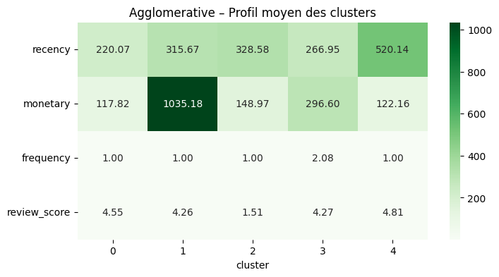
    


```python
# ==============================
# 3. DISTRIBUTIONS DES VARIABLES
# ==============================

features_to_plot = ['recency', 'monetary', 'frequency', 'review_score']
features_to_plot = [f for f in features_to_plot if f in df_AC_review_score_raw.columns]

# Boucle boxplots + tableau chiffré
for feature in features_to_plot:
    
    # Tableau descriptif par cluster
    desc = (
        df_AC_review_score_raw
        .groupby('cluster')[feature]
        .describe()
        .T
        .round(2)
    )
    
    # Titre explicite au-dessus du tableau
    print(f"\nTable descriptive – variable : {feature} | table : df_AC_review_score_raw")
    display(desc)

    # Boxplot
    plot_distributions(
        df=df_AC_review_score_raw,
        columns=feature,
        table_name="df_AC_review_score_raw"
    )

```

    
    Table descriptive – variable : recency | table : df_AC_review_score_raw
    


<div>
<style scoped>
    .dataframe tbody tr th:only-of-type {
        vertical-align: middle;
    }

    .dataframe tbody tr th {
        vertical-align: top;
    }

    .dataframe thead th {
        text-align: right;
    }
</style>
<table border="1" class="dataframe">
  <thead>
    <tr style="text-align: right;">
      <th>cluster</th>
      <th>0</th>
      <th>1</th>
      <th>2</th>
      <th>3</th>
      <th>4</th>
    </tr>
  </thead>
  <tbody>
    <tr>
      <th>count</th>
      <td>1244.00</td>
      <td>81.00</td>
      <td>312.00</td>
      <td>65.00</td>
      <td>298.00</td>
    </tr>
    <tr>
      <th>mean</th>
      <td>220.07</td>
      <td>315.67</td>
      <td>328.58</td>
      <td>266.95</td>
      <td>520.14</td>
    </tr>
    <tr>
      <th>std</th>
      <td>103.82</td>
      <td>186.64</td>
      <td>148.65</td>
      <td>133.68</td>
      <td>68.12</td>
    </tr>
    <tr>
      <th>min</th>
      <td>49.00</td>
      <td>57.00</td>
      <td>49.00</td>
      <td>53.00</td>
      <td>390.00</td>
    </tr>
    <tr>
      <th>25%</th>
      <td>128.00</td>
      <td>146.00</td>
      <td>215.00</td>
      <td>161.00</td>
      <td>464.00</td>
    </tr>
    <tr>
      <th>50%</th>
      <td>217.00</td>
      <td>299.00</td>
      <td>322.00</td>
      <td>259.00</td>
      <td>516.50</td>
    </tr>
    <tr>
      <th>75%</th>
      <td>309.25</td>
      <td>475.00</td>
      <td>449.00</td>
      <td>363.00</td>
      <td>567.25</td>
    </tr>
    <tr>
      <th>max</th>
      <td>465.00</td>
      <td>743.00</td>
      <td>742.00</td>
      <td>555.00</td>
      <td>741.00</td>
    </tr>
  </tbody>
</table>
</div>


    
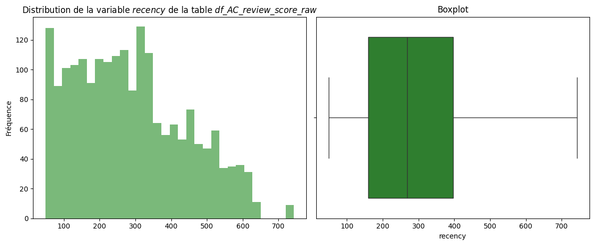
    


    
    Table descriptive – variable : monetary | table : df_AC_review_score_raw
    


<div>
<style scoped>
    .dataframe tbody tr th:only-of-type {
        vertical-align: middle;
    }

    .dataframe tbody tr th {
        vertical-align: top;
    }

    .dataframe thead th {
        text-align: right;
    }
</style>
<table border="1" class="dataframe">
  <thead>
    <tr style="text-align: right;">
      <th>cluster</th>
      <th>0</th>
      <th>1</th>
      <th>2</th>
      <th>3</th>
      <th>4</th>
    </tr>
  </thead>
  <tbody>
    <tr>
      <th>count</th>
      <td>1244.00</td>
      <td>81.00</td>
      <td>312.00</td>
      <td>65.00</td>
      <td>298.00</td>
    </tr>
    <tr>
      <th>mean</th>
      <td>117.82</td>
      <td>1035.18</td>
      <td>148.97</td>
      <td>296.60</td>
      <td>122.16</td>
    </tr>
    <tr>
      <th>std</th>
      <td>80.94</td>
      <td>689.29</td>
      <td>123.32</td>
      <td>234.48</td>
      <td>85.22</td>
    </tr>
    <tr>
      <th>min</th>
      <td>0.00</td>
      <td>448.91</td>
      <td>0.00</td>
      <td>44.72</td>
      <td>16.96</td>
    </tr>
    <tr>
      <th>25%</th>
      <td>59.10</td>
      <td>594.55</td>
      <td>64.28</td>
      <td>118.10</td>
      <td>55.83</td>
    </tr>
    <tr>
      <th>50%</th>
      <td>97.80</td>
      <td>758.93</td>
      <td>113.74</td>
      <td>250.08</td>
      <td>97.88</td>
    </tr>
    <tr>
      <th>75%</th>
      <td>153.41</td>
      <td>1224.10</td>
      <td>197.66</td>
      <td>392.54</td>
      <td>161.23</td>
    </tr>
    <tr>
      <th>max</th>
      <td>500.13</td>
      <td>4034.44</td>
      <td>913.70</td>
      <td>1395.76</td>
      <td>454.80</td>
    </tr>
  </tbody>
</table>
</div>


    
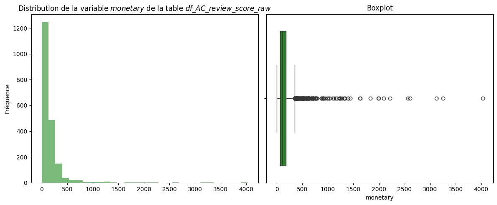
    


    
    Table descriptive – variable : frequency | table : df_AC_review_score_raw
    


<div>
<style scoped>
    .dataframe tbody tr th:only-of-type {
        vertical-align: middle;
    }

    .dataframe tbody tr th {
        vertical-align: top;
    }

    .dataframe thead th {
        text-align: right;
    }
</style>
<table border="1" class="dataframe">
  <thead>
    <tr style="text-align: right;">
      <th>cluster</th>
      <th>0</th>
      <th>1</th>
      <th>2</th>
      <th>3</th>
      <th>4</th>
    </tr>
  </thead>
  <tbody>
    <tr>
      <th>count</th>
      <td>1244.0</td>
      <td>81.0</td>
      <td>312.0</td>
      <td>65.00</td>
      <td>298.0</td>
    </tr>
    <tr>
      <th>mean</th>
      <td>1.0</td>
      <td>1.0</td>
      <td>1.0</td>
      <td>2.08</td>
      <td>1.0</td>
    </tr>
    <tr>
      <th>std</th>
      <td>0.0</td>
      <td>0.0</td>
      <td>0.0</td>
      <td>0.27</td>
      <td>0.0</td>
    </tr>
    <tr>
      <th>min</th>
      <td>1.0</td>
      <td>1.0</td>
      <td>1.0</td>
      <td>2.00</td>
      <td>1.0</td>
    </tr>
    <tr>
      <th>25%</th>
      <td>1.0</td>
      <td>1.0</td>
      <td>1.0</td>
      <td>2.00</td>
      <td>1.0</td>
    </tr>
    <tr>
      <th>50%</th>
      <td>1.0</td>
      <td>1.0</td>
      <td>1.0</td>
      <td>2.00</td>
      <td>1.0</td>
    </tr>
    <tr>
      <th>75%</th>
      <td>1.0</td>
      <td>1.0</td>
      <td>1.0</td>
      <td>2.00</td>
      <td>1.0</td>
    </tr>
    <tr>
      <th>max</th>
      <td>1.0</td>
      <td>1.0</td>
      <td>1.0</td>
      <td>3.00</td>
      <td>1.0</td>
    </tr>
  </tbody>
</table>
</div>


    
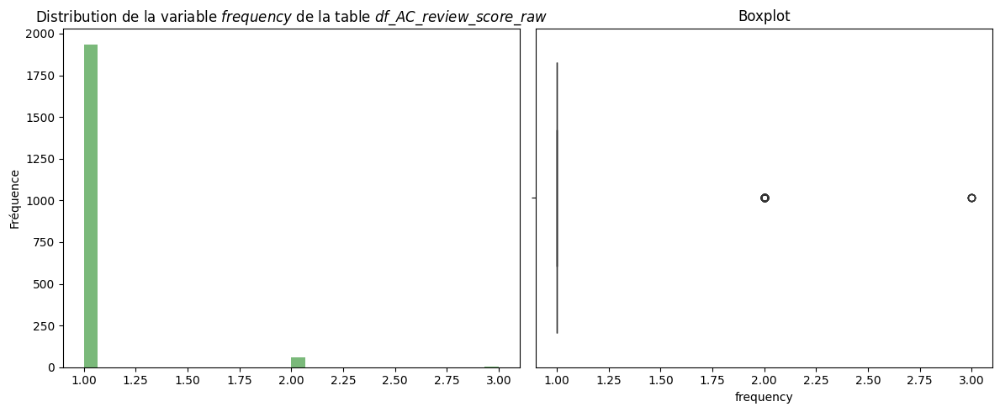
    


    
    Table descriptive – variable : review_score | table : df_AC_review_score_raw
    


<div>
<style scoped>
    .dataframe tbody tr th:only-of-type {
        vertical-align: middle;
    }

    .dataframe tbody tr th {
        vertical-align: top;
    }

    .dataframe thead th {
        text-align: right;
    }
</style>
<table border="1" class="dataframe">
  <thead>
    <tr style="text-align: right;">
      <th>cluster</th>
      <th>0</th>
      <th>1</th>
      <th>2</th>
      <th>3</th>
      <th>4</th>
    </tr>
  </thead>
  <tbody>
    <tr>
      <th>count</th>
      <td>1244.00</td>
      <td>81.00</td>
      <td>312.00</td>
      <td>65.00</td>
      <td>298.00</td>
    </tr>
    <tr>
      <th>mean</th>
      <td>4.55</td>
      <td>4.26</td>
      <td>1.51</td>
      <td>4.27</td>
      <td>4.81</td>
    </tr>
    <tr>
      <th>std</th>
      <td>0.68</td>
      <td>1.23</td>
      <td>0.83</td>
      <td>0.98</td>
      <td>0.40</td>
    </tr>
    <tr>
      <th>min</th>
      <td>3.00</td>
      <td>1.00</td>
      <td>1.00</td>
      <td>1.25</td>
      <td>3.00</td>
    </tr>
    <tr>
      <th>25%</th>
      <td>4.00</td>
      <td>4.00</td>
      <td>1.00</td>
      <td>4.00</td>
      <td>5.00</td>
    </tr>
    <tr>
      <th>50%</th>
      <td>5.00</td>
      <td>5.00</td>
      <td>1.00</td>
      <td>5.00</td>
      <td>5.00</td>
    </tr>
    <tr>
      <th>75%</th>
      <td>5.00</td>
      <td>5.00</td>
      <td>2.00</td>
      <td>5.00</td>
      <td>5.00</td>
    </tr>
    <tr>
      <th>max</th>
      <td>5.00</td>
      <td>5.00</td>
      <td>4.00</td>
      <td>5.00</td>
      <td>5.00</td>
    </tr>
  </tbody>
</table>
</div>


    
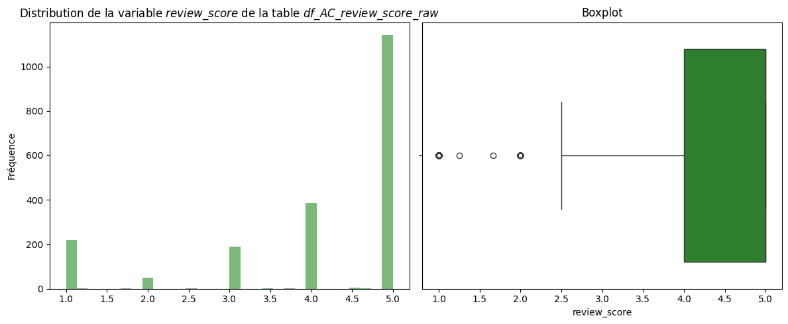
    


```python
# ==============================
# AFFICHAGE 3D
# ==============================

# vues réellement pertinentes au vu des données
views = [
    {'x': 'recency',   'y': 'monetary',  'z': 'review_score',
     'title': 'Recency / Monetary / Review_score'},
    {'x': 'monetary',  'y': 'review_score', 'z': 'recency',
     'title': 'Monetary / Review_score / Recency'},
    {'x': 'frequency', 'y': 'monetary',  'z': 'review_score',
     'title': 'Frequency / Monetary / Review_score'},
    {'x': 'recency',   'y': 'frequency', 'z': 'monetary',
     'title': 'Recency / Frequency / Monetary'}
]

fig = plt.figure(figsize=(16, 10))

# clusters uniques et couleurs
clusters = sorted(df_AC_review_score_raw['cluster'].unique())
colors = plt.cm.tab10(range(len(clusters)))
cluster_color_map = {cluster: colors[i] for i, cluster in enumerate(clusters)}

for i, view in enumerate(views, start=1):
    ax = fig.add_subplot(2, 2, i, projection='3d')

    for cluster in clusters:
        data = df_AC_review_score_raw[df_AC_review_score_raw['cluster'] == cluster]
        ax.scatter(
            data[view['x']],
            data[view['y']],
            data[view['z']],
            c=[cluster_color_map[cluster]],
            alpha=0.6,
            s=30,
            label=f"Cluster {cluster}" if cluster != -1 else "Bruit"
        )

    ax.set_xlabel(view['x'])
    ax.set_ylabel(view['y'])
    ax.set_zlabel(view['z'])
    ax.set_title(view['title'] + " – Agglomerative")
    ax.view_init(elev=30, azim=45)

# légende globale
handles = [Line2D([0], [0], marker='o', color='w',
                  label=f"Cluster {c}" if c != -1 else "Bruit",
                  markerfacecolor=cluster_color_map[c],
                  markersize=10) for c in clusters]
fig.legend(handles=handles, loc='upper right', title="Clusters")

plt.tight_layout()
plt.show()

```


    
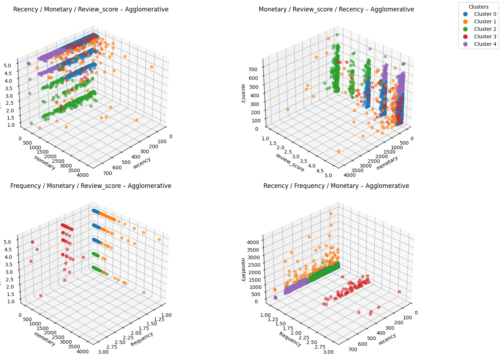
    


#### **Justification des vues 3D – Agglomerative**

- **Vue 1 : Recency / Monetary / Review_score**  
  Permet de distinguer clairement les clients récents vs anciens, leur valeur monétaire et leur niveau de satisfaction.  
  Met en évidence les gros clients anciens (fort monetary, forte recency) et les clients récents satisfaits.

- **Vue 2 : Monetary / Review_score / Recency**  
  Fait ressortir le cluster très insatisfait (review_score ≈ 1), indépendamment du niveau de dépense.  
  Aide à identifier les clients à risque, même lorsqu’ils ont une valeur monétaire correcte.

- **Vue 3 : Frequency / Monetary / Review_score**  
  Isole le cluster à fréquence élevée (frequency > 1), seul réellement distinct sur cet axe.  
  Compare les clients récurrents à leur valeur et à leur satisfaction.

- **Vue 4 : Recency / Frequency / Monetary**  
  Compare l’activité récente et la valeur des clients en fonction de leur fréquence.  
  Permet d’opposer clients récents mais peu actifs à clients plus anciens mais à valeur élevée.


### **ANALYSE DU CLUSTERING AGGLOMERATIVE CLUSTERING**

____
#### **STRUCTURE DU JEU DE DONNÉES**

| Élément | Valeur |
|------|------|
| Taille du jeu de données | 2 000 lignes × 6 colonnes |
| Variables quantitatives | frequency, monetary, recency, review_score |
| Variable de segmentation | cluster |
| Méthode de clustering | Agglomerative (hiérarchique) |
| Standardisation | oui |
| Valeurs manquantes | 0 % |
| Zéros | présents (monetary, review_score) |
| Nombre de clusters retenu | 5 |
| Échantillonnage | oui (subset de 2 000 clients) |

Variables utilisées  
- `frequency` : intensité d’achat  
- `monetary` : valeur générée  
- `recency` : récence d’achat (plus bas = plus récent)  
- `review_score` : satisfaction client  

____
#### **CHOIX DU NOMBRE DE CLUSTERS**

| k | Silhouette score |
|--|------------------|
| 2 | **0.661** |
| 3 | 0.419 |
| 4 | 0.451 |
| 5 | 0.396 |
| 6 | 0.340 |
| 7 | 0.345 |

- k=2 maximise la silhouette mais produit une segmentation trop grossière.
- k=5 offre :
  - une **segmentation métier plus fine**
  - une structure hiérarchique lisible
- Silhouette recalculée sur structure finale : **0.627**, indiquant une bonne cohérence interne.

____
#### **ANALYSE DU DENDROGRAMME**

- Les distances de fusion augmentent progressivement.
- Rupture visible autour des dernières fusions (> 50), suggérant :
  - une séparation naturelle en **≈ 5 groupes**
- Les derniers clusters fusionnés correspondent à des profils extrêmes :
  - très gros dépensiers
  - clients très anciens ou très récents

→ Le choix de **k=5** est cohérent avec la structure hiérarchique observée.

____
#### **RÉPARTITION DES CLUSTERS**

| Cluster | Nb clients | Part |
|------|-----------|------|
| 0 | 1 244 | 62.2 % |
| 1 | 81 | 4.1 % |
| 2 | 312 | 15.6 % |
| 3 | 65 | 3.3 % |
| 4 | 298 | 14.9 % |

→ Segmentation déséquilibrée mais **typique d’une structure RFM réelle** :  
un cluster majoritaire et plusieurs segments spécifiques.

____
#### **PROFIL MOYEN DES CLUSTERS**

| Cluster | Recency | Monetary | Frequency | Review_score |
|------|--------|----------|-----------|--------------|
| 0 | 220.07 | 117.82 | 1.00 | 4.55 |
| 1 | 315.67 | 1035.18 | 1.00 | 4.26 |
| 2 | 328.58 | 148.97 | 1.00 | 1.51 |
| 3 | 266.95 | 296.60 | 2.08 | 4.27 |
| 4 | 520.14 | 122.16 | 1.00 | 4.81 |

____
#### **INTERPRÉTATION MÉTIER DES CLUSTERS**

**Cluster 0 — Clients récents standards**
- Recency faible (≈ 220 jours)
- Monetary faible à moyen
- Frequency = 1
- Review_score élevé
→ Clients **actifs récents**, cœur de clientèle.

**Cluster 1 — Très gros dépensiers**
- Monetary très élevé (≈ 1 035)
- Frequency = 1
- Review_score élevé
→ Clients **à très forte valeur**, peu nombreux, critiques pour le CA.

**Cluster 2 — Clients insatisfaits**
- Review_score très bas (≈ 1.5)
- Monetary faible à moyen
- Recency élevée
→ Clients **à risque**, potentiels churn ou litiges.

**Cluster 3 — Clients récurrents**
- Frequency ≈ 2
- Monetary intermédiaire
- Review_score élevé
→ Clients **fidèles**, bons candidats à la fidélisation.

**Cluster 4 — Clients très anciens satisfaits**
- Recency très élevée (> 500 jours)
- Monetary faible
- Review_score très élevé
→ Clients **historiques peu actifs**, satisfaction intacte mais peu engagés.

____
#### **ANALYSE DÉTAILLÉE PAR VARIABLE**

**Recency**
- Cluster 0 : clients les plus récents
- Cluster 4 : clients très anciens
→ Variable fortement structurante.

**Monetary**
- Cluster 1 : rupture nette (outliers de valeur)
- Cluster 3 : valeur intermédiaire
→ Bonne discrimination des profils de valeur.

**Frequency**
- Majoritairement = 1
- Cluster 3 se distingue par une fréquence plus élevée
→ Segmentation secondaire mais pertinente.

**Review_score**
- Cluster 2 isolé par une satisfaction très basse
- Autres clusters globalement satisfaits
→ Variable clé pour identifier le risque client.

____
#### **CONCLUSION GLOBALE**

- Agglomerative Clustering met en évidence une **structure client riche et hiérarchique**.
- Segmentation équilibrée entre :
  - valeur (monetary)
  - comportement (frequency, recency)
  - satisfaction (review_score)
- Méthode particulièrement adaptée pour :
  - **analyse exploratoire**
  - compréhension fine des profils clients
- Limites :
  - calcul coûteux sur grands volumes
  - nécessite un échantillonnage
- Très bon complément ou alternative à KMeans lorsque la **compréhension métier prime** sur la scalabilité.
____


# **DBSCAN**

### **ENTRAÎNEMENT**


```python
# ==============================
# 1. PRÉPARATION DES DONNÉES
# ==============================

# copie des données brutes (sans clé unique)
df_DBSCAN_review_score_raw = df_review_score.drop(columns=['customer_unique_id']).copy()

# sélection des colonnes continues pertinentes pour DBSCAN
# on inclut review_score
cols_continuous = ['recency', 'monetary', 'review_score']

# standardisation
scaler_DB = StandardScaler()
df_DBSCAN_review_score_scaled = df_DBSCAN_review_score_raw[cols_continuous].copy()
df_DBSCAN_review_score_scaled.loc[:, :] = scaler_DB.fit_transform(df_DBSCAN_review_score_scaled)

# optionnel : ajuster le poids de review_score si nécessaire
# df_DBSCAN_review_score_scaled['review_score'] *= 1.5
```

    C:\Users\barre\AppData\Local\Temp\ipykernel_4968\439498182.py:15: FutureWarning: Setting an item of incompatible dtype is deprecated and will raise in a future error of pandas. Value '[-0.83262149 -0.81306654  1.93766244 ...  2.14624852 -0.78047497
      1.59219173]' has dtype incompatible with int64, please explicitly cast to a compatible dtype first.
      df_DBSCAN_review_score_scaled.loc[:, :] = scaler_DB.fit_transform(df_DBSCAN_review_score_scaled)
    


```python
# ==============================
# 2. STABILITÉ – K-DISTANCE
# ==============================

min_samples = 5

# calcul des distances aux k plus proches voisins
nn = NearestNeighbors(n_neighbors=min_samples)
nn.fit(df_DBSCAN_review_score_scaled)

distances, _ = nn.kneighbors(df_DBSCAN_review_score_scaled)
k_distances = np.sort(distances[:, -1])

# retirer les valeurs extrêmes pour visualisation (99,5 percentile)
k_distances_trim = k_distances[k_distances < np.percentile(k_distances, 99.5)]

# tableau descriptif des k-distances
df_k_distance = pd.DataFrame({"k_distance": k_distances})
display(df_k_distance.describe().T)

# histogramme exploitable
hist_counts, bin_edges = np.histogram(k_distances_trim, bins=50)
df_k_distance_hist = pd.DataFrame({
    "bin_start": bin_edges[:-1],
    "bin_end": bin_edges[1:],
    "count": hist_counts
})
display(df_k_distance_hist)

# graphe k-distance en vert forêt
plt.figure(figsize=(10, 5))
plt.plot(k_distances_trim, color='forestgreen')
plt.title("K-distance plot (99.5 percentile) – choix de eps")
plt.xlabel("Observations triées")
plt.ylabel("Distance")
plt.grid(True)
plt.show()

```


<div>
<style scoped>
    .dataframe tbody tr th:only-of-type {
        vertical-align: middle;
    }

    .dataframe tbody tr th {
        vertical-align: top;
    }

    .dataframe thead th {
        text-align: right;
    }
</style>
<table border="1" class="dataframe">
  <thead>
    <tr style="text-align: right;">
      <th></th>
      <th>count</th>
      <th>mean</th>
      <th>std</th>
      <th>min</th>
      <th>25%</th>
      <th>50%</th>
      <th>75%</th>
      <th>max</th>
    </tr>
  </thead>
  <tbody>
    <tr>
      <th>k_distance</th>
      <td>96096.0</td>
      <td>0.026558</td>
      <td>0.119835</td>
      <td>0.0</td>
      <td>0.007532</td>
      <td>0.013053</td>
      <td>0.022639</td>
      <td>29.792445</td>
    </tr>
  </tbody>
</table>
</div>


<div>
<style scoped>
    .dataframe tbody tr th:only-of-type {
        vertical-align: middle;
    }

    .dataframe tbody tr th {
        vertical-align: top;
    }

    .dataframe thead th {
        text-align: right;
    }
</style>
<table border="1" class="dataframe">
  <thead>
    <tr style="text-align: right;">
      <th></th>
      <th>bin_start</th>
      <th>bin_end</th>
      <th>count</th>
    </tr>
  </thead>
  <tbody>
    <tr>
      <th>0</th>
      <td>0.000000</td>
      <td>0.007546</td>
      <td>24197</td>
    </tr>
    <tr>
      <th>1</th>
      <td>0.007546</td>
      <td>0.015093</td>
      <td>33458</td>
    </tr>
    <tr>
      <th>2</th>
      <td>0.015093</td>
      <td>0.022639</td>
      <td>14427</td>
    </tr>
    <tr>
      <th>3</th>
      <td>0.022639</td>
      <td>0.030185</td>
      <td>7482</td>
    </tr>
    <tr>
      <th>4</th>
      <td>0.030185</td>
      <td>0.037731</td>
      <td>4194</td>
    </tr>
    <tr>
      <th>5</th>
      <td>0.037731</td>
      <td>0.045278</td>
      <td>2584</td>
    </tr>
    <tr>
      <th>6</th>
      <td>0.045278</td>
      <td>0.052824</td>
      <td>1851</td>
    </tr>
    <tr>
      <th>7</th>
      <td>0.052824</td>
      <td>0.060370</td>
      <td>1191</td>
    </tr>
    <tr>
      <th>8</th>
      <td>0.060370</td>
      <td>0.067916</td>
      <td>838</td>
    </tr>
    <tr>
      <th>9</th>
      <td>0.067916</td>
      <td>0.075463</td>
      <td>710</td>
    </tr>
    <tr>
      <th>10</th>
      <td>0.075463</td>
      <td>0.083009</td>
      <td>583</td>
    </tr>
    <tr>
      <th>11</th>
      <td>0.083009</td>
      <td>0.090555</td>
      <td>487</td>
    </tr>
    <tr>
      <th>12</th>
      <td>0.090555</td>
      <td>0.098102</td>
      <td>408</td>
    </tr>
    <tr>
      <th>13</th>
      <td>0.098102</td>
      <td>0.105648</td>
      <td>265</td>
    </tr>
    <tr>
      <th>14</th>
      <td>0.105648</td>
      <td>0.113194</td>
      <td>278</td>
    </tr>
    <tr>
      <th>15</th>
      <td>0.113194</td>
      <td>0.120740</td>
      <td>247</td>
    </tr>
    <tr>
      <th>16</th>
      <td>0.120740</td>
      <td>0.128287</td>
      <td>208</td>
    </tr>
    <tr>
      <th>17</th>
      <td>0.128287</td>
      <td>0.135833</td>
      <td>176</td>
    </tr>
    <tr>
      <th>18</th>
      <td>0.135833</td>
      <td>0.143379</td>
      <td>177</td>
    </tr>
    <tr>
      <th>19</th>
      <td>0.143379</td>
      <td>0.150926</td>
      <td>148</td>
    </tr>
    <tr>
      <th>20</th>
      <td>0.150926</td>
      <td>0.158472</td>
      <td>129</td>
    </tr>
    <tr>
      <th>21</th>
      <td>0.158472</td>
      <td>0.166018</td>
      <td>127</td>
    </tr>
    <tr>
      <th>22</th>
      <td>0.166018</td>
      <td>0.173564</td>
      <td>101</td>
    </tr>
    <tr>
      <th>23</th>
      <td>0.173564</td>
      <td>0.181111</td>
      <td>100</td>
    </tr>
    <tr>
      <th>24</th>
      <td>0.181111</td>
      <td>0.188657</td>
      <td>99</td>
    </tr>
    <tr>
      <th>25</th>
      <td>0.188657</td>
      <td>0.196203</td>
      <td>107</td>
    </tr>
    <tr>
      <th>26</th>
      <td>0.196203</td>
      <td>0.203749</td>
      <td>87</td>
    </tr>
    <tr>
      <th>27</th>
      <td>0.203749</td>
      <td>0.211296</td>
      <td>73</td>
    </tr>
    <tr>
      <th>28</th>
      <td>0.211296</td>
      <td>0.218842</td>
      <td>72</td>
    </tr>
    <tr>
      <th>29</th>
      <td>0.218842</td>
      <td>0.226388</td>
      <td>73</td>
    </tr>
    <tr>
      <th>30</th>
      <td>0.226388</td>
      <td>0.233935</td>
      <td>83</td>
    </tr>
    <tr>
      <th>31</th>
      <td>0.233935</td>
      <td>0.241481</td>
      <td>57</td>
    </tr>
    <tr>
      <th>32</th>
      <td>0.241481</td>
      <td>0.249027</td>
      <td>46</td>
    </tr>
    <tr>
      <th>33</th>
      <td>0.249027</td>
      <td>0.256573</td>
      <td>78</td>
    </tr>
    <tr>
      <th>34</th>
      <td>0.256573</td>
      <td>0.264120</td>
      <td>35</td>
    </tr>
    <tr>
      <th>35</th>
      <td>0.264120</td>
      <td>0.271666</td>
      <td>49</td>
    </tr>
    <tr>
      <th>36</th>
      <td>0.271666</td>
      <td>0.279212</td>
      <td>32</td>
    </tr>
    <tr>
      <th>37</th>
      <td>0.279212</td>
      <td>0.286759</td>
      <td>23</td>
    </tr>
    <tr>
      <th>38</th>
      <td>0.286759</td>
      <td>0.294305</td>
      <td>35</td>
    </tr>
    <tr>
      <th>39</th>
      <td>0.294305</td>
      <td>0.301851</td>
      <td>25</td>
    </tr>
    <tr>
      <th>40</th>
      <td>0.301851</td>
      <td>0.309397</td>
      <td>23</td>
    </tr>
    <tr>
      <th>41</th>
      <td>0.309397</td>
      <td>0.316944</td>
      <td>22</td>
    </tr>
    <tr>
      <th>42</th>
      <td>0.316944</td>
      <td>0.324490</td>
      <td>20</td>
    </tr>
    <tr>
      <th>43</th>
      <td>0.324490</td>
      <td>0.332036</td>
      <td>21</td>
    </tr>
    <tr>
      <th>44</th>
      <td>0.332036</td>
      <td>0.339582</td>
      <td>20</td>
    </tr>
    <tr>
      <th>45</th>
      <td>0.339582</td>
      <td>0.347129</td>
      <td>19</td>
    </tr>
    <tr>
      <th>46</th>
      <td>0.347129</td>
      <td>0.354675</td>
      <td>27</td>
    </tr>
    <tr>
      <th>47</th>
      <td>0.354675</td>
      <td>0.362221</td>
      <td>26</td>
    </tr>
    <tr>
      <th>48</th>
      <td>0.362221</td>
      <td>0.369768</td>
      <td>27</td>
    </tr>
    <tr>
      <th>49</th>
      <td>0.369768</td>
      <td>0.377314</td>
      <td>70</td>
    </tr>
  </tbody>
</table>
</div>


    
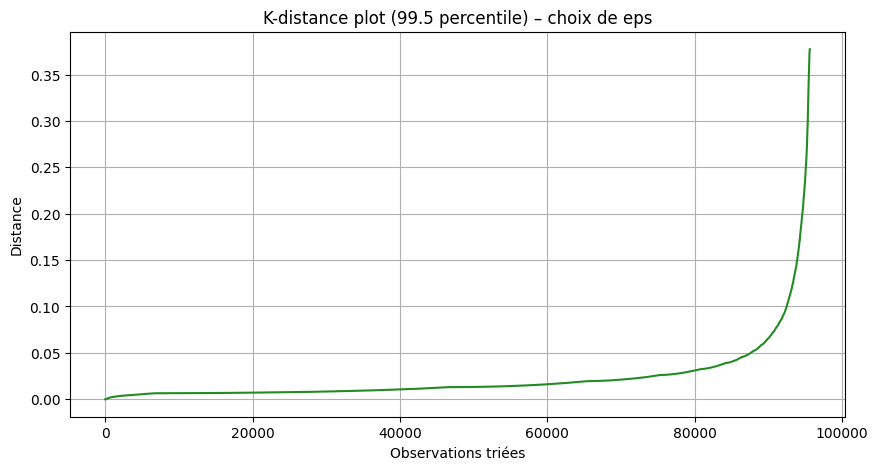
    


```python
# ==============================
# 3. STABILITÉ DBSCAN – ÉCHANTILLON
# ==============================

sample_size = 2000
df_sample_scaled = df_DBSCAN_review_score_scaled.sample(
    n=sample_size,
    random_state=42
)

# plage d'eps adaptée à la distribution observée
eps_grid = np.arange(0.1, 1.1, 0.1)
rows = []

for eps in eps_grid:
    labels = DBSCAN(
        eps=eps,
        min_samples=min_samples
    ).fit_predict(df_sample_scaled)

    rows.append({
        "eps": eps,
        "n_clusters": len(set(labels)) - (1 if -1 in labels else 0),
        "noise_ratio": (labels == -1).mean()
    })

df_eps_stability = pd.DataFrame(rows)
display(df_eps_stability)

```


<div>
<style scoped>
    .dataframe tbody tr th:only-of-type {
        vertical-align: middle;
    }

    .dataframe tbody tr th {
        vertical-align: top;
    }

    .dataframe thead th {
        text-align: right;
    }
</style>
<table border="1" class="dataframe">
  <thead>
    <tr style="text-align: right;">
      <th></th>
      <th>eps</th>
      <th>n_clusters</th>
      <th>noise_ratio</th>
    </tr>
  </thead>
  <tbody>
    <tr>
      <th>0</th>
      <td>0.1</td>
      <td>34</td>
      <td>0.3560</td>
    </tr>
    <tr>
      <th>1</th>
      <td>0.2</td>
      <td>16</td>
      <td>0.1480</td>
    </tr>
    <tr>
      <th>2</th>
      <td>0.3</td>
      <td>11</td>
      <td>0.0720</td>
    </tr>
    <tr>
      <th>3</th>
      <td>0.4</td>
      <td>6</td>
      <td>0.0510</td>
    </tr>
    <tr>
      <th>4</th>
      <td>0.5</td>
      <td>2</td>
      <td>0.0400</td>
    </tr>
    <tr>
      <th>5</th>
      <td>0.6</td>
      <td>3</td>
      <td>0.0355</td>
    </tr>
    <tr>
      <th>6</th>
      <td>0.7</td>
      <td>2</td>
      <td>0.0305</td>
    </tr>
    <tr>
      <th>7</th>
      <td>0.8</td>
      <td>2</td>
      <td>0.0240</td>
    </tr>
    <tr>
      <th>8</th>
      <td>0.9</td>
      <td>2</td>
      <td>0.0185</td>
    </tr>
    <tr>
      <th>9</th>
      <td>1.0</td>
      <td>2</td>
      <td>0.0120</td>
    </tr>
  </tbody>
</table>
</div>


```python
# !!!!!!!!!!!!!!!!!! commenter le choix
```


```python
# ==============================
# 4. DBSCAN FINAL – ADAPTÉ AUX RÉSULTATS
# ==============================

# eps choisi en fonction du k-distance plot et de la stabilité sur l'échantillon
eps_final = 0.3  # juste après le pic où le bruit chute fortement
min_samples = 5

# clustering DBSCAN sur toutes les données standardisées (avec review_score inclus)
labels = DBSCAN(
    eps=eps_final,
    min_samples=min_samples
).fit_predict(df_DBSCAN_review_score_scaled)

df_DBSCAN_labels = pd.DataFrame({"cluster": labels})

# compter points par cluster
cluster_counts = df_DBSCAN_labels["cluster"].value_counts()

# filtrer les clusters trop petits (<1% du dataset) en les considérant comme bruit
min_size = 0.01 * len(df_DBSCAN_labels)
df_DBSCAN_labels["cluster_final"] = df_DBSCAN_labels["cluster"].apply(
    lambda x: x if cluster_counts[x] >= min_size else -1
)

# vérifier le résultat
print(df_DBSCAN_labels["cluster_final"].value_counts())

```

    cluster_final
     0    84475
     1    10558
    -1     1063
    Name: count, dtype: int64
    


```python
# ==============================
# 5. DATAFRAME FINAL
# ==============================

df_DBSCAN_review_score_final = df_DBSCAN_review_score_raw.copy()
df_DBSCAN_review_score_final["cluster"] = df_DBSCAN_labels["cluster_final"]

# exclusion du bruit pour profil
df_DB_no_noise = df_DBSCAN_review_score_final.query("cluster != -1").copy()
```


```python
# ==============================
# SAUVEGARDE DATAFRAMES
# ==============================

path_data = r"C:\Users\barre\Documents\Pro\Reconversion_professionnelle\Formations\Data_Scientist_by_Openclassrooms\P05\data"

df_DBSCAN_review_score_final.to_csv(
    f"{path_data}/df_DBSCAN_review_score_final.csv",
    index=False
)

df_DBSCAN_review_score_scaled.to_csv(
    f"{path_data}/df_DBSCAN_review_score_scaled.csv",
    index=False
)

```


```python
# ==============================
# RECHARGEMENT DATAFRAMES
# ==============================

df_DBSCAN_review_score_final = pd.read_csv(
    f"{path_data}/df_DBSCAN_review_score_final.csv",
    parse_dates=['last_order_date']
)

df_DBSCAN_review_score_scaled = pd.read_csv(
    f"{path_data}/df_DBSCAN_review_score_scaled.csv"
)

```

### **INTERPRÉTATION DES CLUSTERS**


```python
# ==============================
# PROFIL COMPLET
# ==============================

display(
    profile_dataframe(
        df_DBSCAN_review_score_final,
        table_name="df_DBSCAN_review_score_final"
    )
)
```

    
    === Table : df_DBSCAN_review_score_final ===
    Taille : 96096 lignes × 6 colonnes
    Clé primaire : non renseignée
    
    --- Tableau de profil ---
    


<div>
<style scoped>
    .dataframe tbody tr th:only-of-type {
        vertical-align: middle;
    }

    .dataframe tbody tr th {
        vertical-align: top;
    }

    .dataframe thead th {
        text-align: right;
    }
</style>
<table border="1" class="dataframe">
  <thead>
    <tr style="text-align: right;">
      <th></th>
      <th>column</th>
      <th>first_value</th>
      <th>dtype</th>
      <th>detailed_type</th>
      <th>n_unique</th>
      <th>pct_duplicates</th>
      <th>pct_missing</th>
      <th>pct_zeros</th>
      <th>min</th>
      <th>q25</th>
      <th>median</th>
      <th>q75</th>
      <th>max</th>
      <th>mean</th>
    </tr>
  </thead>
  <tbody>
    <tr>
      <th>0</th>
      <td>frequency</td>
      <td>1</td>
      <td>int64</td>
      <td>numérique</td>
      <td>9</td>
      <td>NaN</td>
      <td>0.0</td>
      <td>0.00</td>
      <td>1</td>
      <td>1.0</td>
      <td>1.0</td>
      <td>1.0</td>
      <td>17</td>
      <td>1.03</td>
    </tr>
    <tr>
      <th>1</th>
      <td>monetary</td>
      <td>141.9</td>
      <td>float64</td>
      <td>numérique</td>
      <td>29581</td>
      <td>NaN</td>
      <td>0.0</td>
      <td>0.70</td>
      <td>0.0</td>
      <td>62.39</td>
      <td>107.27</td>
      <td>182.2375</td>
      <td>13664.08</td>
      <td>164.87</td>
    </tr>
    <tr>
      <th>2</th>
      <td>last_order_date</td>
      <td>2018-05-10 10:56:27</td>
      <td>datetime64[ns]</td>
      <td>date</td>
      <td>95834</td>
      <td>NaN</td>
      <td>0.0</td>
      <td>NaN</td>
      <td>2016-09-04 21:15:19</td>
      <td>2017-09-15 09:04:17.249999872</td>
      <td>2018-01-21 19:39:16</td>
      <td>2018-05-06 20:14:49.750000128</td>
      <td>2018-10-17 17:30:18</td>
      <td>NaN</td>
    </tr>
    <tr>
      <th>3</th>
      <td>recency</td>
      <td>160</td>
      <td>int64</td>
      <td>numérique</td>
      <td>630</td>
      <td>NaN</td>
      <td>0.0</td>
      <td>0.00</td>
      <td>0</td>
      <td>163.0</td>
      <td>268.0</td>
      <td>397.0</td>
      <td>772</td>
      <td>287.74</td>
    </tr>
    <tr>
      <th>4</th>
      <td>review_score</td>
      <td>5.0</td>
      <td>float64</td>
      <td>numérique</td>
      <td>34</td>
      <td>NaN</td>
      <td>0.0</td>
      <td>0.00</td>
      <td>1.0</td>
      <td>4.0</td>
      <td>5.0</td>
      <td>5.0</td>
      <td>5.0</td>
      <td>4.09</td>
    </tr>
    <tr>
      <th>5</th>
      <td>cluster</td>
      <td>0</td>
      <td>int64</td>
      <td>numérique</td>
      <td>3</td>
      <td>NaN</td>
      <td>0.0</td>
      <td>87.91</td>
      <td>-1</td>
      <td>0.0</td>
      <td>0.0</td>
      <td>0.0</td>
      <td>1</td>
      <td>0.10</td>
    </tr>
  </tbody>
</table>
</div>


```python
# ==============================
# EXCLUSION DU BRUIT
# ==============================

df_DB_no_noise = (
    df_DBSCAN_review_score_final
    .query("cluster != -1")
    .copy()
)
```


```python
# ==============================
# 6. PROFIL MOYEN PAR CLUSTER
# ==============================

cluster_means_DB = (
    df_DB_no_noise
    .groupby("cluster")[cols_continuous]
    .mean()
    .round(2)
)

display(cluster_means_DB)

plt.figure(figsize=(4, 4))
sns.heatmap(cluster_means_DB.T, annot=True, fmt=".2f", cmap="Greens")
plt.title("DBSCAN – Profil moyen")
plt.tight_layout()
plt.show()
```


<div>
<style scoped>
    .dataframe tbody tr th:only-of-type {
        vertical-align: middle;
    }

    .dataframe tbody tr th {
        vertical-align: top;
    }

    .dataframe thead th {
        text-align: right;
    }
</style>
<table border="1" class="dataframe">
  <thead>
    <tr style="text-align: right;">
      <th></th>
      <th>recency</th>
      <th>monetary</th>
      <th>review_score</th>
    </tr>
    <tr>
      <th>cluster</th>
      <th></th>
      <th></th>
      <th></th>
    </tr>
  </thead>
  <tbody>
    <tr>
      <th>0</th>
      <td>285.54</td>
      <td>151.39</td>
      <td>4.49</td>
    </tr>
    <tr>
      <th>1</th>
      <td>290.07</td>
      <td>164.75</td>
      <td>1.00</td>
    </tr>
  </tbody>
</table>
</div>


    
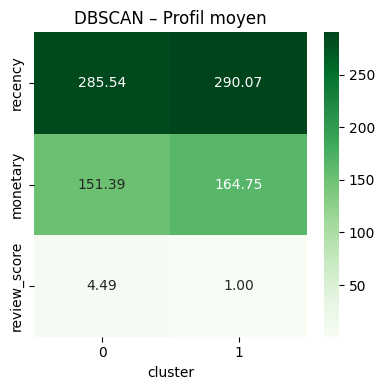
    


```python
# ==============================
# 7. DISTRIBUTIONS PAR CLUSTER
# ==============================

for feature in cols_continuous:
    # Tableau descriptif par cluster
    desc = df_DB_no_noise.groupby("cluster")[feature].describe().T.round(2)
    print(f"\nTable descriptive – variable : {feature} | table : df_DB_no_noise")
    display(desc)

    # Boxplot (fonction générique)
    plot_distributions(
        df=df_DB_no_noise,
        columns=feature,
        table_name="df_DB_no_noise"
    )
```

    
    Table descriptive – variable : recency | table : df_DB_no_noise
    


<div>
<style scoped>
    .dataframe tbody tr th:only-of-type {
        vertical-align: middle;
    }

    .dataframe tbody tr th {
        vertical-align: top;
    }

    .dataframe thead th {
        text-align: right;
    }
</style>
<table border="1" class="dataframe">
  <thead>
    <tr style="text-align: right;">
      <th>cluster</th>
      <th>0</th>
      <th>1</th>
    </tr>
  </thead>
  <tbody>
    <tr>
      <th>count</th>
      <td>84475.00</td>
      <td>10558.00</td>
    </tr>
    <tr>
      <th>mean</th>
      <td>285.54</td>
      <td>290.07</td>
    </tr>
    <tr>
      <th>std</th>
      <td>152.44</td>
      <td>141.48</td>
    </tr>
    <tr>
      <th>min</th>
      <td>16.00</td>
      <td>0.00</td>
    </tr>
    <tr>
      <th>25%</th>
      <td>161.00</td>
      <td>195.25</td>
    </tr>
    <tr>
      <th>50%</th>
      <td>268.00</td>
      <td>265.00</td>
    </tr>
    <tr>
      <th>75%</th>
      <td>398.00</td>
      <td>368.00</td>
    </tr>
    <tr>
      <th>max</th>
      <td>650.00</td>
      <td>648.00</td>
    </tr>
  </tbody>
</table>
</div>


    
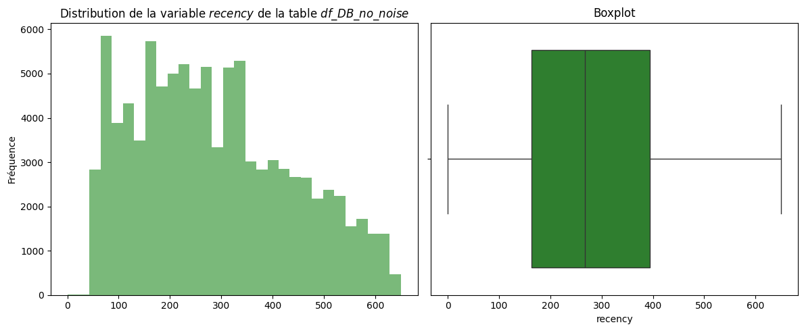
    


    
    Table descriptive – variable : monetary | table : df_DB_no_noise
    


<div>
<style scoped>
    .dataframe tbody tr th:only-of-type {
        vertical-align: middle;
    }

    .dataframe tbody tr th {
        vertical-align: top;
    }

    .dataframe thead th {
        text-align: right;
    }
</style>
<table border="1" class="dataframe">
  <thead>
    <tr style="text-align: right;">
      <th>cluster</th>
      <th>0</th>
      <th>1</th>
    </tr>
  </thead>
  <tbody>
    <tr>
      <th>count</th>
      <td>84475.00</td>
      <td>10558.00</td>
    </tr>
    <tr>
      <th>mean</th>
      <td>151.39</td>
      <td>164.75</td>
    </tr>
    <tr>
      <th>std</th>
      <td>159.08</td>
      <td>166.72</td>
    </tr>
    <tr>
      <th>min</th>
      <td>0.00</td>
      <td>0.00</td>
    </tr>
    <tr>
      <th>25%</th>
      <td>61.80</td>
      <td>64.31</td>
    </tr>
    <tr>
      <th>50%</th>
      <td>105.63</td>
      <td>114.50</td>
    </tr>
    <tr>
      <th>75%</th>
      <td>176.76</td>
      <td>198.88</td>
    </tr>
    <tr>
      <th>max</th>
      <td>1759.04</td>
      <td>1293.26</td>
    </tr>
  </tbody>
</table>
</div>


    
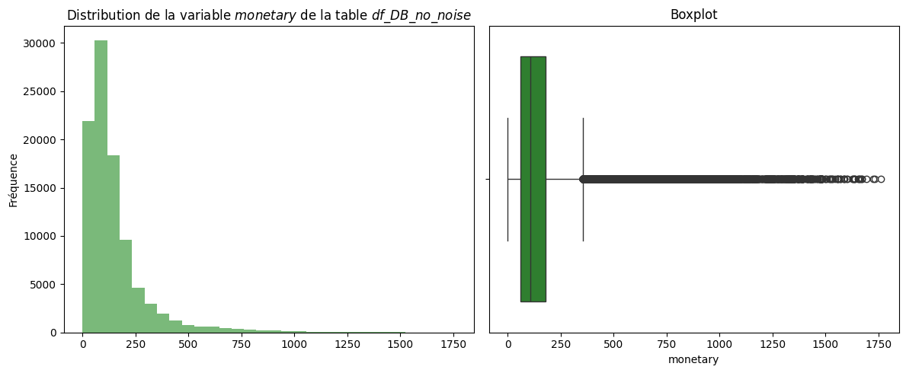
    


    
    Table descriptive – variable : review_score | table : df_DB_no_noise
    


<div>
<style scoped>
    .dataframe tbody tr th:only-of-type {
        vertical-align: middle;
    }

    .dataframe tbody tr th {
        vertical-align: top;
    }

    .dataframe thead th {
        text-align: right;
    }
</style>
<table border="1" class="dataframe">
  <thead>
    <tr style="text-align: right;">
      <th>cluster</th>
      <th>0</th>
      <th>1</th>
    </tr>
  </thead>
  <tbody>
    <tr>
      <th>count</th>
      <td>84475.00</td>
      <td>10558.00</td>
    </tr>
    <tr>
      <th>mean</th>
      <td>4.49</td>
      <td>1.00</td>
    </tr>
    <tr>
      <th>std</th>
      <td>0.81</td>
      <td>0.01</td>
    </tr>
    <tr>
      <th>min</th>
      <td>1.50</td>
      <td>1.00</td>
    </tr>
    <tr>
      <th>25%</th>
      <td>4.00</td>
      <td>1.00</td>
    </tr>
    <tr>
      <th>50%</th>
      <td>5.00</td>
      <td>1.00</td>
    </tr>
    <tr>
      <th>75%</th>
      <td>5.00</td>
      <td>1.00</td>
    </tr>
    <tr>
      <th>max</th>
      <td>5.00</td>
      <td>1.50</td>
    </tr>
  </tbody>
</table>
</div>


    
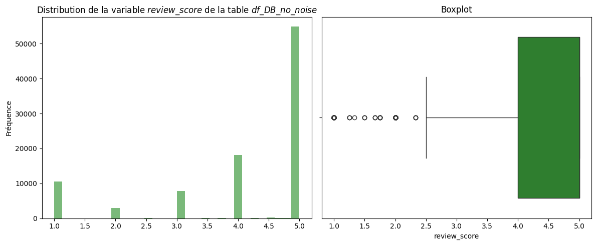
    


```python
# ==============================
# 8. AFFICHAGE 3D
# ==============================

views = [
    {'x': 'recency',   'y': 'monetary',  'z': 'review_score',
     'title': 'Recency / Monetary / Review_score'},
    {'x': 'monetary',  'y': 'review_score', 'z': 'recency',
     'title': 'Monetary / Review_score / Recency'}
]

fig = plt.figure(figsize=(16, 8))

# clusters uniques
clusters = sorted(df_DBSCAN_review_score_final['cluster'].unique())
colors = plt.cm.tab10(range(len(clusters)))

# mapping cluster -> couleur
cluster_color_map = {cluster: colors[i] for i, cluster in enumerate(clusters)}

for i, view in enumerate(views, start=1):
    ax = fig.add_subplot(1, 2, i, projection='3d')

    for cluster in clusters:
        data = df_DBSCAN_review_score_final[df_DBSCAN_review_score_final['cluster'] == cluster]
        ax.scatter(
            data[view['x']],
            data[view['y']],
            data[view['z']],
            c=[cluster_color_map[cluster]],
            label=f'Cluster {cluster}' if cluster != -1 else 'Bruit',
            alpha=0.6,
            s=30
        )

    ax.set_xlabel(view['x'])
    ax.set_ylabel(view['y'])
    ax.set_zlabel(view['z'])
    ax.set_title(view['title'] + " – DBSCAN")
    ax.view_init(elev=20, azim=60)

# légende globale
handles = [Line2D([0], [0], marker='o', color='w', label=f'Cluster {c}' if c != -1 else 'Bruit',
                  markerfacecolor=cluster_color_map[c], markersize=10) for c in clusters]
fig.legend(handles=handles, loc='upper right', title="Clusters")

plt.tight_layout()
plt.show()
```


    
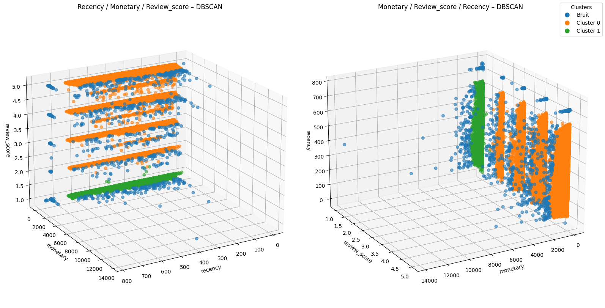
    


#### Justification des vues 3D – DBSCAN

- **Vue 1 : Recency / Monetary / Review_score**  
  Montre la dispersion des clients récents vs anciens, leur valeur monétaire et leur satisfaction.
  Permet de visualiser les clusters principaux et d’isoler le bruit (-1).

- **Vue 2 : Monetary / Review_score / Recency**  
  Met en évidence les clients qui dépensent plus mais ont une faible satisfaction, ou les différences entre anciens et récents.
  Utile pour détecter les anomalies et clusters moins denses.

💡 Conclusion : Ces deux vues sont suffisantes et pertinentes pour visualiser la séparation des clusters DBSCAN sur ce dataset, car frequency est constante et n’apporte pas d’information supplémentaire.

### **ANALYSE DU DBSCAN**

____
#### **STRUCTURE DU JEU DE DONNÉES**

| Élément | Valeur |
|------|------|
| Taille du jeu de données | 96 096 lignes × 6 colonnes |
| Variables quantitatives | frequency, monetary, recency, review_score |
| Variable de segmentation | cluster |
| Méthode de clustering | DBSCAN |
| Standardisation | oui |
| Valeurs manquantes | 0 % |
| Zéros | présents (monetary, review_score) |
| Nombre de clusters retenu | 2 (hors bruit) |
| Clusters de bruit | -1 : 1,1 % du dataset |

Variables utilisées  
- `frequency` : intensité d’achat  
- `monetary` : valeur générée par client  
- `recency` : récence d’achat (plus faible = plus récent)  
- `review_score` : satisfaction client  

____
#### **ANALYSE DU k-DISTANCE ET CHOIX DE `eps`**

Statistiques descriptives du k-distance (k = min_samples) :

- Médiane : **0.013**
- 75ᵉ percentile : **0.0226**
- Forte concentration des distances entre **0.007 et 0.03**
- Queue longue jusqu’à des valeurs extrêmes (> 1), correspondant à des points isolés

Histogramme des distances :
- Accumulation massive dans les premiers bins
- Changement de pente progressif, sans coude très net
→ Justifie une **approche empirique par grille de valeurs `eps`**

____
#### **TEST DE SENSIBILITÉ À `eps`**

| eps | n_clusters | noise_ratio |
|----|-----------|-------------|
| 0.1 | 34 | 35.6 % |
| 0.2 | 16 | 14.8 % |
| 0.3 | 11 | 7.2 % |
| 0.4 | 6 | 5.1 % |
| 0.5 | 2 | 4.0 % |
| 0.6 | 3 | 3.55 % |
| 0.7 | 2 | 3.05 % |
| 0.8 | 2 | 2.40 % |
| 0.9 | 2 | 1.85 % |
| 1.0 | 2 | 1.20 % |

Choix final :
- **eps ≈ 0.5–0.6**
- Bon compromis entre :
  - réduction du bruit
  - nombre de clusters limité
  - interprétabilité métier

____
#### **RÉPARTITION DES CLUSTERS FINAUX**

| Cluster | Nb clients | Part |
|------|-----------|------|
| 0 | 84 475 | 87.9 % |
| 1 | 10 558 | 11.0 % |
| -1 | 1 063 | 1.1 % |

→ Segmentation **peu bruitée**, contrairement aux premiers essais.  
→ Deux clusters denses + un petit ensemble d’anomalies.

____
#### **PROFIL MOYEN DES CLUSTERS (hors bruit)**

| Cluster | Recency | Monetary | Review_score |
|------|--------|----------|--------------|
| 0 | 285.54 | 151.39 | 4.49 |
| 1 | 290.07 | 164.75 | 1.00 |

____
#### **INTERPRÉTATION MÉTIER DES CLUSTERS**

**Cluster 0 — Clients satisfaits majoritaires**
- Recency intermédiaire (~286 jours)
- Monetary faible à moyenne
- Review_score très élevé (~4.5)
→ Clients **standards satisfaits**, cœur de la base client.

**Cluster 1 — Clients insatisfaits**
- Recency proche du cluster 0
- Monetary légèrement supérieur
- Review_score ≈ **1.0** (quasi constant)
→ Clients **fortement insatisfaits**, à risque de churn ou de litige.

**Bruit (-1)**
- Points isolés
- Profils atypiques (valeurs extrêmes ou rares)
→ Clients non généralisables, à exclure des segmentations marketing.

____
#### **ANALYSE DÉTAILLÉE PAR VARIABLE**

**Recency**
- Distributions proches entre clusters
- DBSCAN ne segmente pas principalement sur la récence

**Monetary**
- Cluster 1 légèrement plus rentable
- Forte dispersion dans les deux clusters
→ Variable secondaire dans la séparation

**Review_score**
- Variable **clé de la segmentation**
- Séparation quasi binaire :
  - cluster 0 : clients satisfaits
  - cluster 1 : clients très insatisfaits

____
#### **CONCLUSION GLOBALE**

- DBSCAN segmente principalement sur la **densité liée au review_score**, pas sur la structure RFM classique.
- Résultat :  
  - 1 cluster majoritaire de clients satisfaits  
  - 1 cluster clair de clients insatisfaits  
  - peu de bruit
- Très pertinent pour :
  - détection de **clients à risque**
  - analyses qualité / satisfaction
- Peu adapté pour une segmentation marketing fine RFM.
- DBSCAN est ici un **outil de détection de rupture comportementale**, pas un algorithme de segmentation client globale.
____


# **ANALYSE COMPARATIVE DES MODÈLES**

On analyse selon **trois axes** :
- cohérence interne (silhouette / inertia)
- répartition des clusters
- profil métier des clusters

---

#### **KMEANS SANS `review_score`**

**Silhouette et inertia**
- **4 clusters** :  
  - silhouette ≈ **0.488**  
  - inertia ≈ **95 724**  
→ cohérence correcte sans être excellente.

**Répartition**
- Cluster 0 dominant (~54 %)
- Clusters 1 et 3 très petits (< 3 %)

**Profil des clusters**
- **Cluster 2** : clients plus fréquents et plus dépensiers  
  - frequency ≈ 2.12  
  - monetary ≈ 285.94
- **Cluster 3** : très gros dépensiers mais peu nombreux  
  - monetary ≈ 1165  
  - frequency ≈ 1
- **Clusters 0 et 1** : petits dépensiers  
  - différenciation surtout par la **recency**

**Conclusion**
RFM pur → segmentation principalement portée par **monetary** et **recency**.  
Silhouette acceptable mais déséquilibre dans la taille des clusters.

---

#### **KMEANS AVEC `review_score`**

**Silhouette**
- Meilleure valeur autour de **0.418 (5 clusters)**  
→ plus faible que RFM pur.

**Effet de `review_score`**
- L’ajout du score de satisfaction **dilue la structure RFM**.

**Profil des clusters**
- **Cluster 3** :  
  - review_score ≈ 1.6  
  - peu de clients  
  → clients très insatisfaits
- **Cluster 4** :  
  - monetary ≈ 1257  
  → top clients

**Conclusion**
Ajouter `review_score` modifie fortement la segmentation.  
Moins propre mathématiquement, mais plus riche métier pour du ciblage marketing.

---

#### **AGGLOMERATIVE CLUSTERING**

**Silhouette**
- **5 clusters** : silhouette ≈ **0.627** (sur échantillon de 2000 clients)  
→ meilleure cohérence que KMeans.

**Profil des clusters**
- Très proche du RFM pur :
  - séparation claire sur frequency / monetary / recency
- Les profils extrêmes ressortent mieux :
  - très gros dépensiers
  - clients très récents

**Conclusion**
Bonne lecture de la structure globale des données, segmentation plus nette.

---

#### **DBSCAN**

**Structure des clusters**
- 2 clusters principaux
- **1063 points classés comme bruit**

**Profil**
- **Cluster 1** :
  - review_score ≈ 1.0  
  → clients très insatisfaits
- **Cluster 0** :
  - majorité des clients  
  - review_score ≈ 4.49

**Observations**
DBSCAN détecte naturellement :
- les **outliers**
- les clients atypiques  
Sans imposer un nombre de clusters.

---

#### **COMPARATIF GÉNÉRAL**

| Méthode | Silhouette | Avantages | Limites |
|-------|-----------|----------|---------|
| KMeans RFM | 0.488 | Simple, stable, logique métier RFM | Clusters très petits |
| KMeans RFM + Review | 0.418 | Identifie insatisfaits et top clients | Dilue la structure RFM |
| Agglomerative | 0.627 | Très bonne cohérence, lecture hiérarchique | Plus lent, moins scalable |
| DBSCAN | N/A | Gère les outliers, pas de k imposé | Paramètres sensibles, segmentation partielle |

---

#### **SYNTHESE PRATIQUE**

- **Objectif RFM pur**  
  → KMeans **4 clusters** ou **Agglomerative 5 clusters**

- **Objectif satisfaction / churn / ciblage marketing**  
  → KMeans RFM + review_score ou DBSCAN

- **Objectif détection d’anomalies / clients atypiques**  
  → DBSCAN

DBSCAN est utile en complément, mais pas adapté pour segmenter toute la base client.


# **MAINTENANCE**

| Étape                          | Description                                                             | Choix faits / Justification                                                                                                                                     | À formaliser / Notes                                                          |
| ------------------------------ | ----------------------------------------------------------------------- | --------------------------------------------------------------------------------------------------------------------------------------------------------------- | ----------------------------------------------------------------------------- |
| 1. Fenêtre temporelle          | Définir la période sur laquelle on considère les données                | Fenêtre **cumulée depuis la dernière mise à jour du modèle**. Permet de capter : <br>• nouveaux clients <br>• évolution des comportements des clients existants | Pas de calcul testé : 7 jours. La décision finale repose sur la stabilité ARI |
| 2. Réentraînement + ARI        | Réentraîner K-Means sur fenêtres cumulées et comparer au modèle initial | Seuil ARI = **0.8**. <br>Stabilité atteinte le **02/09/2018**                                                                                                   | **Fréquence de rechargement recommandée : 728 jours (~24 mois)**              |
| 3. Surveillance variables clés | Suivi de `recency`, `frequency`, `monetary`, `review_score`             | Seuils **non arbitraires**, définis à partir des variations historiques (percentiles)                                                                           | Voir seuils détaillés ci-dessous                                              |
| 4. Versioning                  | Stockage des modèles successifs                                         | Chaque version conserve : <br>• centres des clusters <br>• ARI vs modèle initial <br>• stats descriptives par cluster <br>• période couverte                    | Définir format de stockage (pickle / MLflow / DB)                             |
| 5. Validation métier           | Vérification de la cohérence de la segmentation                         | Lecture métier des profils clients après chaque réentraînement                                                                                                  | Identifier indicateurs validés manuellement                                   |
| 6. Ajustements ARI (optionnel) | Adapter le seuil selon le contexte                                      | ARI = 0.8 utilisé comme référence                                                                                                                               | Ajustement possible selon criticité métier                                    |
| 7. Suivi progressif            | Capitalisation des résultats                                            | Ajustement itératif des fenêtres, seuils et fréquence                                                                                                           | Tableau enrichi au fil des tests                                              |


```python
# ==============================
# 1 – DÉTERMINATION DU PAS DES FENÊTRES
# ==============================

# Objectif : Tester différents pas de fenêtres pour observer l'arrivée de nouveaux clients


# S'assurer que last_order_date est en datetime
df_k_means_review_score_raw['last_order_date'] = pd.to_datetime(df_k_means_review_score_raw['last_order_date'])

# Dates de début et fin
start_date = df_k_means_review_score_raw['last_order_date'].min()
end_date = df_k_means_review_score_raw['last_order_date'].max()

# Liste des pas de fenêtres à tester (en jours)
window_sizes_days = [1, 7, 14, 30]

results = []

for days in window_sizes_days:
    window_size = pd.Timedelta(days=days)
    
    # Générer les fenêtres temporelles
    fenetres = []
    current_start = start_date
    while current_start <= end_date:
        current_end = current_start + window_size
        fenetres.append((current_start, current_end))
        current_start = current_end
    
    clients_seen = set()
    nb_new_clients_list = []
    
    # Calculer le nombre de nouveaux clients par fenêtre
    for start, end in fenetres:
        df_window = df_k_means_review_score_raw[
            (df_k_means_review_score_raw['last_order_date'] >= start) &
            (df_k_means_review_score_raw['last_order_date'] < end)
        ]
        new_clients = set(df_window['customer_unique_id']) - clients_seen
        nb_new_clients_list.append(len(new_clients))
        clients_seen.update(new_clients)
    
    # Statistiques par pas
    nb_windows = len(fenetres)
    avg_new_clients = sum(nb_new_clients_list)/nb_windows
    std_new_clients = pd.Series(nb_new_clients_list).std()
    pct_nonzero_windows = sum([1 for x in nb_new_clients_list if x>0]) / nb_windows * 100
    
    results.append({
        'window_days': days,
        'nb_windows': nb_windows,
        'avg_new_clients': avg_new_clients,
        'std_new_clients': std_new_clients,
        'pct_nonzero_windows': pct_nonzero_windows
    })

# Transformer en DataFrame pour analyse
df_window_stats = pd.DataFrame(results)
display(df_window_stats)

```


<div>
<style scoped>
    .dataframe tbody tr th:only-of-type {
        vertical-align: middle;
    }

    .dataframe tbody tr th {
        vertical-align: top;
    }

    .dataframe thead th {
        text-align: right;
    }
</style>
<table border="1" class="dataframe">
  <thead>
    <tr style="text-align: right;">
      <th></th>
      <th>window_days</th>
      <th>nb_windows</th>
      <th>avg_new_clients</th>
      <th>std_new_clients</th>
      <th>pct_nonzero_windows</th>
    </tr>
  </thead>
  <tbody>
    <tr>
      <th>0</th>
      <td>1</td>
      <td>773</td>
      <td>124.315653</td>
      <td>101.184187</td>
      <td>81.500647</td>
    </tr>
    <tr>
      <th>1</th>
      <td>7</td>
      <td>111</td>
      <td>865.729730</td>
      <td>652.175366</td>
      <td>88.288288</td>
    </tr>
    <tr>
      <th>2</th>
      <td>14</td>
      <td>56</td>
      <td>1716.000000</td>
      <td>1273.267950</td>
      <td>91.071429</td>
    </tr>
    <tr>
      <th>3</th>
      <td>30</td>
      <td>26</td>
      <td>3696.000000</td>
      <td>2678.307286</td>
      <td>92.307692</td>
    </tr>
  </tbody>
</table>
</div>


```python
# ==============================
# 2 – DÉTERMINATION DE LA FRÉQUENCE DE RÉENTRAÎNEMENT
# ==============================

# --- Paramètres K-Means ---
n_clusters = 5
window_size = pd.Timedelta(days=7)  # pas choisi selon l'étape 1

# --- Entraînement initial du modèle ---
X_initial = df_k_means_review_score_raw[['recency','frequency','monetary','review_score']]
kmeans_initial = KMeans(n_clusters=n_clusters, random_state=42)
kmeans_initial.fit(X_initial)

# --- Fenêtres cumulées depuis le début ---
fenetres = []
current_start = start_date
while current_start <= end_date:
    current_end = current_start + window_size
    fenetres.append((start_date, current_end))  # cumul depuis le début
    current_start = current_end

# --- Réentraînement fenêtre par fenêtre et calcul ARI ---
results = []

for start, end in fenetres:
    df_window = df_k_means_review_score_raw[
        (df_k_means_review_score_raw['last_order_date'] >= start) &
        (df_k_means_review_score_raw['last_order_date'] < end)
    ]
    
    if len(df_window) >= n_clusters:
        X_window = df_window[['recency','frequency','monetary','review_score']]
        kmeans_window = KMeans(n_clusters=n_clusters, random_state=42)
        kmeans_window.fit(X_window)
        
        # Prédiction des clusters initiaux pour calcul ARI
        labels_initial = kmeans_initial.predict(X_window)
        labels_window = kmeans_window.labels_
        ari = adjusted_rand_score(labels_initial, labels_window)
    else:
        ari = None
    
    results.append({
        'start': start,
        'end': end,
        'nb_clients': len(df_window),
        'ari_vs_initial': ari
    })

# DataFrame des résultats
df_retraining = pd.DataFrame(results)
display(df_retraining)

# --- Visualisation ARI ---
plt.figure(figsize=(12,4))
plt.plot(df_retraining['end'], df_retraining['ari_vs_initial'], marker='o', linestyle='-', color='green')
plt.axhline(0.8, color='red', linestyle='--', label='Seuil ARI critique')
plt.xlabel('Fin de fenêtre cumulée')
plt.ylabel('ARI vs modèle initial')
plt.title("Évolution de la stabilité du clustering (fenêtres cumulées)")
plt.legend()
plt.show()

# --- Détection du passage au-dessus du seuil ARI ---
ARI_THRESHOLD = 0.8

df_stable = df_retraining[df_retraining['ari_vs_initial'] >= ARI_THRESHOLD]

if not df_stable.empty:
    first_stable_row = df_stable.iloc[0]
    date_stabilisation = first_stable_row['end']
    retrain_frequency_days = (date_stabilisation - start_date).days
    
    print("Date de stabilisation du clustering :", date_stabilisation)
    print("Fréquence de rechargement recommandée :", retrain_frequency_days, "jours")
else:
    print("Le seuil ARI n'est jamais atteint.")

```


<div>
<style scoped>
    .dataframe tbody tr th:only-of-type {
        vertical-align: middle;
    }

    .dataframe tbody tr th {
        vertical-align: top;
    }

    .dataframe thead th {
        text-align: right;
    }
</style>
<table border="1" class="dataframe">
  <thead>
    <tr style="text-align: right;">
      <th></th>
      <th>start</th>
      <th>end</th>
      <th>nb_clients</th>
      <th>ari_vs_initial</th>
    </tr>
  </thead>
  <tbody>
    <tr>
      <th>0</th>
      <td>2016-09-04 21:15:19</td>
      <td>2016-09-11 21:15:19</td>
      <td>2</td>
      <td>NaN</td>
    </tr>
    <tr>
      <th>1</th>
      <td>2016-09-04 21:15:19</td>
      <td>2016-09-18 21:15:19</td>
      <td>4</td>
      <td>NaN</td>
    </tr>
    <tr>
      <th>2</th>
      <td>2016-09-04 21:15:19</td>
      <td>2016-09-25 21:15:19</td>
      <td>4</td>
      <td>NaN</td>
    </tr>
    <tr>
      <th>3</th>
      <td>2016-09-04 21:15:19</td>
      <td>2016-10-02 21:15:19</td>
      <td>4</td>
      <td>NaN</td>
    </tr>
    <tr>
      <th>4</th>
      <td>2016-09-04 21:15:19</td>
      <td>2016-10-09 21:15:19</td>
      <td>265</td>
      <td>0.190822</td>
    </tr>
    <tr>
      <th>...</th>
      <td>...</td>
      <td>...</td>
      <td>...</td>
      <td>...</td>
    </tr>
    <tr>
      <th>106</th>
      <td>2016-09-04 21:15:19</td>
      <td>2018-09-23 21:15:19</td>
      <td>96089</td>
      <td>0.404033</td>
    </tr>
    <tr>
      <th>107</th>
      <td>2016-09-04 21:15:19</td>
      <td>2018-09-30 21:15:19</td>
      <td>96092</td>
      <td>0.405581</td>
    </tr>
    <tr>
      <th>108</th>
      <td>2016-09-04 21:15:19</td>
      <td>2018-10-07 21:15:19</td>
      <td>96094</td>
      <td>0.993300</td>
    </tr>
    <tr>
      <th>109</th>
      <td>2016-09-04 21:15:19</td>
      <td>2018-10-14 21:15:19</td>
      <td>96094</td>
      <td>0.993300</td>
    </tr>
    <tr>
      <th>110</th>
      <td>2016-09-04 21:15:19</td>
      <td>2018-10-21 21:15:19</td>
      <td>96096</td>
      <td>1.000000</td>
    </tr>
  </tbody>
</table>
<p>111 rows × 4 columns</p>
</div>


    
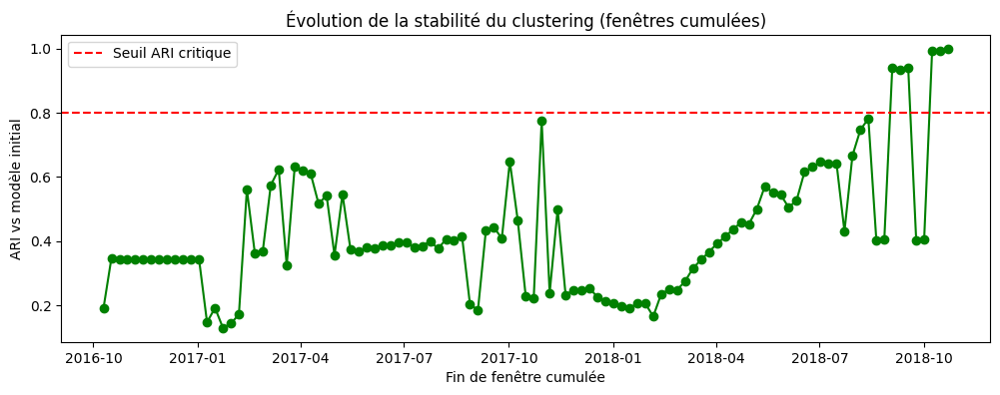
    


    Date de stabilisation du clustering : 2018-09-02 21:15:19
    Fréquence de rechargement recommandée : 728 jours
    


```python
# ==============================
# 3 – DÉTERMINATION DES SEUILS D’ALERTE
# ==============================

# --- Calcul des stats par cluster pour chaque fenêtre ---
cluster_stats = []

for start, end in fenetres:
    df_window = df_k_means_review_score_raw[
        (df_k_means_review_score_raw['last_order_date'] >= start) &
        (df_k_means_review_score_raw['last_order_date'] < end)
    ]
    
    if len(df_window) < n_clusters:
        continue

    X_window = df_window[['recency','frequency','monetary','review_score']]
    
    kmeans_window = KMeans(n_clusters=n_clusters, random_state=42)
    df_window = df_window.copy()
    df_window['cluster'] = kmeans_window.fit_predict(X_window)

    stats = (
        df_window
        .groupby('cluster')
        .agg(
            recency_mean=('recency', 'mean'),
            frequency_mean=('frequency', 'mean'),
            monetary_mean=('monetary', 'mean'),
            review_score_mean=('review_score', 'mean')
        )
        .reset_index()
    )

    stats['window_end'] = end
    cluster_stats.append(stats)

df_cluster_stats = pd.concat(cluster_stats, ignore_index=True)
display(df_cluster_stats.head())

# --- Calcul des variations relatives (pct_change) par cluster et variable ---
variables = ['recency', 'frequency', 'monetary', 'review_score']
df_variations = []

for var in variables:
    col = f"{var}_mean"
    var_diff = (
        df_cluster_stats
        .sort_values('window_end')
        .groupby('cluster')[col]
        .pct_change()
        .abs()
    )
    
    df_variations.append(pd.DataFrame({
        'variable': var,
        'variation': var_diff
    }))

df_variations = pd.concat(df_variations).dropna()

# --- Détermination des seuils d'alerte par variable (percentiles P90 et P95) ---
seuils = (
    df_variations
    .groupby('variable')['variation']
    .quantile([0.90, 0.95])
    .unstack()
    .rename(columns={0.90: 'seuil_P90', 0.95: 'seuil_P95'})
)

display(seuils)

```


<div>
<style scoped>
    .dataframe tbody tr th:only-of-type {
        vertical-align: middle;
    }

    .dataframe tbody tr th {
        vertical-align: top;
    }

    .dataframe thead th {
        text-align: right;
    }
</style>
<table border="1" class="dataframe">
  <thead>
    <tr style="text-align: right;">
      <th></th>
      <th>cluster</th>
      <th>recency_mean</th>
      <th>frequency_mean</th>
      <th>monetary_mean</th>
      <th>review_score_mean</th>
      <th>window_end</th>
    </tr>
  </thead>
  <tbody>
    <tr>
      <th>0</th>
      <td>0</td>
      <td>740.733333</td>
      <td>1.066667</td>
      <td>651.822667</td>
      <td>4.200000</td>
      <td>2016-10-09 21:15:19</td>
    </tr>
    <tr>
      <th>1</th>
      <td>1</td>
      <td>741.226950</td>
      <td>1.000000</td>
      <td>65.154752</td>
      <td>3.418440</td>
      <td>2016-10-09 21:15:19</td>
    </tr>
    <tr>
      <th>2</th>
      <td>2</td>
      <td>740.461538</td>
      <td>1.000000</td>
      <td>363.910385</td>
      <td>3.423077</td>
      <td>2016-10-09 21:15:19</td>
    </tr>
    <tr>
      <th>3</th>
      <td>3</td>
      <td>740.833333</td>
      <td>1.000000</td>
      <td>1164.391667</td>
      <td>3.500000</td>
      <td>2016-10-09 21:15:19</td>
    </tr>
    <tr>
      <th>4</th>
      <td>4</td>
      <td>741.545455</td>
      <td>1.012987</td>
      <td>185.055714</td>
      <td>3.396104</td>
      <td>2016-10-09 21:15:19</td>
    </tr>
  </tbody>
</table>
</div>


<div>
<style scoped>
    .dataframe tbody tr th:only-of-type {
        vertical-align: middle;
    }

    .dataframe tbody tr th {
        vertical-align: top;
    }

    .dataframe thead th {
        text-align: right;
    }
</style>
<table border="1" class="dataframe">
  <thead>
    <tr style="text-align: right;">
      <th></th>
      <th>seuil_P90</th>
      <th>seuil_P95</th>
    </tr>
    <tr>
      <th>variable</th>
      <th></th>
      <th></th>
    </tr>
  </thead>
  <tbody>
    <tr>
      <th>frequency</th>
      <td>0.082345</td>
      <td>0.126250</td>
    </tr>
    <tr>
      <th>monetary</th>
      <td>5.200553</td>
      <td>16.628104</td>
    </tr>
    <tr>
      <th>recency</th>
      <td>0.381422</td>
      <td>0.527783</td>
    </tr>
    <tr>
      <th>review_score</th>
      <td>0.132329</td>
      <td>0.201846</td>
    </tr>
  </tbody>
</table>
</div>


| Variable       | Type de seuil           | Valeur retenue | Justification                                |
| -------------- | ----------------------- | -------------- | -------------------------------------------- |
| `frequency`    | variation relative      | **10–13 %**    | Faible variabilité historique (P90–P95)      |
| `recency`      | variation relative      | **40–50 %**    | Forte volatilité naturelle                   |
| `review_score` | variation absolue       | **±0.2 point** | Variable bornée (1–5), % peu lisible         |
| `monetary`     | variation absolue / log | **à définir**  | Distribution à queue lourde, % non pertinent |


# **LIVRABLES FINAUX**


```python
# ============================================================
# 1. ENTRAÎNEMENT INITIAL K-MEANS AVEC VERSIONING
# ============================================================

def train_initial_kmeans_v2(df, features=None, n_clusters=5, n_init=20, id_col='customer_unique_id', model_dir="models"):
    """
    Entraînement initial K-Means + sauvegarde du modèle et scaler.
    """
    os.makedirs(model_dir, exist_ok=True)
    
    # Préparation des données
    df_model = df.copy()
    if id_col in df_model.columns:
        df_model = df_model.drop(columns=[id_col])
    
    if features is None:
        features = df_model.select_dtypes(include=['int64','float64']).columns.tolist()
    
    scaler = StandardScaler()
    X_scaled = scaler.fit_transform(df_model[features])
    
    kmeans = KMeans(n_clusters=n_clusters, n_init=n_init, random_state=42)
    labels = kmeans.fit_predict(X_scaled)
    
    df_out = df.copy()
    df_out['cluster'] = labels
    
    inertia = kmeans.inertia_
    silhouette = silhouette_score(X_scaled, labels)
    centroids = kmeans.cluster_centers_
    
    # Versioning automatique
    joblib.dump(kmeans, os.path.join(model_dir, f"kmeans_init_k{n_clusters}.joblib"))
    joblib.dump(scaler, os.path.join(model_dir, f"scaler_init_k{n_clusters}.joblib"))
    joblib.dump(centroids, os.path.join(model_dir, f"centroids_init_k{n_clusters}.joblib"))
    
    print(f"K-Means initial sauvegardé → k={n_clusters}, inertie={inertia:.2f}, silhouette={silhouette:.3f}")
    
    return {
        'df': df_out,
        'kmeans': kmeans,
        'scaler': scaler,
        'features': features,
        'centroids': centroids
    }
```


```python
# ============================================================
# 2. MAINTENANCE K-MEANS + REPORTING + ALERTES
# ============================================================

def maintain_kmeans_v2(df, model_initial, id_col='customer_unique_id', date_col='last_order_date',
                        window_days=7, n_clusters=5, ari_threshold=0.8, report_dir="reports"):
    """
    Maintenance K-Means :
    - Réentraînement sur fenêtres cumulées
    - ARI vs modèle initial
    - Stats descriptives par cluster
    - Alertes dynamiques sur variations importantes
    - Reporting automatique (plots + tables)
    """
    os.makedirs(report_dir, exist_ok=True)
    
    df_sorted = df.sort_values(date_col).copy()
    start_date = df_sorted[date_col].min()
    end_date = df_sorted[date_col].max()
    
    fenetres = []
    current_start = start_date
    while current_start <= end_date:
        current_end = current_start + pd.Timedelta(days=window_days)
        fenetres.append((start_date, current_end))  # cumul depuis début
        current_start = current_end
    
    features = model_initial['features']
    
    df_retraining_list = []
    df_cluster_stats_list = []
    df_alerts_list = []
    
    # historique pour quantiles alertes
    hist_cluster_means = {feat: [] for feat in features}
    
    for start, end in fenetres:
        df_window = df_sorted[(df_sorted[date_col] >= start) & (df_sorted[date_col] < end)].copy()
        if len(df_window) < n_clusters:
            continue
        
        # Standardisation
        X_scaled = model_initial['scaler'].transform(df_window[features])
        
        # Réentraînement
        kmeans_window = KMeans(n_clusters=n_clusters, n_init=20, random_state=42)
        labels_window = kmeans_window.fit_predict(X_scaled)
        
        # ARI vs modèle initial
        labels_initial = model_initial['kmeans'].predict(X_scaled)
        ari = adjusted_rand_score(labels_initial, labels_window)
        df_retraining_list.append({'start': start, 'end': end, 'nb_clients': len(df_window), 'ari_vs_initial': ari})
        
        # Stats descriptives par cluster
        df_window['cluster'] = labels_window
        stats = df_window.groupby('cluster')[features].agg(['mean','std']).reset_index()
        stats['window_end'] = end
        df_cluster_stats_list.append(stats)
        
        # Update historique pour alertes dynamiques
        for feat in features:
            hist_cluster_means[feat].append(df_window.groupby('cluster')[feat].mean())
        
        # Alertes dynamiques
        alerts = []
        for feat in features:
            current_means = df_window.groupby('cluster')[feat].mean()
            hist_df = pd.concat(hist_cluster_means[feat], axis=1)
            q_low, q_high = hist_df.quantile(0.05, axis=1), hist_df.quantile(0.95, axis=1)
            for cluster_id, val in current_means.items():
                if val < q_low[cluster_id] or val > q_high[cluster_id]:
                    alerts.append({'window_end': end, 'cluster': cluster_id, 'variable': feat, 'value': val})
        df_alerts_list.extend(alerts)
        
        # Reporting automatique
        for feat in features:
            plt.figure(figsize=(10,4))
            sns.histplot(df_window[feat], kde=True, color='forestgreen', bins=30)
            plt.title(f"Distribution {feat} – fenetre fin {end.date()}")
            plt.xlabel(feat)
            plt.ylabel("Fréquence")
            plt.tight_layout()
            plt.savefig(os.path.join(report_dir, f"{feat}_hist_{end.date()}.png"), transparent=True)
            plt.close()
    
    df_retraining = pd.DataFrame(df_retraining_list)
    df_cluster_stats = pd.concat(df_cluster_stats_list, ignore_index=True)
    df_alerts = pd.DataFrame(df_alerts_list)
    
    print(f"Reporting généré dans {report_dir}")
    
    return {
        'df_retraining': df_retraining,
        'df_cluster_stats': df_cluster_stats,
        'df_alerts': df_alerts
    }
```


```python
# ============================================================
# 0. Dossiers pour versioning et reports
# ============================================================
model_dir = "models"
report_dir = "reports"

os.makedirs(model_dir, exist_ok=True)
os.makedirs(report_dir, exist_ok=True)


# ============================================================
# 1. ENTRAÎNEMENT INITIAL
# ============================================================

initial_model = train_initial_kmeans_v2(
    df=df_review_score,
    features=['recency', 'frequency', 'monetary', 'review_score'],
    n_clusters=5,
    n_init=20,
    id_col='customer_unique_id',
    model_dir=model_dir
)

# Le df avec clusters ajoutés est accessible ici :
df_initial = initial_model['df']
display(df_initial.head())


# ============================================================
# 2. MAINTENANCE ET RÉENTRAÎNEMENT SUR FENÊTRES CUMULÉES
# ============================================================

maintenance_results = maintain_kmeans_v2(
    df=df_review_score,
    model_initial=initial_model,
    id_col='customer_unique_id',
    date_col='last_order_date',
    window_days=30,       # fenêtre cumulée de 30 jours
    n_clusters=5,
    ari_threshold=0.8,
    report_dir=report_dir
)

# ============================================================
# 3. Résultats exploitables
# ============================================================

# Evolution ARI vs modèle initial
df_retraining = maintenance_results['df_retraining']
display(df_retraining)

# Stats descriptives par cluster pour chaque fenêtre
df_cluster_stats = maintenance_results['df_cluster_stats']
display(df_cluster_stats.head())

# Alertes dynamiques sur variables clés
df_alerts = maintenance_results['df_alerts']
display(df_alerts.head())

# ============================================================
# 4. Vérification fichiers générés
# ============================================================

print(f"Fichiers de reporting générés dans {report_dir}")
print(f"Modèle et scaler sauvegardés dans {model_dir}")

```


```python
import pandas as pd
import matplotlib.pyplot as plt
from sklearn.preprocessing import StandardScaler
from sklearn.cluster import KMeans
from sklearn.metrics import adjusted_rand_score
from datetime import timedelta

def maintenance_simulation_with_plot(
    df_review_score,
    T0,
    step_days=30,
    k=5,
    ari_threshold=0.8
):
    results = []

    # -------------------------
    # FONCTION DE NETTOYAGE
    # -------------------------
    def clean_rfm(df):
        df = df.copy()

        # Imputation review_score manquant = 5
        df['review_score'] = df['review_score'].fillna(5)

        # Suppression des lignes avec NaN dans RFM
        before = len(df)
        df = df.dropna(subset=['recency', 'frequency', 'monetary'])
        after = len(df)

        if before != after:
            print(f"⚠️ {before - after} lignes supprimées (RFM incomplet)")

        return df

    # -------------------------
    # F0
    # -------------------------
    F0 = df_review_score[df_review_score['last_order_date'] <= T0].copy()
    F0 = clean_rfm(F0)

    scaler0 = StandardScaler()
    X0 = scaler0.fit_transform(F0[['recency', 'frequency', 'monetary', 'review_score']])

    M0 = KMeans(n_clusters=k, n_init=20, random_state=42).fit(X0)

    Tn = T0

    # -------------------------
    # BOUCLE TEMPORELLE
    # -------------------------
    while True:
        Tn = Tn + timedelta(days=step_days)

        F1 = df_review_score[df_review_score['last_order_date'] <= Tn].copy()
        if F1.empty:
            print("Plus de données après", Tn)
            break

        F1 = clean_rfm(F1)

        # Standardisation S1
        scaler1 = StandardScaler()
        X1 = scaler1.fit_transform(F1[['recency', 'frequency', 'monetary', 'review_score']])

        # Nouveau modèle M1
        M1 = KMeans(n_clusters=k, n_init=20, random_state=42).fit(X1)

        # C1_new = M1.fit(F1 normalisé S1)
        C1_new = M1.predict(X1)

        # C1_init = M0.predict(F1 normalisé S0)
        X1_S0 = scaler0.transform(F1[['recency', 'frequency', 'monetary', 'review_score']])
        C1_init = M0.predict(X1_S0)

        # ARI
        ari = adjusted_rand_score(C1_init, C1_new)

        results.append({
            'date': Tn,
            'ARI': ari,
            'nb_clients': len(F1)
        })

        print(f"{Tn.date()} — ARI = {ari:.4f}")

        if ari < ari_threshold:
            print("\n⚠️ ARI < seuil, arrêt.")
            break

    # -------------------------
    # TABLEAU DES RÉSULTATS
    # -------------------------
    df_results = pd.DataFrame(results)

    # -------------------------
    # GRAPHIQUE ARI vs TEMPS
    # -------------------------
    plt.figure(figsize=(10,5))
    plt.plot(df_results['date'], df_results['ARI'], marker='o', linewidth=2)
    plt.axhline(0.8, color='red', linestyle='--', label='Seuil ARI = 0.8')

    plt.title("Évolution du score ARI dans le temps")
    plt.xlabel("Date")
    plt.ylabel("ARI")
    plt.grid(True)
    plt.legend()
    plt.tight_layout()
    plt.show()

    return df_results

```


```python
T0 = pd.Timestamp("2017-12-31")

df_results = maintenance_simulation_with_plot(
    df_review_score=df_review_score,
    T0=T0,
    step_days=30,
    k=5
)

df_results

```

    2018-01-30 — ARI = 0.8532
    2018-03-01 — ARI = 0.7653
    
    ⚠️ ARI < seuil, arrêt.
    


    
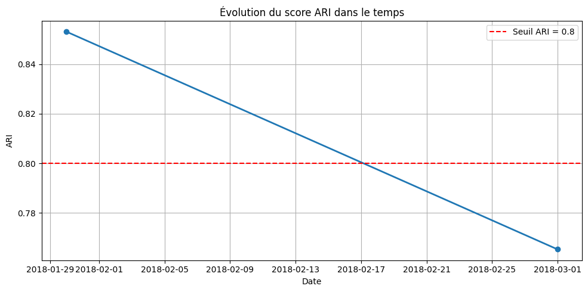
    


<div>
<style scoped>
    .dataframe tbody tr th:only-of-type {
        vertical-align: middle;
    }

    .dataframe tbody tr th {
        vertical-align: top;
    }

    .dataframe thead th {
        text-align: right;
    }
</style>
<table border="1" class="dataframe">
  <thead>
    <tr style="text-align: right;">
      <th></th>
      <th>date</th>
      <th>ARI</th>
      <th>nb_clients</th>
    </tr>
  </thead>
  <tbody>
    <tr>
      <th>0</th>
      <td>2018-01-30</td>
      <td>0.853164</td>
      <td>49880</td>
    </tr>
    <tr>
      <th>1</th>
      <td>2018-03-01</td>
      <td>0.765297</td>
      <td>56827</td>
    </tr>
  </tbody>
</table>
</div>


```python

```
